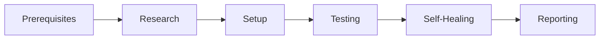



## Overview

AI coding assistants generate code incredibly quickly—but they're "terrible at validating their own work unless you give them a framework to follow." Cole Medin presents a comprehensive validation workflow packaged as a single command that enables AI coding agents to self-validate their work.

The "self-healing AI coding workflow" uses browser automation, parallel sub-agents, and structured testing to dramatically reduce the mental burden of reviewing AI-generated code.

## The Problem

- AI coding assistants generate code at incredible speed
- Manual review of hundreds or thousands of lines is overwhelming
- **"AI generated code is still your responsibility"**
- Agents skip validation unless explicitly instructed

## The Solution: 6-Phase Workflow

| Phase | Purpose |
|-------|---------|
| **Prerequisites** | Verify environment (Linux/WSL, frontend available) |
| **Research** | Three parallel sub-agents analyze codebase, database, and code quality |
| **Setup** | Start dev server, identify user journeys |
| **Testing** | For-loop through each user journey with browser automation |
| **Self-Healing** | Fix blocking issues, retest, iterate |
| **Reporting** | Structured output with fixes, remaining issues, and screenshots |

## Parallel Research Phase

Three sub-agents run **simultaneously**:

1. **App Structure Agent** - Understands codebase and user journeys
2. **Database Schema Agent** - Maps database structure and relationships  
3. **Code Review Agent** - Finds logic errors and potential bugs

All research is compiled into context for the primary agent before testing begins.

## End-to-End Testing Methodology

The workflow tests your application as a real user would:

- **Browser Navigation** - Uses Vercel Agent Browser CLI
- **Snapshots** - Understands page state before interaction
- **Database Verification** - Queries backend to confirm CRUD operations
- **Screenshots** - Captures UI state for visual verification
- **Responsive Checks** - Tests mobile, tablet, and desktop views

## Self-Healing Loop

The agent follows a structured approach:

1. **Fix only blocking issues** that prevent testing
2. **Document moderate/minor issues** for human review
3. **Iterate**: fix → retest → screenshot → validate
4. **Continue** until user journey is complete

This distinction is crucial—the agent doesn't try to fix everything, just the blockers. All other findings are documented for collaborative review.

## Structured Reporting

Every run produces consistent output:

- **What was fixed** - Issues the agent resolved
- **Remaining issues** - Documented for human decision
- **Screenshots** - Visual evidence of testing
- **Optional markdown** - For follow-up in new context window

## Integration with Feature Development

The workflow fits into the **PIV Loop** (Plan → Implement → Validate):

1. **Plan** - Create structured markdown with validation strategy
2. **Implement** - Agent writes the feature
3. **Validate** - Add to plan: *"Use the E2E test skill to do comprehensive testing"*

The E2E test runs as a sub-skill after implementation completes.

## Technical Stack

| Component | Tool |
|-----------|------|
| Browser Automation | Vercel Agent Browser CLI |
| Alternative | Chrome DevTools MCP |
| Database | PostgreSQL/Neon (adaptable) |
| Platform | Linux or WSL |

## Practical Recommendations

### When to Use
- After completing feature implementation
- For regression testing before deployment
- When reviewing large amounts of AI-generated code

### Best Practices
1. **Plan validation upfront** - Include E2E testing in planning documents
2. **Use database branches** - Keep test data isolated (Neon branching)
3. **Review screenshots** - Visual verification complements automated checks
4. **New context for follow-up** - Use markdown report in fresh session

### Limitations
- Requires frontend (backend-only apps need different approach)
- Takes significant time—"set and forget" approach recommended
- Currently Linux/WSL only for Agent Browser CLI

## Key Insight

> "The point is not to be fast. The point is to be comprehensive."

The workflow transforms an overwhelming manual task into a systematic, automated process. It finds issues that agents would rarely catch on their own—and the time investment is worth it.

---

## Resources

- **Skill.md**: Available in [GitHub repo](https://github.com/coleam00) (video description)
- **Previous Video**: Vercel Agent Browser CLI deep dive
- **Bright Data**: Use code "ColeMedin" for $20 free credits

---

*Source: [YouTube Video](https://www.youtube.com/watch?v=YeCHI1dmpZY) by Cole Medin*