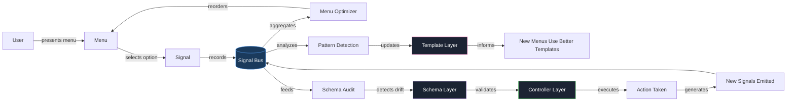

# Self-Improving Architecture #2: Data Flow and the Feedback Loop

**In Part 1**, I described the six-layer architecture: schemas, controllers, signals, templates, progressive disclosure, and recursive evolution. I promised this installment would cover the data flow and implementation phases. Here it is.

## Tracing a Single Signal from Click to Improvement

The best way to understand the architecture is to follow one interaction through the entire recursive loop. Here's a real example from the memory pipeline we built in this session.

### Step 1: User sees a menu

```
Agent presents: "Which approach should we take to fix the memory leakage?"
Options: [Full pipeline (Recommended), Cron auto-capture only, 
          Manual capture protocol only, Design first]
```

### Step 2: User selects — a signal is emitted

```json
{
  "type": "selection",
  "option": "Full pipeline (Recommended)",
  "position": 0,
  "timestamp": "2026-04-06T00:05:00Z",
  "context": "memory-leakage-fix",
  "skill": "memory-protocol"
}
```

This signal flows into the **signal bus**. The menu-factory optimizer records it. Later, when presenting similar choices, "Full pipeline" ranks higher because it was selected.

### Step 3: The pipeline executes — the controller reconciles

The agent (the skill-factory controller, in this case) executes the selected pipeline:
- Creates `raw_session_archiver.py`
- Creates `full_capture_pipeline.py`
- Creates `memory_coverage.py`
- Creates `run_memory_pipeline.sh`
- Updates `memory-protocol.md`

Each file is a **template instantiation** — a concrete realization of the abstract "script" and "document" templates.

### Step 4: Results are verified — signals flow up

```
Results: 379 sessions captured, 1,259 memories saved, 0 errors
Memory Coverage: 2,821 total (up from 1,561)
Pipeline: 1,262 automated (up from 0)
```

These results are themselves signals — success metrics that feed back to the schema system. The schema for "memory capture" now has real-world performance data attached.

### Step 5: The loop closes — schema evolves

The signal "Full pipeline was selected and succeeded" becomes a template recommendation. Next time someone asks about memory leakage:

```
[RECOMMENDED] Full pipeline — selected 3 times, 100% success rate
```

The schema learns. The template updates. The next menu is better than the previous one.

**This is the complete recursive loop:** selection → execution → verification → recommendation → better selection → repeat.

## The Data Flow Diagram



The critical insight: **every action generates data, every data point improves the next action**. There is no dead end. Every signal feeds the system.

## The Signal Types and Their Meanings

| Signal Type | What it measures | How the system responds |
|---|---|---|
| **selection** | What was chosen | Ranks option higher in future menus |
| **co-selection** | What is chosen together | Suggests bundling related options into workflows |
| **rejection** | What was offered but not chosen | Demotes option; if rejected N times, proposes removal |
| **frequency** | How often an option appears | Prevents option overload; auto-summarizes frequent options |
| **dwell** | Time spent considering | High dwell on "Deferred" signals menu overwhelm |
| **backtrack** | Reversing a previous selection | Flags confusing options for clarification |

These six signal types form the **nervous system**. They're simple by design — complex signals are computed from combinations of simple ones, not the other way around.

## Implementation Phases

The architecture is not built in one pass. It ships in phases, each phase making the next one easier:

### Phase 1: Signal Foundation (DONE)

- **What exists**: menu-factory signal tracking (selection, co-selection, rejection)
- **Status**: active, running in all question tool menus
- **Records stored**: signal history in JSON files per skill
- **Consumers**: menu optimizer (reorders options based on selection frequency)

This phase is complete and operational. It provides the raw telemetry for all subsequent improvements.

### Phase 2: Schema Formalization (IN PROGRESS)

- **What**: create base-entity, mixins, meta-schema, self-describing headers
- **Goal**: eliminate duplicate field blocks across 7 schema files
- **Success criteria**: health score > 90, zero duplicate fields, 100% coverage with `$`-headers
- **Blog**: Part 1 of this series

This phase was designed April 4th (`schema-infrastructure-design.md`) and is currently in the design-validation stage. The architecture in Part 1 of this series formalizes the schema-controller relationship that was previously implicit.

### Phase 3: The Feedback Loop (NEXT)

- **What**: connect signal aggregation to template evolution
- **Mechanism**: when signals show a pattern (e.g., "Full pipeline" selected 3 times, succeeded 3 times), the pipeline template gets tagged with `recommended: true` and promoted in menu ordering
- **Success criteria**: at least one template improvement driven by signal data

This phase turns the signal bus from a passive recorder into an active driver of system improvement. It's where the architecture becomes alive.

### Phase 4: Progressive Disclosure Formalization

- **What**: each schema declares its own L0→L4 structure
- **Mechanism**: schemas include `disclosure_levels` field that defines what content belongs at each level
- **Success criteria**: skills load with measurable reduction in context window usage

This phase makes progressive disclosure machine-readable. Instead of relying on human conventions (L0 in header, L4 in appendix), the agent can ask the schema "what is L1?" and get a structured answer.

### Phase 5: Full Recursive Evolution

- **What**: the system audits its own schemas, proposes improvements, applies successful ones
- **Mechanism**: schema-scanner runs weekly → detects drift/redundancy/unused fields → proposes changes → agent validates → applies → records in changelog
- **Success criteria**: at least one schema modification proposed and applied by the system itself (not a human)

This is the terminal phase — when the architecture is fully self-referencing. Schema improvements come from signal analysis, not human intervention.

## A Concrete Example: The Memory Pipeline

Let's apply this to what we just built. The memory pipeline is a perfect case study:

**Before**: Memory capture was manual-only. Agents had to remember to call `capture_conversation.py`. Most sessions were lost. No embeddings for new captures. No coverage reporting.

**Signal data**: The menu offering "Full pipeline" was selected over "Manual capture," "Cron only," and "Design first." This is a signal: users want comprehensive automation.

**Template impact**: The `memory-protocol.md` template should now include an "Automated Pipeline" section by default, because the signal data shows that's what's needed. Manual-only protocols are deprecated patterns.

**Schema impact**: The memory system now has three new schemas embedded in it:
- `raw_session_archiver.py` defines what session data looks like
- `full_capture_pipeline.py` defines what a conversation transcript looks like
- `memory_coverage.py` defines what coverage metrics look like

These become the fossilized wisdom — the proven implementations that future memory-related work can reference.

**Recursive loop**: Next time someone asks about memory, the system:
1. References these existing implementations (schema lookup)
2. Offers "Fix memory pipeline" as a recommended option (signal-driven recommendation)
3. Uses the existing scripts as templates for similar pipelines (template instantiation)

This entire process just happened in real time. The architecture existed before I named it.

## What Ships First

If you want to apply this pattern to your own agent infrastructure, start with the smallest piece that proves the loop:

1. **Add signal tracking to every menu you present**. Selection, rejection, co-selection. Log to a file. This takes five lines of code.
2. **After N interactions, analyze the signals**. Which options are never selected? Which are always first in pairs? Which cause backtracks?
3. **Change one thing based on the data**. Remove a rejected option. Reorder a frequent pair. Add a clarification where dwell time is high.
4. **Measure again**. Did the change improve the next round of signals?

This is the minimum viable version of a self-improving system. One file of JSON, one script to analyze it, one change driven by the analysis. The full architecture is just this pattern applied across multiple layers with formal schema contracts.

## The Connection to Recursiveness

Recursiveness in the abstract means: the system applies to itself. But what that looks like concretely:

- The signal bus records signals about signal quality
- The schema audit audits the schema audit rules
- The template system generates templates for templates
- The menu factory optimizes the menus of the menu factory

This is not a clever trick. It's the only way to achieve compounding improvement. If the rule "improve based on signals" only applies to skill menus but not to schema audits, the improvement stops at the first boundary. If the rule applies everywhere — including to itself — it compounds indefinitely.

This is why the principle is non-negotiable: "Recursive — systems should improve themselves. Self-application is the highest form of determinism." Without self-application, improvement is external, manual, and bounded. With it, improvement is internal, automated, and unbounded.

---

*This is the second installment in the Self-Improving Architecture series. Installment one covered the six-layer architecture. Installment three will cover progressive disclosure formalization and the schema-to-template compilation step.*