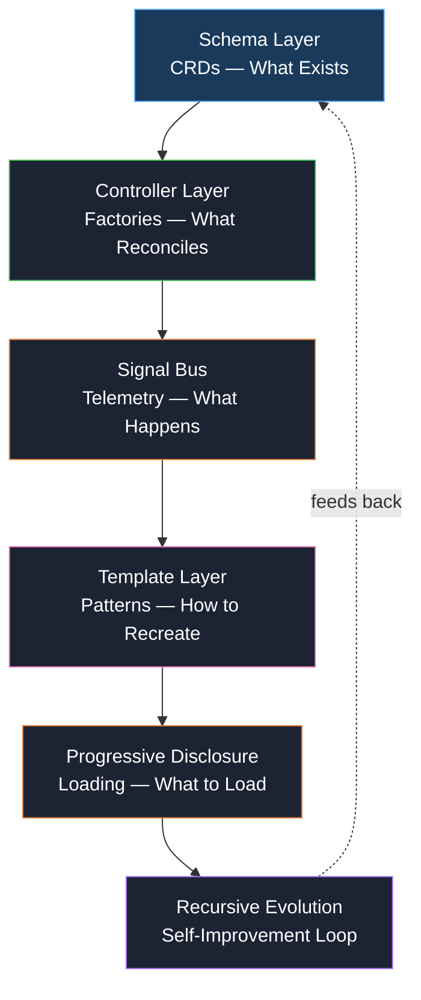

# The Self-Improving Architecture: Schemas, Control Planes, and Recursive Evolution

**Most agent infrastructures are static.** Define a schema, use it until it breaks, fix it manually. The pattern below flips this: the architecture improves itself.

This is not theoretical. It documents the emergent pattern across an existing system of four independent "factories" — skill, research, project, and agent — each managing their own lifecycle. When connected, they form a recursive loop.

## The Architecture



Each layer is both consumer and producer of the layer below it:

- **Schemas** define what controllers can be, but controllers emit signals that improve schemas
- **Templates** fossilize what works, but signal-derived rules update those templates
- **Progressive disclosure** is governed by schemas, but the disclosure rules are themselves disclosed progressively — recursion

## Layer 1: Schemas (Custom Resource Definitions)

In Kubernetes, a CRD (Custom Resource Definition) declares what kind of objects can exist in the cluster. Schedules, deployments, services, ingresses — each is a declaration, not an imperative command.

The equivalent in this architecture:

| Schema Type | Purpose | Examples |
|---|---|---|
| **base-entity** | Root entity — shared fields | id, title, status, priority, created, updated, description |
| **mixins** | Composable fragments | mixin-schedulable, mixin-trackable, mixin-traceable, mixin-relatable |
| **entity schemas** | Specific definitions | project-schema, research-schema, agent-schema, skill-schema |
| **meta-schemas** | Describes the schema system | schema-schema, validation rules |
| **sub-schemas** | Extracted shared blocks | signal-tracking-schema, roadmap-schema, dashboard-schema |

The key principle: **schemas are the constitution.** They define what is valid. Every factory, every template, every signal — all trace back to schema definitions.

## Layer 2: Controllers (The Factories)

In Kubernetes, a Controller is a control loop that watches the cluster state and tries to move the current state toward the desired state (defined in CRDs). This is the **reconcile loop**.

The equivalent:

| Controller | Manages | Reconcile Logic |
|---|---|---|
| **skill-factory** | Skills (SKILL.md, context, menus, cron) | Scan → validate → score → evolve → publish |
| **research-factory** | Research tasks | Create adapter → gather sources → synthesize → store findings |
| **project-factory** | Projects (phases, roadmaps, dashboards) | Plan → execute → signal → adjust → report |
| **agent-factory** | Agent definitions | Define tools → set parameters → export targets |

**Each controller is autonomous.** It reads its schema, loads progressively (L0→L4), emits signals, and improves itself. No central orchestrator decides what each factory does.

## Layer 3: Signal Bus (The Nervous System)

Every interaction emits a signal:

- **selection** — which menu option was chosen
- **co-selection** — which options are chosen together
- **rejection** — which options were presented but not chosen
- **frequency** — how often an option appears
- **dwell** — time spent considering an option
- **backtrack** — reversing a previous selection

These signals flow into a shared bus. Any controller can subscribe. The menu-factory optimizer reads these signals to reorder and improve menu options. The schema system reads them to detect field drift and unused properties.

## Layer 4: Templates (Fossilized Wisdom)

Templates are the proven patterns:

- `project-template.yaml` — standard project structure
- `agent-template.yaml` — agent definition template
- `research-template.yaml` — research task template

When schemas evolve, templates should evolve. When signals show that certain menu structures consistently perform better, templates should adopt those structures.

**Templates are how the system remembers what works.** Without them, every improvement evaporates when the schema changes.

## Layer 5: Progressive Disclosure (The Attention Budget)

Schemas are loaded in layers:

| Level | Content | Purpose |
|---|---|---|
| **L0** | Identity — name, version, maturity | "What is this?" |
| **L1** | Intent — purpose, goals, scope | "What does it do?" |
| **L2** | Details — commands, configs, workflows | "How do I use it?" |
| **L3** | Advanced — edge cases, troubleshooting | "What goes wrong?" |
| **L4** | Reference — full API, all options | "Everything" |

The recursion: the rules for loading are themselves loaded progressively. You only learn the rules for L2 when you reach L1, which tells you about L2.

## The Recursive Loop (The Engine That Improves Itself)

This is where it becomes alive:

```
Schemas define valid structure
    ↓
Controllers reconcile against schemas
    ↓
Controllers emit signals (what works, what doesn't)
    ↓
Signals aggregate → patterns emerge
    ↓
Templates update (absorbing what works)
    ↓
Schemas audit → detect drift, extract duplicates
    ↓
Schemas evolve → better contracts
    ↓
Next reconciliation is smarter
    ↓
Repeat forever
```

This is the same pattern as:

- **Kubernetes controllers** — reconcile desired state, emit events, CRDs get extended
- **Biological systems** — DNA defines structure, feedback selects mutations, evolution compounds
- **Machine learning** — model produces output, loss function measures error, gradient updates weights

But it runs across an entire agent infrastructure ecosystem. Not a single model — a collection of independent, self-improving subsystems.

## What Exists Today

This architecture is not aspirational. It already exists in emergent form:

- **7 schema files** across multiple locations, with shared field patterns
- **4 independent factories** that already manage their own lifecycles
- **Signal tracking** capturing menu interactions and feeding the optimizer
- **Template system** with project, agent, and research templates
- **Progressive disclosure** implemented in skill SKILL.md files with L0→L4 structure
- **1262 conversation memories** captured verbatim from actual sessions

The work ahead is **formalizing** this pattern — making schemas self-describing, connecting the feedback loop, and ensuring every improvement compounds rather than evaporates.

## Three Approaches Compared

When designing this system, three architectures were considered:

| Aspect | Centralized | Distributed CRD ★ | Event Bus |
|---|---|---|---|
| Authority | Single controller | Per-factory | None (emergent) |
| Scalability | Poor | Excellent | Excellent |
| Debuggability | Easy | Good | Hard |
| 7B model reasoning | Yes | Yes | No |
| Adding new factory | Requires central change | Independent | Independent |
| Progressive disclosure | Centralized | Per-factory | Undefined |

The Distributed CRD pattern was chosen because it matches what is already working, scales to new factories without modification, and keeps each subsystem understandable in isolation — a requirement for small model reasoning.

## The Principle of Recursiveness

Recursiveness in this architecture means: **systems should improve themselves through self-application.**

- Schemas describe the schema system
- Progressive disclosure discloses its own rules progressively
- Signal scoring improves signal scoring
- Templates generate better templates
- Factories improve the factories that created them

Self-application is the highest form of determinism. When the system that defines the system can itself be redefined by its own output, improvement becomes inevitable — compounding with each cycle.

---

*This is the first installment in a series documenting the OpenCode self-improving architecture. Installment two will cover the data flow and implementation phases.*