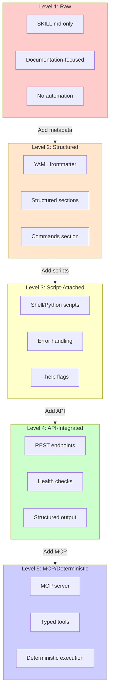
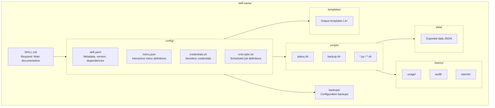
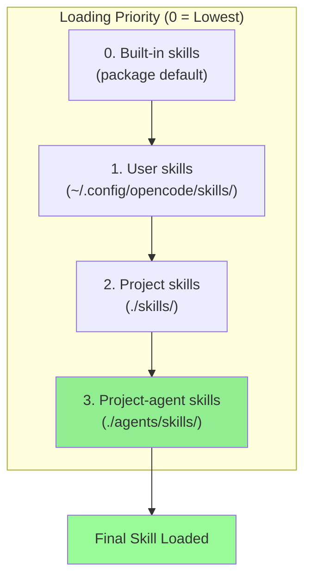
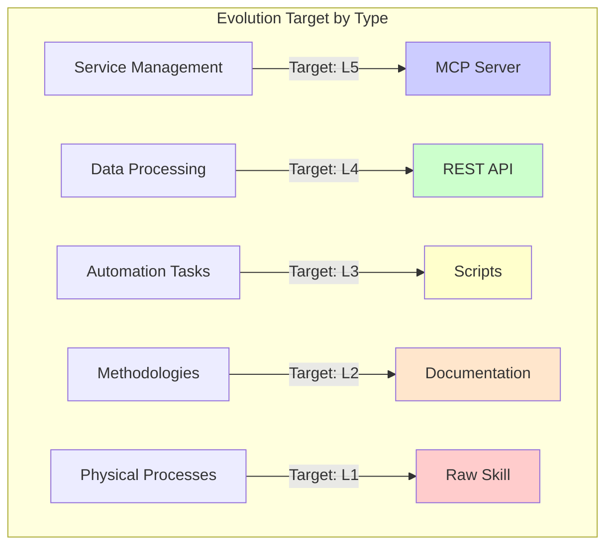

## Overview

The OpenCode skill system uses a **Knowledge Crystallization Pipeline** - converting probabilistic LLM interactions into deterministic, reusable components. This post explains the complete architecture.

## Skill Maturity Levels

Skills evolve through five distinct levels of maturity:



## Skill Directory Structure



## Quality Gates Between Levels


## Skill Loading Precedence



## YAML Frontmatter Schema

```yaml
---
name: skill-name
description: Brief description of the skill
version: 1.0.0
created: 2026-03-08
status: production | development | deprecated
maturity: L1 | L2 | L3 | L4 | L5
author: AuthorName
tags: [tag1, tag2, tag3]
dependencies:
  - dependency1
  - dependency2
---
```

## Full skill.yaml Schema (L3+)

```yaml
name: router
version: 3.0.0
description: Comprehensive network management
status: production
trigger: router
aliases:
  - edgerouter
  - network
last_updated: 2026-03-07T20:40:00Z

features:
  - port_forwarding
  - dhcp_management
  - firewall_rules

cron_jobs:
  - name: daily_backup
    schedule: "0 4 * * *"
    command: "scripts/backup.sh"
    enabled: true

dependencies:
  required_tools:
    - bash
    - ssh
    - sshpass
  associated_skills:
    - name: nginx
      level: intimate
      purpose: "Monitor reverse proxy"
```

## Menu Schema (menu.json)

```json
{
  "skill": "skill-name",
  "version": "3.0.0",
  "menus": {
    "main": {
      "header": "Menu Title",
      "question": "What would you like to do?",
      "multiple": false,
      "options": [
        {
          "id": "action-id",
          "label": "📊 Label Text",
          "description": "Description of action",
          "action": "exec:scripts/action.sh"
        },
        {
          "id": "submenu",
          "label": "📋 Submenu",
          "description": "Open submenu",
          "action": "show-menu:submenu-name"
        }
      ]
    }
  }
}
```

## Standardized Output Schema (L3+)

```python
from pydantic import BaseModel

class SkillOutput(BaseModel):
    success: bool
    data: dict | None
    error: str | None
    meta: dict  # duration, tokens, cache_hit, trace_id
```

## Evolution Decision Matrix



## Skill Evolution Checklist

| Transition | Actions Required |
|------------|-----------------|
| **L1→L2** | Add YAML frontmatter, structured sections, commands section |
| **L2→L3** | Create scripts/, add error handling, add --help flags |
| **L3→L4** | Document API endpoints, add curl examples, health checks |
| **L4→L5** | Create MCP server, define tool schemas, implement transport |

## 2026 Determinism Formula

```
Determinism = Schema Validation + State Reducer + Tool Mocks + Policy Gates
```

**Critical**: `temperature=0` does NOT achieve determinism. Reliability comes from **architecture + guardrails**, not better prompts.

## Current Skills Inventory

| Level | Count | Examples |
|-------|-------|----------|
| **L5** | 1 | agent-browser |
| **L4** | 2 | tracking, openrag |
| **L3** | 5 | router (13 scripts), news, cronflow |
| **L2** | 42 | research, flow, blog-post-creator |
| **L1** | 21 | versions, beautiful-mermaid |
| **L0** | 3 | Incomplete skills |

## Key Insight

Not all skills should reach Level 5. Methodology skills (research, telos) should remain at L2 (documentation-only). Service management skills should evolve to L5 for deterministic execution.

---

*This architecture enables progressive enhancement while maintaining simplicity for documentation-only skills.*