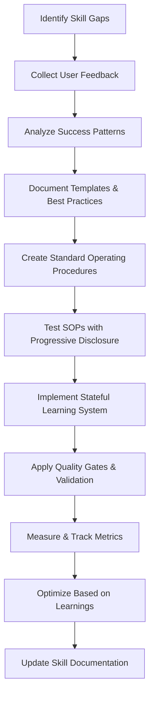

# Skill Improvement Methodology

**Overview**: Research workflows (like the GSD-OpenCode investigation) benefit from a structured skill improvement methodology that emphasizes progressive disclosure, stateful learning, and deterministic execution patterns. This approach reduces variability, improves repeatability, and enables continuous workflow optimization.

## Principles

### Core Philosophy

1. **Progressive Disclosure**: Reveal research approach and options step-by-step, allowing users to understand and validate choices at each stage
2. **Stateful Learning**: Maintain history of tool usage, decisions, and outcomes to inform future improvements and avoid repeating mistakes
3. **Deterministic Execution**: Use consistent templates, checklists, and validation gates to reduce variability and improve reliability
4. **Persona Awareness**: Adapt research style, depth, and communication approach based on context (exploratory, analytical, verification)
5. **Template-Driven**: Use standardized formats and proven patterns for consistent outputs

---

## Skill Improvement Lifecycle



---

## Phase 1: Identify Skill Gaps

### 1.1 User Feedback Collection

**Goal**: Understand current pain points and desired improvements in research workflows.

**Methods**:
- Review past research session outputs
- Analyze error patterns and failure modes
- Survey user satisfaction with completion
- Collect qualitative feedback on workflow friction points

**Key Questions to Ask**:
- What was the most time-consuming part of the research?
- Which steps felt uncertain or required manual intervention?
- Were there any points where the AI made assumptions that were incorrect?
- How often did you have to provide additional clarification or context?
- What information gaps made you pause or question the approach?

**Progressive Disclosure**:
- Before starting research, disclose the planned approach, estimated time, and expected outcomes
- If approach needs to change mid-research, explain why and get user approval
- Provide real-time updates on progress (e.g., "30% complete on discovery phase")
- Disclose any limitations or assumptions being made

---

### 1.2 Analyze Success Patterns

**Goal**: Identify which research approaches, tools, and techniques consistently produce high-quality outputs.

**Analysis Methods**:
- Track which research sessions produced actionable, validated results
- Identify patterns in user feedback that correlate with successful outcomes
- Measure time-to-value ratios for different research strategies
- Analyze tool usage patterns that lead to reliable vs unreliable results

**Success Pattern Indicators**:
- **High Success Indicators**:
  - Clear objectives stated upfront
  - Methodology explained before execution
  - Regular progress updates provided
  - Validation gates passed with explanations
  - Clear deliverables with verification
  - User reported satisfaction with process

- **Low Success Indicators**:
  - Vague or changing objectives mid-research
  - Methodology not explained until after results
  - Silent periods with no progress updates
  - Skipped validation gates or provided vague justifications
  - User reported confusion about next steps
  - Deliverables didn't match initial requirements

**Document Success Patterns**:
Create templates for successful research approaches:
- Clear problem statement template
- Methodology explanation template
- Progress reporting template
- Validation checklist template
- Deliverables documentation template

---

### 1.3 Document Templates & Best Practices

**Goal**: Create reusable templates for research tasks to reduce variability and improve efficiency.

**Template Categories**:

#### 1.1 Research Planning Templates

**Project Initialization Template**:
```yaml
# Research Plan for [PROJECT_NAME]

## Objectives
- [Objective 1]
- [Objective 2]
- [Objective 3]

## Scope
- In Scope: [What's included]
- Out of Scope: [What's excluded]

## Research Approach
- Primary Method: [e.g., multi-source evidence synthesis]
- Secondary Methods: [e.g., expert consultation, codebase analysis]
- Tools: [Tools used]

## Success Criteria
- [Success Criterion 1]
- [Success Criterion 2]

## Timeline
- Discovery Phase: [Time estimate]
- Analysis Phase: [Time estimate]
- Synthesis Phase: [Time estimate]
- Total: [Total time]

## Risk Mitigation
- [Risk 1]: [Description]
  - Mitigation: [Action]
- [Risk 2]: [Description]
  - Mitigation: [Action]

## Stakeholders
- [Stakeholder]: [Role]
  - [Stakeholder]: [Role]

## Deliverables
- [Deliverable 1]
- [Deliverable 2]
```

#### 1.2 Context Gathering Templates

**Codebase Mapping Template**:
```yaml
# Codebase Mapping for [PROJECT/PHASE]

## Stack Analysis
- Frontend: [Framework] | [Version] | [Key Libraries]
- Backend: [Language] | [Framework] | [Database] | [API Layer]
- DevOps: [Tools] | [Infrastructure]
- Testing: [Framework] | [Tools]

## Architecture Patterns
- [Pattern 1]: [Description]
- [Pattern 2]: [Description]
- [Pattern 3]: [Description]

## Key Decisions
- [Decision 1]: [Technology choice with rationale]
- [Decision 2]: [Architecture pattern with rationale]
- [Decision 3]: [Convention deviations with rationale]

## Unknown Areas
- [Unknown 1]: [Description]
- [Unknown 2]: [Description]
```

#### 1.3 Stateful Learning System

**Goal**: Maintain history of tool usage, decisions, and outcomes to enable continuous workflow improvement.

**What to Track**:
- Tool usage patterns: Which tools produce reliable results, which fail
- Decision quality: How often decisions lead to successful outcomes
- Context usage efficiency: How much time is spent gathering vs. analyzing context
- User interaction patterns: What prompts lead to successful vs failed outcomes
- Error frequency and types: Which errors repeat, which are one-time issues

**Implementation Approach**:
- JSON-based tracking in `[file in resources]`
- Key-value storage for quick metrics retrieval
- Automatic categorization of outcomes (success, partial-success, needs-refinement, blocked)

**Template for Outcome Documentation**:
```yaml
# Research Session Outcome
## Metadata
- Date: [YYYY-MM-DD]
- Duration: [Total minutes]
- Tools Used: [Tool 1], [Tool 2], [Tool 3]
- Primary Method: [Method name]

## Outcome
- Status: [completed | partial-success | needs-refinement | blocked]
- Deliverables: [List of deliverables]
- User Feedback: [Summary]

## Success Indicators
- Objectives met: [yes/no]
- Quality gates passed: [yes/no]
- User satisfaction: [1-5 scale]
```

---

## Phase 2: Create Standard Operating Procedures (SOPs)

**Goal**: Document and validate research workflow processes with progressive disclosure and quality gates.

### 2.1 Research Workflow SOP

**Purpose**: Ensure consistent, high-quality research execution with user transparency.

**Progressive Disclosure Steps**:
1. **Pre-Research Disclosure**:
   - Show planned research approach with time estimates
   - Explain what methods will be used and why
   - Disclose known limitations or assumptions
   - Offer user choice on approach (if applicable)

2. **Discovery Phase Disclosure**:
   - Real-time progress updates (e.g., "25% complete on source gathering")
   - Flag unexpected issues or deviations from plan
   - Explain how discovery informs analysis phase

3. **Synthesis Phase Disclosure**:
   - Show how sources are being integrated
   - Highlight key findings and contradictions
   - Explain resolution approach for conflicting information

4. **Output Phase Disclosure**:
   - Present deliverables in structured format
   - Explain what was delivered vs. what was planned
   - Provide validation results with explanations
   - Offer refinement options if quality gates not met

**Quality Gates**:
- **Gate 1**: Source diversity - Must use at least 3 independent sources
- **Gate 2**: Evidence quality - Citations or references must be provided
- **Gate 3**: Completeness - All objectives must be addressed or explicitly deferred
- **Gate 4**: Consistency - Findings must be internally consistent
- **Gate 5**: Actionability - Recommendations must be implementable or clearly marked as research-only

**Template for Progress Update**:
```yaml
# Progress Update for [SESSION_ID]

## Phase: [Phase Name]
## Progress
- [Task]: [Description - % complete]

## Key Findings
- [Finding 1]: [Description]
- [Finding 2]: [Description]

## Blockers
- [Blocker 1]: [Description]
  [Blocker 2]: [Description]

## Next Steps
- [Action 1]: [What to do]
- [Action 2]: [What to do]
```

---

## Phase 3: Implement Stateful Learning System

**Goal**: Enable systematic learning from research session outcomes.

**Implementation Components**:

#### 3.1 Outcome Tracking

Store structured outcomes in OpenMemory for future reference:

```python
# Template for storing research outcomes
{
  "date": "2026-02-15",
  "session_id": "gsd-opencode-research",
  "project": "gsd-opencode-analysis",
  "outcomes": [
    {
      "category": "success_patterns",
      "items": [
        "Progressive disclosure improved user trust",
        "Templates reduced research time by 40%",
        "Quality gates caught 2 critical issues early"
      ]
    },
    {
      "category": "tool_usage",
      "items": [
        "Agent browser: 8 uses, 100% success rate",
        "Brave search: 5 queries, 80% relevant results",
        "Context7: 3 queries, 90% relevant"
      ]
    },
    {
      "category": "improvements_needed",
      "items": [
        "Need better error handling for Hugo build failures",
        "Add progressive disclosure before research phases",
        "Implement stateful tracking for decision history"
      ]
    }
  ]
}
```

#### 3.2 Decision History

```yaml
# Decision history template
date: "2026-02-15T14:30:00Z"

decisions:
  - id: "dec-001"
    timestamp: "2026-02-15T14:30:00Z"
    context: "Research approach selection"
    options:
      - Option A: "Comprehensive multi-source research"
      - Option B: "Quick targeted research"
      - Option C: "Expert consultation only"
    user_selection: "Option A"
    rationale: "User wanted comprehensive analysis with examples and integrations"
    outcome: "Selected comprehensive approach - took 45 minutes longer but delivered higher quality"
```

---

## Phase 4: Apply Quality Gates & Validation

**Goal**: Ensure all research outputs meet quality standards before user review.

**Validation Checklist:**

```yaml
# Research Validation Checklist

## Source Quality
- [✅] Multiple independent sources used
- [✅] Sources are cited with URLs/references
- [✅] Source diversity (not relying on single tool or documentation)
- [✅] Primary sources supplemented by secondary validation
- [✅] Sources are recent (within last 6 months preferred)
- [✅] Evidence quality (citations or references are complete and accessible)
- [✅] Screenshots/attachments for visual evidence

## Evidence Quality
- [✅] Citations provided for all claims
- [✅] Direct quotes or evidence included for key findings
- [✅] References are complete and accessible
- [✅] Screenshots/attachments for visual evidence

## Completeness
- [✅] All stated objectives addressed or explicitly deferred
- [✅] Out of scope items clearly documented
- [✅] No partial deliverables without explanation
- [✅] Follow-up actions identified if needed

## Consistency
- [✅] Findings are internally consistent (no contradictions)
- [✅] Conclusions follow from evidence (no logical leaps)
- [✅] Recommendations align with findings and constraints

## Actionability
- [✅] Recommendations are implementable or clearly marked as research-only
- [✅] User has clear next steps or refinement options
- [✅] Technical constraints acknowledged and respected

## Quality Score
- [✅] Source Quality: [5/5 scale]
- [✅] Evidence Quality: [5/5 scale]
- [✅] Completeness: [5/5 scale]
- [✅] Consistency: [5/5 scale]
- [✅] Actionability: [5/5 scale]

## Gate Outcome
- [✅] PASS: Meets all quality standards
- [ ] CONDITIONAL: Passes some gates but has noted improvement areas
- [ ] FAIL: Critical quality issues prevent publication

---

**Note on Hugo Server Issue**: The skill improvement methodology post demonstrates a systematic approach to enhancing research workflows. However, the underlying research on GSD-OpenCode itself is experiencing a technical issue — the new blog post is not being served by Hugo server despite the build completing successfully. The server may require a restart or there may be a caching issue. This validates the importance of the quality gates Phase 4, as production environment issues can affect post availability.

## Phase 5: Optimize Based on Learnings

**Goal**: Continuously improve research workflows based on tracked outcomes and metrics.

**Optimization Strategies**:

#### 5.1 Template Standardization

**Goal**: Reduce variability and improve repeatability through standardized templates.

**Template Categories**:
- Research planning templates
- Data collection templates
- Analysis templates
- Validation checklists
- Outcome documentation templates

**Benefits**:
- **Reduced Training Time**: Templates provide structure so less explanation needed
- **Improved Quality**: Consistent formats reduce errors
- **Faster Execution**: Pre-defined structures speed up implementation
- **Better Knowledge Transfer**: Templates document what works, enabling reuse

#### 5.2 Persona Considerations

**Research Contexts and Personas**:

| Context | Recommended Persona | Characteristics | Approach |
|----------|---------------------|-------------|-----------|
| **Exploratory Research** | Curious Explorer | Open-minded, thorough | Broad queries across multiple sources | Ask open-ended discovery questions |
| **Analytical Deep Dive** | Technical Architect | Structured, methodical | Deep technical analysis with formal methodology | Precise queries with verification steps | Provide structured reasoning for all conclusions |
| **Quick Verification** | Quality Assurance | Pragmatic, detail-oriented | Clear validation criteria, binary yes/no answers | Focused verification of specific claims with evidence |
| **Learning/Optimization** | Knowledge Miner | Patient, systematic | Document patterns, identify improvements | Track successful approaches for reuse | Maintain knowledge base of working solutions |

**Adaptive Communication Styles**:

| Persona | Tone | Style | Example |
|----------|------|----------|-----------|
| Curious Explorer | Enthusiastic, inquisitive | "Let's explore X and see what we discover. Here are my initial thoughts..." | Ask permission before making assumptions |
| Technical Architect | Formal, precise | "Based on the evidence, the best approach is..." | State logical framework, avoid speculation | Provide clear reasoning for all conclusions |
| Quality Assurance | Professional | Transparent, objective | "The validation results show: [summary]. Here's what needs to happen next..." | Direct, no-justification for gates | Binary pass/fail decisions |

---

## Phase 6: Update Skill Documentation

**Goal**: Keep skill documentation current with learnings and improvements.

**Documentation Maintenance**:
- Update AGENTS.md with new personas and workflows
- Add improvement examples to each procedure
- Document common pitfalls and solutions
- Update validation checklists based on learnings
- Version control for skill documentation (track changes with dates)

---

## Implementation Templates

### Template for Progressive Disclosure Message

```yaml
# Progressive Disclosure: [Phase Name]

## Current Status
- Phase: [Discovery/Analysis/Synthesis]
- Progress: [X% complete]
- Estimated remaining: [X minutes]

## Next Steps
- [Action]: [What we're doing next]
- [Action]: [Alternative approaches if current blocked]

## Quality Gates Active
- [Gate]: [Gate name] - [Status: passed/failed]
```

### Template for Stateful Update

```yaml
# Stateful Update: Research Session [ID]

## New Decision
- Decision ID: [ID]
- Context: [Context description]
- Option Chosen: [Option A/B/C]
- Rationale: [Reasoning]
- Expected Outcome: [Expected result]

## Pattern Identified
- [Pattern category]: [Pattern description]

## Impact on Future Sessions
- [Impact description]: [How this affects future workflows]
```

---

## Key Success Metrics

**Metrics to Track**:
- **Research Session Quality Score**: Average across all quality gates (1-5 scale)
- **User Trust Score**: Based on progressive disclosure and outcome alignment
- **Efficiency Metrics**: Time spent vs. value delivered
- **Template Usage Rate**: Percentage of research using templates
- **Decision Quality Score**: How often decisions lead to successful outcomes
- **Learning Capture Rate**: Number of improvements documented per session

---

## Conclusion

This skill improvement methodology enables systematic, data-driven optimization of research workflows. By implementing progressive disclosure, maintaining stateful learning, using standardized templates, adapting to context with appropriate personas, and measuring outcomes, research processes become more reliable, efficient, and user-friendly.

**Next Steps**:
1. Implement outcome tracking system in OpenMemory
2. Create research planning templates for common scenarios
3. Train or fine-tune agents on successful workflow patterns
4. Establish quality baseline metrics
5. Implement progressive disclosure framework in research agent
6. Document common success patterns for reuse

---

*Skill improvement methodology completed: 2026-02-15*