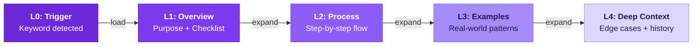
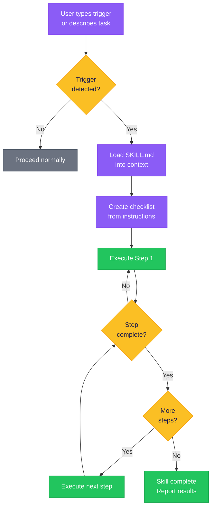
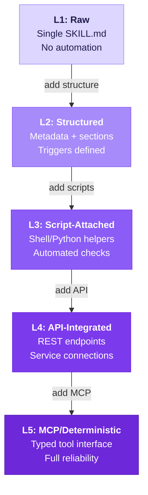

## What if you could install "common sense" into your AI?

Every developer who's worked with an AI coding assistant knows the feeling. You ask it to fix a bug, and it jumps straight to changing code — no investigation, no root cause analysis, no reproduction steps. You ask it to build a feature, and it starts typing immediately — no design discussion, no edge case consideration, no "should we even do this?"

What if you could change that? What if your AI *automatically* stopped to think before coding? If it ran through a checklist before deploying? If it followed your team's conventions without you asking every single time?

That's what **skills** are for. They're the difference between an AI that reacts and an AI that *reasons*.

## What Skills Actually Are

A skill is a **reusable, versioned workflow instruction** that you install into your AI agent's environment. Think of it like a plugin for your AI's brain — except instead of adding new capabilities (it can already write code), you're adding new *behaviours*.

Skills live as plain Markdown files called `SKILL.md`. They contain structured instructions: what to do, when to do it, how to do it, and what to check before moving on. When a skill is triggered — either by a keyword or by the AI recognizing a situation — those instructions load into the AI's context, and it follows them step by step.

The key insight: **skills don't give your AI new knowledge. They give it discipline.**

Your AI already knows how to write tests. A skill makes it write them *before* the implementation. Your AI already knows how to debug. A skill makes it find the root cause *before* proposing a fix. Your AI already knows how to brainstorm. A skill makes it ask "should we even build this?" *before* writing a single line.

## The SKILL.md Format

Here's what a real skill looks like. This is a simplified version of a brainstorming skill — one that forces design thinking before any code gets written:

```markdown
---
name: brainstorming
version: 2.1.0
triggers: [brainstorm, bs, "design before code"]
maturity: L3
---

# Brainstorming Skill

## Purpose
Explore user intent, requirements, and design BEFORE implementation.
Never start coding without brainstorming first.

## When to Activate
- User asks to create a new feature
- User wants to build a component
- User describes adding functionality
- Any request that starts with "can you make..." or "I need a..."

## Checklist (MANDATORY)
- [ ] Understand the core problem (not just the stated request)
- [ ] Identify constraints and edge cases
- [ ] Explore at least 2 approaches
- [ ] Get user confirmation before proceeding to code
- [ ] Summarize the chosen approach in plain language

## Process

### Step 1: Problem Extraction
Ask: "What problem are you actually trying to solve?"
Do NOT accept the first answer at face value. Dig deeper.

### Step 2: Constraint Discovery
Identify: timeline, tech stack constraints, performance requirements,
integration points, user expectations.

### Step 3: Approach Exploration
Generate at least 2 viable approaches. For each, list:
- Pros and cons
- Estimated complexity
- Risk factors

### Step 4: Decision Gate
Present approaches to user. Use question tool. Wait for explicit choice.
Do NOT proceed without user confirmation.

### Step 5: Summary
Write a 3-sentence summary of the chosen approach.
Save to memory before proceeding to implementation.

## Anti-Patterns (DO NOT)
- Do NOT start coding during brainstorming
- Do NOT skip the decision gate
- Do NOT assume the user's first idea is the best one
- Do NOT present only one approach
```

Every skill follows this pattern: **purpose, triggers, checklist, process, and anti-patterns**. The anti-patterns section is surprisingly important — it's the "don't do the obvious wrong thing" guardrail that prevents your AI from falling into common traps.

## Progressive Disclosure: Loading Only What You Need

Here's the clever part. Skills use **progressive disclosure** — they don't dump their entire contents into your AI's context at once. That would waste tokens and dilute focus.

Instead, skills load in layers:



- **L0** — The trigger fires. The AI knows *which* skill to use, but hasn't loaded anything yet.
- **L1** — The overview loads. Purpose, checklist, and basic structure. Enough for simple tasks.
- **L2** — The detailed process loads. Step-by-step instructions, decision trees, specific actions.
- **L3** — Examples and patterns load. Real-world cases, common variations, gotchas.
- **L4** — Deep context loads. Edge cases, historical decisions, team-specific conventions.

Most tasks only need L1 or L2. Complex, unusual situations expand to L3 or L4 automatically. This means your AI gets exactly the right amount of guidance — no more, no less.

## Trigger Words: How Skills Activate

Skills don't activate randomly. They respond to **trigger words** — specific keywords or phrases that tell the AI "this situation calls for that skill."

Some triggers are explicit. You type `brainstorm` or `tdd` or `debug`, and the corresponding skill loads. Others are implicit — the AI detects that you're about to do something that matches a skill's activation criteria, and it loads proactively.



Common triggers and what they activate:

| Trigger | Skill | What It Forces |
|---------|-------|----------------|
| `brainstorm`, `bs` | Brainstorming | Design discussion before code |
| `tdd` | Test-Driven Development | Write tests before implementation |
| `debug` | Systematic Debugging | Root cause analysis before fixing |
| `review` | Code Review | Structured feedback before merging |
| `plan` | Writing Plans | Written plan before touching code |
| `checkpoint` | Checkpoint | Save state before risky changes |

The beauty of triggers is that they work both ways. You can invoke them explicitly when you want structure: "Use TDD for this feature." But your AI can also detect situations where a skill should apply — "I notice you're about to implement a feature. Would you like me to use the brainstorming skill first?"

That second behaviour is the game-changer. It means your AI develops something resembling *judgment*.

## The Skill Factory: Building Your Own

The real power of skills isn't the ones that come pre-built. It's the ability to create your own — to encode your team's workflows, your personal preferences, your hard-won lessons into reusable instructions.

Skills evolve through five **maturity levels**, each adding more structure and reliability:



**L1 — Raw**: A single Markdown file with freeform instructions. You write what you want the AI to do, and it follows along. Good for personal experiments and one-off workflows.

**L2 — Structured**: Metadata in YAML frontmatter. Defined triggers, sections, and a checklist. The AI knows *when* to activate and *what* to check. Most skills live here — it's the sweet spot of effort versus reward.

**L3 — Script-Attached**: Shell scripts and Python helpers that the skill can invoke. Instead of telling the AI "run the tests," the skill includes a script that *actually runs the tests and parses the output*. This removes ambiguity and makes the workflow more deterministic.

**L4 — API-Integrated**: The skill connects to external services — reads from a dashboard API, posts to a project management tool, queries a database. Your AI doesn't just follow instructions; it interacts with your infrastructure.

**L5 — MCP/Deterministic**: The skill becomes a full Model Context Protocol server with typed tool interfaces. At this level, skills are essentially software — versioned, tested, reliable. They behave the same way every time.

You don't need to start at L5. Most teams get enormous value from L2 skills — just writing down "here's how we do things" and having the AI follow it consistently. The staircase exists so you can evolve skills gradually, adding more structure as a workflow proves its value.

## Real Skills in Action

Let me show you three skills that completely changed how I work with AI agents.

### The Brainstorming Skill

**Without it**: You say "build me a user auth system." The AI starts writing JWT middleware. You realize you wanted OAuth with Google. You rewrite everything.

**With it**: You say "build me a user auth system." The AI *stops* and asks: "What problem are you solving? Who are the users? Do you need social login, email/password, or both? What's your session strategy?" Five minutes of questions save two hours of rework.

The brainstorming skill forces a decision gate before any code. It presents at least two approaches, lists trade-offs, and waits for your explicit go-ahead. It's the "measure twice, cut once" of AI-assisted development.

### The TDD Skill

**Without it**: You say "fix the login bug." The AI changes three files. Two new bugs appear. You fix those. Three more appear. Welcome to whack-a-mole.

**With it**: You say "fix the login bug." The AI writes a test that reproduces the bug first. The test fails. Then it makes the minimal change to make the test pass. Then it checks that all existing tests still pass. One change, verified, done.

The TDD skill enforces the red-green-refactor cycle. It creates a todo list before touching code. Each item in the list is a test. Implementation only begins when the failing test exists. It's slower for the first fix, but dramatically faster over time because you stop introducing regressions.

### The Debugging Skill

**Without it**: You say "the API returns 500 errors." The AI suggests checking the logs, restarting the server, and updating dependencies — three shots in the dark.

**With it**: You say "the API returns 500 errors." The AI follows a systematic root cause analysis: reproduce the error, isolate the failing component, trace the execution path, identify the specific line, understand *why* it fails, then — and only then — propose a fix.

The debugging skill prohibits guessing. Its anti-patterns section explicitly says: "Do NOT propose fixes before identifying the root cause. Do NOT suggest restarting services as a first step. Do NOT change multiple things at once." It's the scientific method, encoded as an AI workflow.

## Why This Matters

Skills solve the fundamental problem of AI-assisted development: **consistency**. Without skills, your AI is brilliant but unpredictable. Sometimes it writes great code. Sometimes it skips tests. Sometimes it asks great questions. Sometimes it just starts building.

Skills make the good behaviour automatic and the bad behaviour impossible. They turn "I hope the AI does the right thing" into "the AI *will* do the right thing, because I taught it how."

And here's the thing that surprised me: the act of writing skills made *me* a better developer. When you sit down to write a debugging skill, you have to actually think about your debugging process. What do you do first? What do you never do? What's the sequence that actually works? Articulating that process — even just to teach an AI — crystallizes knowledge you didn't realize you had.

Skills aren't just for AI. They're for us.

---

*This is Post 4 in **The Agentic Stack** series — a practical guide to building AI-powered development workflows. Read the full series to learn how prompts, memory, skills, and orchestration combine to turn an AI chatbot into a reliable engineering partner.*