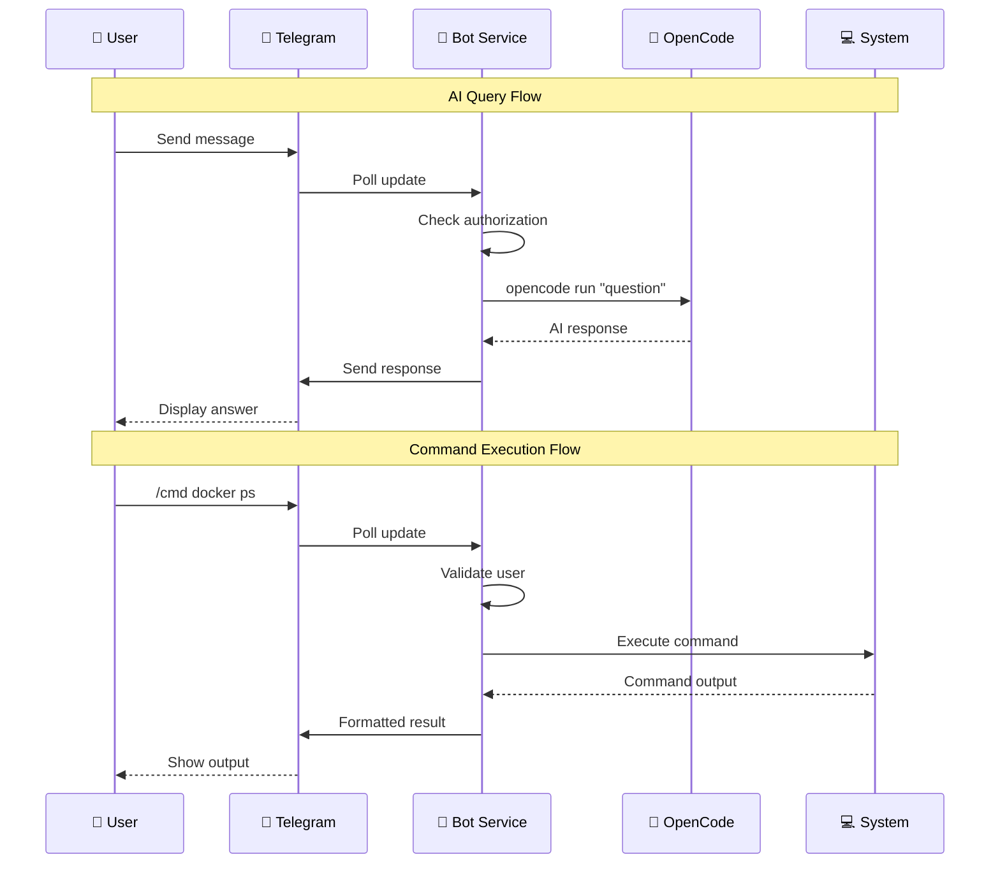
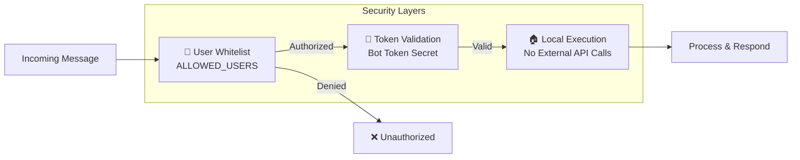

Building a bridge between Telegram and OpenCode creates a powerful mobile AI assistant that can answer questions, run commands, and manage your server from anywhere. This guide covers the complete setup with architecture diagram.

## Architecture Overview

The integration uses a **polling-based Telegram bot** that connects to the **OpenCode CLI** for AI responses. It runs as a systemd service on the host machine, providing direct access to system commands and Docker containers.

```mermaid
flowchart TB
    subgraph External["External Services"]
        TG[📱 Telegram App<br/>Mobile/Desktop]
        API[Telegram Bot API<br/>api.telegram.org]
    end

    subgraph Server["Your Server"]
        subgraph Systemd["Systemd Service"]
            BOT[🤖 telegram-bot.service<br/>/opt/telegram-bot/bot.py]
        end
        
        subgraph Commands["Command Handlers"]
            ASK[/ask - AI Chat]
            CMD[/cmd - Shell Execute]
            RUN[/run - Predefined Actions]
            MEM[/remember - Memory Store]
            STATUS[/status - System Info]
        end
        
        subgraph Core["OpenCode Engine"]
            OC[OpenCode CLI<br/>/root/.opencode/bin/opencode]
            MODEL[Model: gemini-2.5-flash<br/>Timeout: 180s]
        end
        
        subgraph Storage["Local Storage"]
            LOGS[📝 Logs<br/>/opt/telegram-bot/logs/]
            MEMORY[🧠 Memory Files<br/>/opt/telegram-bot/memory/]
        end
        
        subgraph System["System Resources"]
            DOCKER[🐳 Docker]
            SHELL[💻 Shell Commands]
        end
    end

    TG <-->|Polling| API
    API <-->|Long Polling| BOT
    BOT --> ASK & CMD & RUN & MEM & STATUS
    ASK --> OC
    OC --> MODEL
    CMD --> SHELL
    RUN --> SHELL & DOCKER
    BOT --> LOGS
    MEM --> MEMORY
    SHELL & DOCKER --> STATUS
```

## Data Flow Diagram



## Available Commands

| Command | Purpose | Example |
|---------|---------|---------|
| `/start` | Show welcome and help | `/start` |
| `/ask` | Ask OpenCode a question | `/ask explain docker networking` |
| `/cmd` | Execute shell command | `/cmd docker ps` |
| `/run` | Run predefined action | `/run health` |
| `/remember` | Save to memory file | `/remember user prefers vim` |
| `/memory` | View memory files | `/memory user` |
| `/status` | System overview | `/status` |

## Predefined Actions

The `/run` command provides quick system operations:

| Action | Description |
|--------|-------------|
| `health` | Container health status |
| `space` | Disk usage analysis |
| `uptime` | System uptime and memory |
| `containers` | List running containers |
| `logs` | Recent system logs |
| `cleanup` | Docker cleanup (prune) |
| `restart_failed` | Restart stopped containers |

## Installation Steps

### 1. Create Telegram Bot

1. Open Telegram and search for `@BotFather`
2. Send `/newbot` and follow the prompts
3. Save the **bot token** (format: `123456789:ABC...`)

### 2. Get Your Chat ID

```bash
# Start a conversation with your bot first
curl -s "https://api.telegram.org/bot<YOUR_TOKEN>/getUpdates" | python3 -m json.tool
# Look for "chat": {"id": 123456789}
```

### 3. Create Directory Structure

```bash
mkdir -p /opt/telegram-bot/{data,logs,memory}
python3 -m venv /opt/telegram-bot/venv
/opt/telegram-bot/venv/bin/pip install python-telegram-bot==22.5
```

### 4. Create Systemd Service

```bash
cat > /etc/systemd/system/telegram-bot.service << 'EOF'
[Unit]
Description=OpenCode Telegram Bot
After=network.target

[Service]
Type=simple
User=root
WorkingDirectory=/opt/telegram-bot
Environment="TELEGRAM_BOT_TOKEN=YOUR_TOKEN_HERE"
Environment="TELEGRAM_CHAT_ID=YOUR_CHAT_ID"
Environment="ALLOWED_USERS=YOUR_CHAT_ID"
ExecStart=/opt/telegram-bot/venv/bin/python /opt/telegram-bot/bot.py
Restart=always
RestartSec=10

[Install]
WantedBy=multi-user.target
EOF
```

### 5. Enable and Start

```bash
systemctl daemon-reload
systemctl enable telegram-bot
systemctl start telegram-bot
```

## Security Model



### Security Considerations

- **User Whitelist**: Only `ALLOWED_USERS` can interact with the bot
- **Token Security**: Bot token must be kept secret
- **Root Access**: Bot runs as root for Docker access—restrict who can use `/cmd`
- **Command Injection**: The `/cmd` endpoint allows arbitrary commands—use carefully

## Memory System

The bot maintains persistent memory files in `/opt/telegram-bot/memory/`:

| File | Purpose |
|------|---------|
| `user.md` | User preferences and profile |
| `memory.md` | Long-term facts and decisions |
| `soul.md` | Bot personality configuration |
| `agent.md` | Behavioral rules |
| `notes.md` | General notes |

### Using Memory

```bash
# Save a preference
/remember user prefers dark mode

# View memory
/memory user

# Save important information
/remember memory API endpoint is https://api.example.com
```

## Usage Examples

### AI Chat

```
User: What model are you running?
Bot: I'm powered by gemini-2.5-flash through OpenCode CLI...
```

### System Monitoring

```
User: /status
Bot:
*System Status*

Uptime: `up 15 days`
Load: `0.45 0.52 0.48`
Memory: `3.2G/15G`
Disk: `120G/500G (24%)`
Containers: `12`
```

### Container Management

```
User: /run health
Bot:
portainer: healthy
homepage: running
nginx: running
hugo: running
...
```

## CLI Helper Script

For sending notifications from scripts or cron jobs:

```bash
#!/bin/bash
# send-telegram.sh
TOKEN="${TELEGRAM_BOT_TOKEN}"
CHAT_ID="${TELEGRAM_CHAT_ID}"

# Send message
curl -s -X POST "https://api.telegram.org/bot${TOKEN}/sendMessage" \
  -d chat_id="${CHAT_ID}" \
  -d text="$1" \
  -d parse_mode="Markdown"
```

### Cron Integration

```bash
# Daily backup notification
0 2 * * * /opt/telegram-bot/send-telegram.sh "Backup completed: $(date)"
```

## Troubleshooting

| Issue | Solution |
|-------|----------|
| Bot not responding | Check `systemctl status telegram-bot` |
| OpenCode timeouts | Simplify questions, check 180s timeout |
| Empty responses | Verify OpenCode binary exists at `/root/.opencode/bin/opencode` |
| Unauthorized messages | Verify Chat ID in `ALLOWED_USERS` |

### Useful Commands

```bash
# Real-time logs
journalctl -u telegram-bot -f

# Check service status
systemctl status telegram-bot

# Test OpenCode directly
/root/.opencode/bin/opencode run "hello"

# View chat history
cat /opt/telegram-bot/logs/chat-$(date +%Y-%m-%d).log
```

## Conclusion

This integration transforms Telegram into a powerful AI-powered system administration tool. The combination of OpenCode's intelligence with direct system access creates a versatile assistant for remote server management.

Key benefits:
- **Mobile Access**: Manage servers from anywhere via Telegram
- **AI-Powered**: Natural language queries converted to actionable responses
- **Secure**: User whitelist and token-based authentication
- **Extensible**: Easy to add new commands and actions
- **Persistent Memory**: Bot remembers preferences and important information

The polling-based architecture ensures reliability without requiring open ports or webhook configurations, making it suitable for servers behind NAT or firewalls.