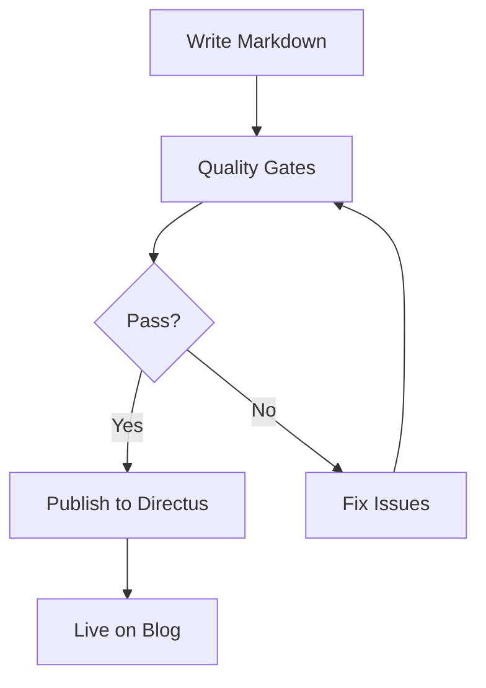
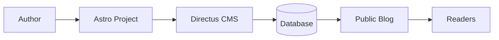
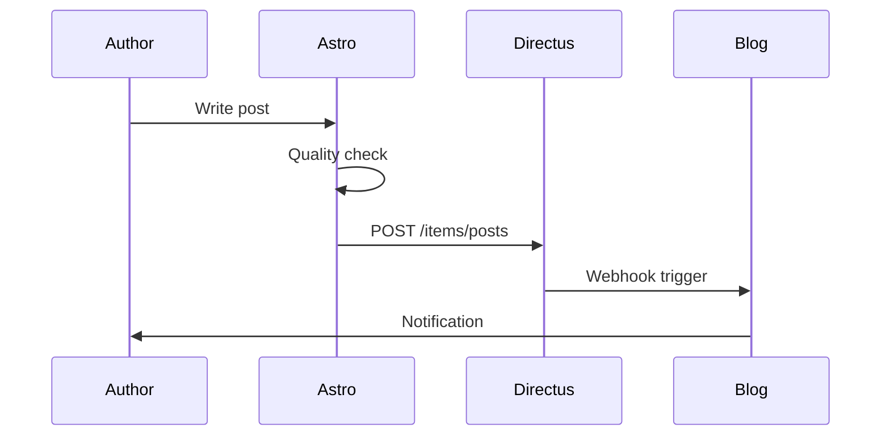
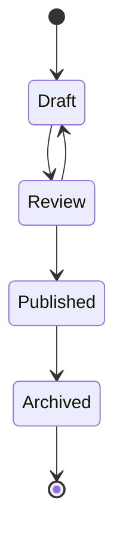

This is a test blog post demonstrating various diagram types supported in Astro.

## System Architecture

Here is a flowchart showing the blog publishing pipeline:



## Data Flow Diagram

How content moves through the system:



## Chart.js Example

Interactive doughnut chart:

```chart
{
  "type": "doughnut",
  "data": {
    "labels": ["Development", "Writing", "Review", "Publishing"],
    "datasets": [{"data": [40, 25, 20, 15]}]
  }
}
```

## Sequence Diagram

The publishing workflow over time:



## State Diagram

Blog post lifecycle:



## Summary

This test demonstrates:
- Flowcharts for processes
- Graphs for relationships
- Sequence diagrams for workflows
- State diagrams for lifecycles
- Chart.js for data visualization