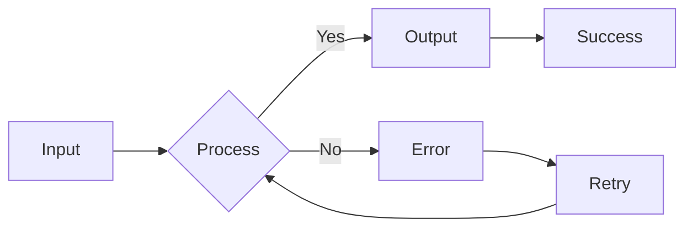
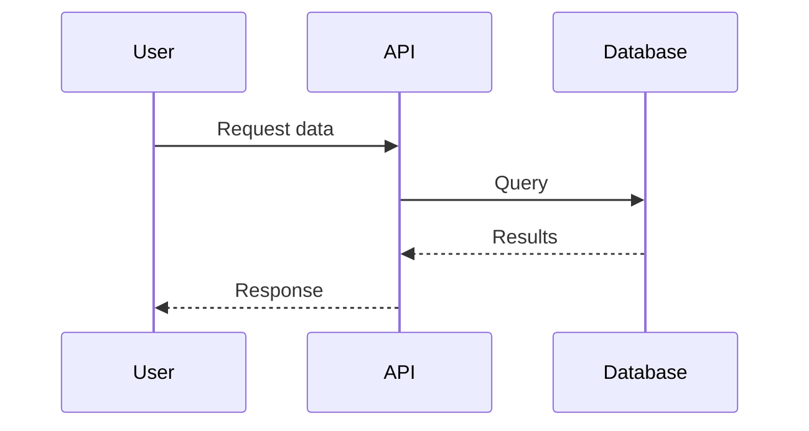

# Test: Mermaid Diagrams & Chart.js

This post tests rendering of Mermaid diagrams and Chart.js charts.

## Mermaid Flowchart



## Mermaid Sequence Diagram



## Chart.js Doughnut

```chart
{
  "type": "doughnut",
  "data": {
    "labels": ["Completed", "In Progress", "Pending"],
    "datasets": [{
      "data": [60, 25, 15],
      "backgroundColor": ["#4ade80", "#fbbf24", "#f87171"]
    }]
  },
  "options": {
    "responsive": true,
    "plugins": {
      "title": {
        "display": true,
        "text": "Task Status Distribution"
      }
    }
  }
}
```

## Chart.js Bar Chart

```chart
{
  "type": "bar",
  "data": {
    "labels": ["Mon", "Tue", "Wed", "Thu", "Fri"],
    "datasets": [{
      "label": "Tasks Completed",
      "data": [12, 19, 8, 15, 22],
      "backgroundColor": "#3b82f6"
    }]
  },
  "options": {
    "responsive": true,
    "plugins": {
      "title": {
        "display": true,
        "text": "Weekly Progress"
      }
    }
  }
}
```

---

**Tags:** test, diagrams, charts
**Categories:** technical