> This post is part of the [Knowledge Crystallization series](/posts/knowledge-crystallization-series).
> See also: [From Ad-Hoc to Deterministic](/posts/from-adhoc-to-deterministic-evolution-of-ai-skills) | [eRAG v2.2](/posts/erag-v22-building-second-brain-for-agent-projects) | [The Recursion Principle](/posts/kc-06-recursion)

---

## The Big Picture

I run 69 skills, 52 Docker containers, and a PostgreSQL memory bank with 1,520+ memories. None of that works by accident. It works because five **meta-factories** sit above every skill, agent, project, research task, and menu — enforcing schemas, driving consistency, and making the entire system deterministic enough that even a 7B-parameter model can operate it correctly.

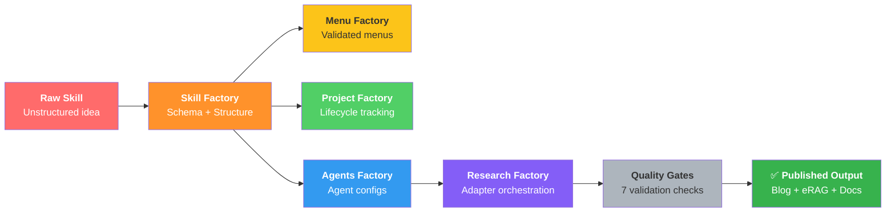

This post is a comprehensive walkthrough of all five factories: what they do, how they connect, the schemas that bind them, and why the architecture matters.

---

## The Problem: Why Factories?

Before the factory pattern, every skill in the ecosystem evolved independently. That sounds liberating — and for a while, it is. But at scale, independence becomes chaos:

- **Skill Factory** was a 2,910-line monolith with no progressive disclosure
- **Project tracking** lived in scattered markdown files with no schema
- **Agent configurations** were ad-hoc YAML with no validation
- **Research tasks** had no quality gates, no scheduling, no lifecycle
- **Menus** were inconsistent — 3 options here, 12 there, no shared suffix

The common thread: **every domain was reinventing the same wheels** — lifecycle management, schema validation, progressive disclosure, quality assurance, and export/publishing. Each did it differently. Each had different bugs.

Factories solve this by extracting the shared patterns into reusable control planes. Each factory is a **hub**; the domain-specific skills it orchestrates are **spokes**. The hub enforces the schema. The spoke does the actual work. Neither touches the other's concerns.

---

## Factory 1: Skill Factory (v2.0, L4)

**Trigger:** `sf` | `skill-factory` | `skill-create`
**Files:** 18 | **SKILL.md:** 325 lines (hub) + ~2,800 lines (context spokes)

### What It Does

Skill Factory creates and evolves every skill in the ecosystem. It enforces:

- **Consistent filing structure** (`SKILL.md`, `context/`, `scripts/`, `templates/`, `history/`)
- **Progressive disclosure** (load only the context file you need)
- **skill.yaml generation** (machine-readable metadata)
- **Evolution protocol** (L1 → L5 maturity ladder)
- **Testing and validation** (structure checks, link validation)

### The Hub-and-Spoke Structure

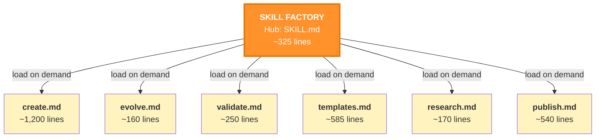

The hub is ~325 lines. That's intentional — it fits in a single context window load. When you need the deep protocol for creating a skill, you load `context/create.md` (~1,200 lines). When you need to validate, you load `context/validate.md`. **You never load everything at once.**

### Evolution Ladder

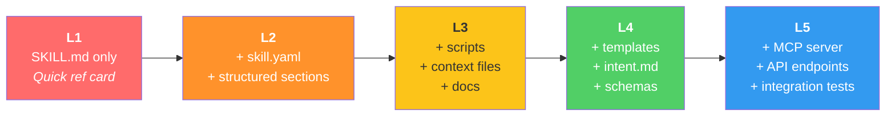

### skill.yaml — The Machine-Readable Contract

Every skill above L2 has a `skill.yaml` that declares its identity, dependencies, files, features, triggers, and menu configuration:

```yaml
name: skill-factory
version: 2.0.0
maturity: L4
triggers: [skill-factory, sf, skill-create]
category: meta
dependencies:
  required: [question-tool, pyyaml, jsonschema]
  skills: [skill-discovery, skill-improver]
features:
  intent_capture: true
  progressive_disclosure: true
  evolution_protocol: true
  hub_spoke_architecture: true
```

This isn't documentation — it's a **contract** that other factories can parse and validate against.

---

## Factory 2: Menu Factory (v2.0, L3)

**Trigger:** `mf` | `menu-factory` | `menu-create`
**Files:** 100 | **SKILL.md:** 669 lines

### What It Does

Menu Factory is the single source of truth for every menu presented by every skill. It enforces:

- **Maximum options** (5 mobile, 8 desktop)
- **Domain range** (2–4 domain-specific options per menu)
- **Standardised suffix** (Defer, Suggest, Discovery, Reminder — auto-appended)
- **Format rules** (labels ≤25 chars, descriptions ≤40 chars)
- **Lead with Recommended** (first option should be the AI's recommendation)

### The Global Config

`rules/global-config.json` is the single source of truth:

```json
{
  "max_options": { "mobile": 5, "desktop": 8 },
  "domain_options_range": [2, 4],
  "suffix": [
    { "id": "defer", "label": "⏳ Defer", "description": "Save for later" },
    { "id": "suggest", "label": "💡 Suggest", "description": "AI picks best option" },
    { "id": "discovery", "label": "🔍 Discovery", "description": "Related skills & docs" },
    { "id": "reminder", "label": "📌 Reminder", "description": "Show system reminders" }
  ],
  "format": { "label_max": 25, "description_max": 40, "lead_with_recommended": true }
}
```

### Inheritance Protocol

Every skill follows the same menu-building process:

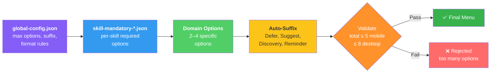

1. Read `global-config.json`
2. Inject skill-mandatory options (if any)
3. Add 2–4 domain-specific options
4. Auto-append suffix
5. Validate: total ≤ 5 (mobile) / ≤ 8 (desktop)

### The Menu Builder Script

`scripts/menu_builder.py` automates menu generation:

```bash
python3 menu_builder.py --domain skill --device mobile
```

It reads the global config, merges domain options, conditionally includes the Reminder suffix (based on whether system reminders are active), and outputs a validated menu.

### Why This Matters

Without Menu Factory, every skill invents its own menu format. Some use 3 options, some use 15. Some have an exit option, some don't. The suffix (Defer, Suggest, Discovery) was added ad-hoc to some skills and forgotten in others. Menu Factory makes consistency **free** — every skill gets the same rules by default.

---

## Factory 3: Project Factory (v1.2, L2)

**Trigger:** `pf` | `project-factory` | `project-create`
**Files:** 13 | **SKILL.md:** 270 lines

### What It Does

Project Factory manages multi-phase projects with schema-driven structure and phase-aware skill loading. It enforces:

- **Deterministic lifecycle** (Idea → Plan → Active → Harvest → Rest)
- **Phase-aware skills** (each phase loads only the skills it needs)
- **Append-only tracking** (decisions, blog posts, memories accumulate)
- **Supplemental context** (webpages, blog articles, eRAG topics, research tasks)
- **Shopping/BOM tracking** (budget, items, sources, statuses)

### The Schema

All projects conform to `context/schema.yaml`. Key sections:

```yaml
project:
  id: string
  title: string
  status: idea | plan | active | harvest | rest
  priority: high | medium | low

  phases:
    idea:    { skills: [brainstorming, research] }
    plan:    { skills: [writing-plans, skill-factory] }
    active:  { skills: [astro, telegram] }
    harvest: { skills: [sync-docs, validate-delivery] }
    rest:    { notes: string }

  shopping:
    budget_total: number
    items:
      - item, quantity, estimated_cost, actual_cost, status, source, url

  context:
    webpages: [...]
    blog_articles: [...]
    erag_topics: [...]
    research_tasks: [...]
```

### Lifecycle Flow

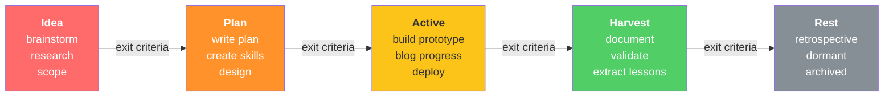

Each phase has **exit criteria** that must be met before advancing. You can't skip to Active without a plan. You can't Harvest without a prototype.

### Active Projects

Currently tracked projects include:

| Project | Status | Description |
|---------|--------|-------------|
| evolution | Rest | Meta-project tracking ecosystem evolution |
| modular-stacked-greenhouse | Tracked | Physical greenhouse build |
| diy-cnc-gantry | Tracked | CNC machine project |
| consultancy | Tracked | Consulting business |
| bot | Tracked | Bot development |
| lockdown | Tracked | Security project |
| garage-tidy | Tracked | Home improvement |

### The `pf` CLI

```bash
pf new <name>           # Create project
pf list                 # View all projects
pf status <name>        # View project details
pf advance <name>       # Advance to next phase (validates exit criteria)
pf update <name> --decision "text"  # Append tracking
pf context <name>       # Manage supplemental context
pf archive <name>       # Move to history
```

---

## Factory 4: Agents Factory (v1.1, L4)

**Trigger:** `af` | `agents-factory` | `agent-create`
**Files:** 33 | **SKILL.md:** 248 lines

### What It Does

Agents Factory creates, validates, and exports AI agent configurations as OpenCode subagent types. It enforces:

- **Pydantic validation** (every agent validated against a strict schema)
- **Agent-Harness separation** (agents reference harnesses by ID)
- **Export targets** (OpenCode config or standalone script)
- **Tracking** (runs, decisions, signal tracking)

### Architecture

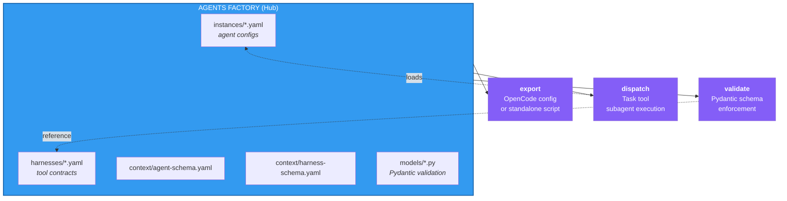

### Agent-Harness Separation

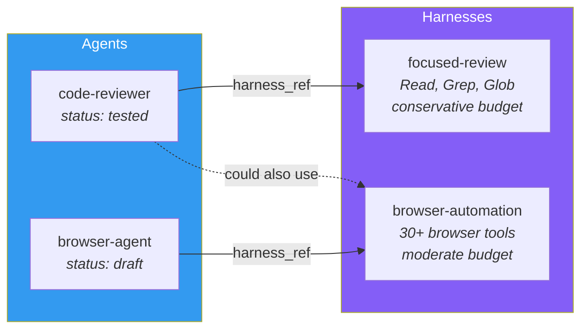

### Current Agents

| Agent | Status | Harness | Purpose |
|-------|--------|---------|---------|
| code-reviewer | Tested | focused-review | Code quality, security, best practices |
| browser-agent | Draft | browser-automation | UI testing, visual validation |

### Current Harnesses

| Harness | Tools | Context Budget | Purpose |
|---------|-------|----------------|---------|
| focused-review | Read, Grep, Glob | Conservative | Single-purpose review agents |
| browser-automation | 30+ browser tools | Moderate | Browser-based UI testing |

### Agent Schema (Excerpt)

```yaml
id: code-reviewer
title: "Code Review Specialist"
version: "1.0.0"
status: tested | production | archived

identity:
  role: "Senior code reviewer..."
  communication_style: concise
  personality_traits: [thorough, constructive, security-conscious]

tools:
  allowed: [Read, Grep, Glob]
  restricted: [Write]

parameters:
  model: glm-5.1
  temperature: 0.3
  max_tokens: 8000
  subagent_type: CodeReviewer

harness_ref: focused-review
export_targets: [opencode, standalone_script]
```

The `restricted: [Write]` line means the code reviewer literally cannot modify files. It can only read and report. This is enforced at the harness level — the agent's observation format requires `status`, `summary` as output fields.

---

## Factory 5: Research Factory (v1.1, L4)

**Trigger:** `rf` | `research-factory` | `research-create`
**Files:** 23 | **SKILL.md:** 355 lines

### What It Does

Research Factory is the most complex factory — a unified control plane for creating, executing, scheduling, improving, and publishing research across multiple adapters. It enforces:

- **Adapter registry** (6 categories mapping to skill combinations)
- **Quality gates** (7 gates covering source diversity, recency, bias, coverage)
- **Cron scheduling** (research runs on autopilot)
- **Instance lifecycle** (idea → active → mature → complete → archived)
- **Project linking** (research feeds into projects)

### Adapter Registry

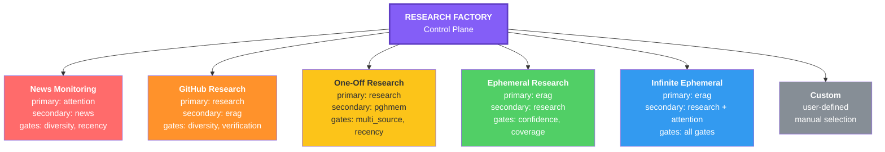

Each category automatically selects the right adapter combination, tools, and quality gates. You don't choose the adapter — you choose the **category**, and the factory handles the rest.

### Quality Gates

Seven gates validate research quality:

| Gate | Check | Default Threshold |
|------|-------|--------------------|
| `source_diversity` | Unique source domains ≥ min_sources | 3 |
| `recency` | Majority of sources within recency_max_days | 90 days |
| `multi_source` | Findings corroborated by 2+ independent sources | 2 per claim |
| `verification` | Key claims verified against primary sources | 1 primary per finding |
| `confidence_tier` | All findings tagged with confidence level | All tagged |
| `coverage` | Coverage score ≥ threshold | 0.7 |
| `search_quality` | Search queries returned sufficient results | 70% hit rate |
| `bias_check` | Multiple perspectives on contentious topics | When enabled |

### Status Promotion

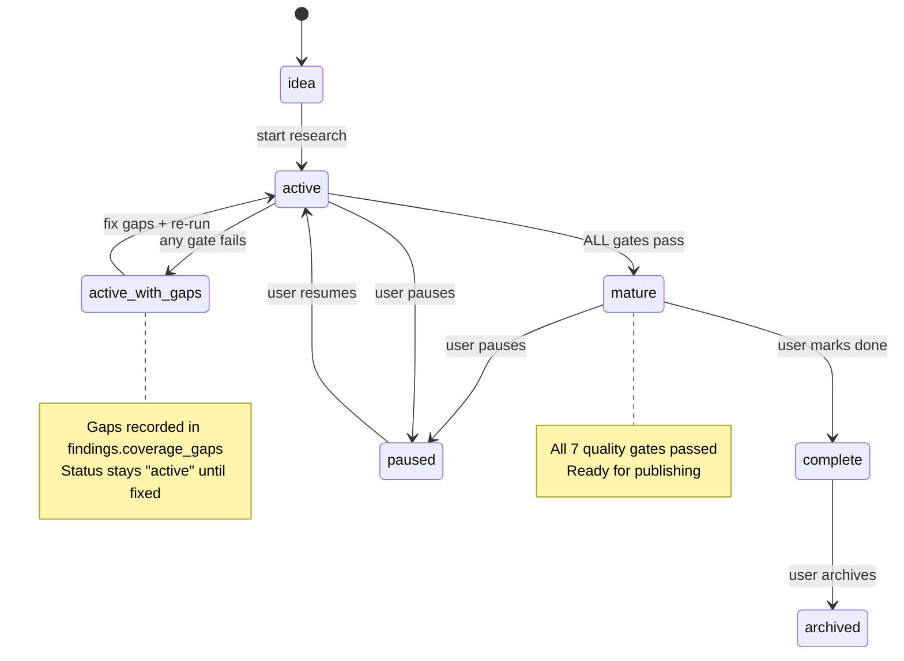

Research can only advance to `mature` when **all** quality gates pass. Any gate failure records gaps and keeps the status at `active`.

### Instance Schema

A research instance captures everything needed for reproducible research:

```yaml
id: test-rf-validation
title: "Research Factory Validation"
category: one-off-research
status: idea | active | mature | complete | paused | archived

adapters:
  primary: research
  config:
    memory_search_first: false
    store_findings: erag
    max_sources: 5

quality:
  min_sources: 2
  require_cross_reference: false

schedule:
  frequency: null  # or cron expression
  next_run: null

findings:
  erag_topic: null
  summaries: []
  coverage_gaps: []

signal_tracking:
  enabled: true
  signals: []
  aggregates:
    top_selections: {}
```

---

## The Shared Patterns

All five factories share common architectural patterns. These aren't coincidences — they're extracted from the same principles.

### 1. Hub-and-Spoke

Every factory is a hub (~250–670 lines). Deep documentation lives in spoke files (`context/*.md`). You load only what you need.

### 2. Schema-Driven

Every entity (skill, agent, project, research instance, menu) has a schema. Schemas are validated at creation time, not at runtime. Pydantic models enforce the schema where Python is involved.

### 3. Progressive Disclosure

L0 (hub only) → L1 (hub + 1 context file) → L2 (hub + scripts) → L3 (hub + full docs) → L4 (hub + templates + schemas). The hub always fits in a single context load.

### 4. Lifecycle Management

Every entity has a status lifecycle with exit criteria:

```mermaid
graph LR
    subgraph Skills
        S1[L1] --> S2[L2] --> S3[L3] --> S4[L4] --> S5[L5]
    end

    subgraph Projects
        P1[Idea] --> P2[Plan] --> P3[Active] --> P4[Harvest] --> P5[Rest]
    end

    subgraph Agents
        A1[Draft] --> A2[Tested] --> A3[Production] --> A4[Archived]
    end

    subgraph Research
        R1[Idea] --> R2[Active] --> R3[Mature] --> R4[Complete] --> R5[Archived]
    end

    style S1 fill:#ff6b6b,color:#fff
    style S2 fill:#ff922b,color:#fff
    style S3 fill:#fcc419,color:#333
    style S4 fill:#51cf66,color:#fff
    style S5 fill:#339af0,color:#fff
    style P1 fill:#ff6b6b,color:#fff
    style P2 fill:#ff922b,color:#fff
    style P3 fill:#fcc419,color:#333
    style P4 fill:#51cf66,color:#fff
    style P5 fill:#868e96,color:#fff
    style A1 fill:#ff6b6b,color:#fff
    style A2 fill:#fcc419,color:#333
    style A3 fill:#51cf66,color:#fff
    style A4 fill:#868e96,color:#fff
    style R1 fill:#ff6b6b,color:#fff
    style R2 fill:#ff922b,color:#fff
    style R3 fill:#51cf66,color:#fff
    style R4 fill:#339af0,color:#fff
    style R5 fill:#868e96,color:#fff
```

### 5. Tracking & History

Append-only tracking. Decisions, runs, blog posts, and memories accumulate. Nothing is deleted — it's archived.

### 6. Dependency Declaration

Every factory declares its dependencies explicitly: required tools, optional skills, and cross-factory references.

---

## How They Connect

The factories aren't isolated — they form a dependency graph:

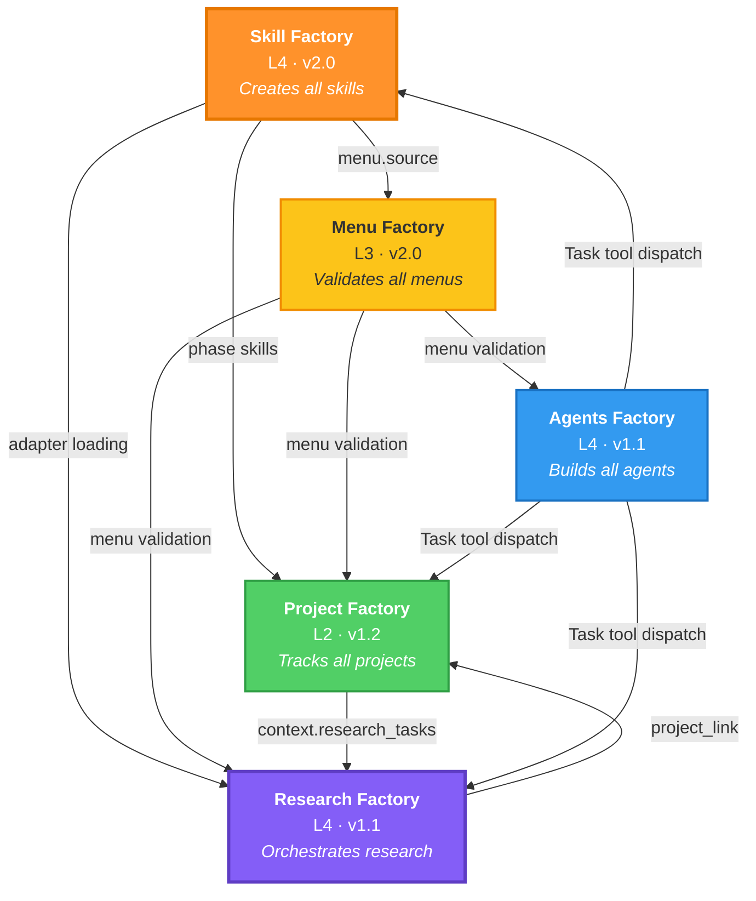

- **Skill Factory** is the foundation — every factory is a skill created by it
- **Menu Factory** provides menu validation to all other factories
- **Project Factory** can link to research tasks managed by Research Factory
- **Agents Factory** produces agents that execute tasks in any factory
- **Research Factory** is the top consumer — it orchestrates research, erag, attention, and news

### Cross-Factory References

| From | To | How |
|------|-----|-----|
| Skill Factory | Menu Factory | `menu.source` in skill.yaml |
| Project Factory | Skill Factory | Phase-specific skill loading |
| Project Factory | Research Factory | `context.research_tasks` |
| Research Factory | Skill Factory | Adapter skill loading |
| Research Factory | Project Factory | `project_link` field |
| Agents Factory | Any Factory | Agent dispatch via Task tool |

---

## The Numbers

| Metric | Value |
|--------|-------|
| Total factory files | 187 |
| Total SKILL.md lines | 1,867 |
| Total context/doc lines | ~6,000+ |
| Active agents | 2 |
| Active harnesses | 3 |
| Active projects | 7 |
| Research categories | 6 |
| Quality gates | 7 |
| Menu suffix options | 4 |
| Menu templates | 4 |

---

## Why This Architecture Matters

### Determinism Over Cleverness

The entire system is designed so that a 7B-parameter model can operate it correctly. Schemas enforce what the model must produce. Progressive disclosure prevents context overflow. Exit criteria prevent premature advancement. The factory is the guardrail.

### Monetisation Through Reuse

Every skill, agent, research instance, and project is a reusable asset. The Blog skill turns research into published content. The Agents Factory turns a harness into a dispatchable worker. The Project Factory turns an idea into a tracked, bloggable project. Each factory is an assembly line that converts raw work into publishable, monetisable output.

### Self-Improvement

The factories improve themselves. Skill Factory evolves skills from L1 to L5. Research Factory's quality gates catch low-quality output and flag it for improvement. Project Factory tracks decisions and extracts lessons during Harvest. The system gets better every time it runs.

### Open Source Ready

Every schema, template, and protocol is in plaintext YAML/JSON/Markdown. No proprietary formats. No vendor lock-in. The entire factory ecosystem can be forked, adapted, and deployed by anyone running OpenCode, Claude Code, or any AI CLI that supports skill files.

---

## The Pipeline


---

## What's Next

| Factory | Current | Next Milestone |
|---------|---------|---------------|
| Skill Factory | L4, v2.0 | L5 with MCP server integration |
| Menu Factory | L3, v2.0 | L4 with usage analytics dashboard |
| Project Factory | L2, v1.2 | L3 with automated phase transitions |
| Agents Factory | L4, v1.1 | v2.0 with multi-agent orchestration |
| Research Factory | L4, v1.1 | v1.2 with automated cron scheduling |

---

*Built with the Skill Factory, validated by the Menu Factory, tracked by the Project Factory, powered by the Agents Factory, researched by the Research Factory. Recursion isn't a bug — it's the architecture.*