# Understanding Your OpenCode System Architecture

## Overview

Your OpenCode setup is a sophisticated, multi-layered AI orchestration system that combines specialized agents, skills, Fabric patterns, MCP servers, and comprehensive global rules. At the center of it all is **Sisyphus**, your main orchestrating agent who coordinates everything seamlessly.

This architectural breakdown will help you understand how all components work together to provide an intelligent, context-aware, and highly capable AI assistance system.

## System Architecture Diagram

```mermaid
graph TB
    subgraph OpenCode["OpenCode Core System"]
        Sisyphus[Sisyphus<br/>Main Agent<br/>Orchestrator]
        GR[Global Rules<br/>Core Protocols<br/>& Instructions]
    end

    subgraph Agents["Specialized Agents (1)"]
        MAR[mobile-app-research<br/>iOS & Android<br/>Project Research]
    end

    subgraph Skills["Skills (28 Specialized Skills)"]
        opencodeskill[opencodeskill<br/>OpenCode Config<br/>Oh-My-OpenCode Plugin]
        homarr[homarr-configuration<br/>Dashboard Management<br/>& Docker Integration]
        update-gr[update-gr<br/>Global Rules<br/>Management]
        todo[todo<br/>Todo Lists<br/>OpenMemory Sync]

        activepieces[activepieces<br/>Workflow Automation<br/>& API Integrations]
        advanced-research[advanced-research<br/>Deep Research<br/>Methodology]
        affine[affine<br/>Knowledge Base<br/>Workspace Tool]
        agent-browser[agent-browser<br/>Browser Automation<br/>95% Success Rate]
        copyparty[copyparty<br/>File Server<br/>Indexing & Search]
        copyparty-copy[copyparty-copy<br/>File Server<br/>Test Copy]
        copyparty-test[copyparty-test<br/>Skill Testing<br/>Validation]
        crawl4ai[crawl4ai<br/>Web Scraping<br/>AI-Powered Extraction]
        databases[databases<br/>Comprehensive DB<br/>Management Suite]
        dokploy[dokploy<br/>Deployment Platform<br/>Application Management]
        filebrowser[filebrowser<br/>Web-Based<br/>File Manager]
        hugo[hugo<br/>Static Site<br/>Generator & Management]
        hugo-mermaid-fix[hugo-mermaid-fix<br/>Mermaid Diagram<br/>Troubleshooting]
        kavita[kavita<br/>Digital Library<br/>Book Management]
        memos[memos<br/>Note-Taking<br/>Service Management]
        memorymanager[memorymanager<br/>Memory Optimization<br/>& Maintenance]
        mindsdb[mindsdb<br/>ML Database<br/>Machine Learning]
        openmemory[openmemory<br/>Semantic Memory<br/>Storage & Retrieval]
        portainer[portainer<br/>Container<br/>Management Platform]
        transcription[transcription<br/>Audio Transcription<br/>YouTube/API]
        ralph-loop-mine[ralph-loop-mine<br/>Autonomous<br/>Iterative Development]
        research[research<br/>Research<br/>Methodology]
        skill-pattern-discoverer[skill-pattern<br/>Discoverer<br/>Pattern Analysis]
        system-review[system-review<br/>System<br/>Evaluation]
        test-skill[test-skill<br/>Skill Testing<br/>& Validation]
        freya[freya<br/>T-Shirt Bleaching<br/>Reverse Tie-Dye]
        ui-ux-pro-max[ui-ux-pro-max<br/>UI/UX Design<br/>50 Styles & Palettes]
        wordpress-management[wordpress-management<br/>CMS Management<br/>WP-CLI Operations]
        openmemory-backup-restore[openmemory-backup-restore<br/>Memory Backup<br/>& Restore]
    end

    subgraph FabricPatterns["Fabric Patterns (240 Patterns)"]
        Analysis[<b>Analysis</b><br/>20+ Patterns<br/>Claims, Logs, Papers<br/>Incidents, Debates]
        Creation[<b>Creation</b><br/>40+ Patterns<br/>Essays, PRs, Summaries<br/>Concepts, Features]
        Extraction[<b>Extraction</b><br/>30+ Patterns<br/>Wisdom, Insights<br/>Patterns, Ideas]
        Improvement[<b>Improvement</b><br/>4 Patterns<br/>Prompts, Writing<br/>Reports]
        Summarization[<b>Summarization</b><br/>10+ Patterns<br/>Meetings, Lectures<br/>Pull Requests]
        Writing[<b>Writing</b><br/>10+ Patterns<br/>Essays, Reports<br/>Latex, Templates]
    end

    subgraph MCPServers["MCP Servers (8 Servers)"]
        brave-search[brave-search<br/>Web Search<br/>General Queries]
        context7[context7<br/>Documentation<br/>& Code Search]
        openmemory-mcp[openmemory-mcp<br/>Memory Storage<br/>& Retrieval API]
        vercel-agent-browser[vercel-agent-browser<br/>Browser Automation<br/>95% Success Rate]
        webfetch[webfetch<br/>URL Content<br/>Fetching]
        websearch[websearch<br/>Exa AI<br/>Web Search]
        codesearch[codesearch<br/>Code Example<br/>& Documentation]
        crawl4ai-mcp[crawl4ai-mcp<br/>Web Crawling<br/>& Scraping]
    end

    subgraph GlobalRulesContent["Global Rules Components"]
        CoreProtocols[Core Protocols<br/>Skill & Pattern Creation<br/>Memory Reading<br/>File Output Protocol]
        Behavioral[Behavioral Guidelines<br/>Evidence-Based Research<br/>Verification Steps<br/>No Assumptions]
        TriggerWords[Trigger Words<br/>30+ Commands<br/>o, c, todo, mem<br/>containers, check, url, etc.]
        Infrastructure[Infrastructure<br/>Container Management<br/>Web Server Testing<br/>Docker Protocols<br/>Port Management]
        DomainSpecific[Domain-Specific<br/>Dokploy, Conversion<br/>Monitoring, GitHub<br/>Hugo Integration]
    end

    %% Data Flow
    Sisyphus -->|consults| GR
    Sisyphus -->|invokes| Agents
    Sisyphus -->|delegates to| Skills
    Sisyphus -->|accesses| MCPServers
    Skills -->|utilizes| FabricPatterns
    GR -->|contains| GlobalRulesContent
    Agents -->|leverages| Skills

    %% Styling
    classDef mainAgent fill:#4a90e2,stroke:#0d47a1,stroke-width:3px,color:#fff
    classDef globalRules fill:#f59e0b,stroke:#d35400,stroke-width:3px,color:#fff
    classDef skills fill:#10b981,stroke:#059669,stroke-width:2px,color:#fff
    classDef fabric fill:#8b5cf6,stroke:#6d28d9,stroke-width:2px,color:#fff
    classDef mcp fill:#ec4899,stroke:#991b1b,stroke-width:2px,color:#fff

    class Sisyphus mainAgent
    class GR,GlobalRulesContent globalRules
    class Skills,Agents skills
    class FabricPatterns fabric
    class MCPServers mcp
```



## Core Components Explained

### 1. Main Agent: Sisyphus

**Sisyphus** is the orchestrating intelligence that coordinates your entire OpenCode system. Named after the mythological figure who endlessly rolls his boulder, Sisyphus represents the daily work of both humans and AI agents.

**Key Responsibilities:**
- **Orchestration**: Coordinates all agents, skills, and MCP servers
- **Intent Recognition**: Parses user requests and routes to appropriate handlers
- **Protocol Enforcement**: Enforces global rules and behavioral guidelines
- **Task Delegation**: Identifies when to delegate to specialized agents
- **Parallel Execution**: Manages concurrent background tasks for efficiency
- **Memory Integration**: Stores important context in OpenMemory for future sessions

### 2. Global Rules (GR)

Your Global Rules file (`/media/docs/instructions/global-instructions.md`) contains the operating principles for the entire system.

**Core Protocol Categories:**
- **Core Protocols**: Skill/pattern creation, memory reading, file output, rules modification
- **Behavioral Guidelines**: Evidence-based research, verification steps, validation checklists
- **Trigger Words**: 30+ commands for quick access (`o`, `c`, `todo`, `mem`, `check`, `url`, etc.)
- **Infrastructure**: Container management, web server testing, Docker protocols, port management
- **Domain-Specific**: Dokploy API, document conversion, monitoring, GitHub integration, Hugo management

**Key Principles:**
- **Evidence-Based Research**: Never make assumptions; verify with data
- **No Destructive Commands**: Always confirm before deletions
- **Skill Delegation**: Trust skills to complete their workflows
- **Web Server Testing**: Always use Vercel Agent Browser for verification
- **Memory Storage**: Automatic triggers for storing important information

### 3. Specialized Agents (1 Agent)

Currently, you have one specialized agent:

**mobile-app-research**
- **Purpose**: Advanced GitHub project research for iOS and Android applications
- **Capabilities**: Repository discovery, health metrics, deep codebase analysis, security assessment, documentation evaluation, comparative analysis
- **Use Case**: When evaluating mobile app frameworks, libraries, or specific repositories

### 4. Skills (28 Specialized Skills)

Skills are specialized workflows that handle specific domains. Each skill has expertise, procedures, and tool permissions.

#### Infrastructure & Configuration Skills
| Skill | Purpose | Key Capabilities |
|---------|---------|------------------|
| **opencodeskill** | OpenCode configuration | Agent setup, MCP servers, LSP configuration, oh-my-opencode plugin |
| **homarr-configuration** | Dashboard management | Container management, database operations, Docker integration |
| **update-gr** | Global rules management | Adding trigger words, modifying commands, documentation updates |
| **portainer** | Container management | Container lifecycle, image management, volume configuration |
| **dokploy** | Deployment platform | Application deployment, project management, CI/CD integration |

#### Data & Memory Skills
| Skill | Purpose | Key Capabilities |
|---------|---------|------------------|
| **openmemory** | Memory system management | Storage, retrieval, reinforcement, backup/restore |
| **memorymanager** | Memory optimization | Maintenance, cleanup, performance tuning |
| **memos** | Note-taking service | API access, management, synchronization |
| **databases** | Comprehensive database suite | PostgreSQL, MySQL, Redis, MongoDB, vector databases |

#### Automation & Development Skills
| Skill | Purpose | Key Capabilities |
|---------|---------|------------------|
| **activepieces** | Workflow automation | Workflow creation, API integrations, automation |
| **ralph-loop-mine** | Autonomous development | Iterative development cycles, multi-agent orchestration |
| **crawl4ai** | Web scraping | AI-powered extraction, content crawling, data processing |
| **transcription** | Audio transcription | YouTube transcripts, API integration, storage |

#### Content Management Skills
| Skill | Purpose | Key Capabilities |
|---------|---------|------------------|
| **hugo** | Static site generator | Site management, theme management, content creation |
| **filebrowser** | Web file manager | File management, web interface, OIDC support |
| **kavita** | Digital library | Book collection, reading lists, metadata management |
| **wordpress-management** | CMS management | WordPress installation, WP-CLI operations, configuration |

#### Research & Analysis Skills
| Skill | Purpose | Key Capabilities |
|---------|---------|------------------|
| **advanced-research** | Deep research | Enterprise-grade methodology, evidence synthesis |
| **research** | Research methodology | Research workflows, best practices, documentation |
| **skill-pattern-discoverer** | Pattern analysis | Skill pattern discovery, structure analysis |
| **system-review** | System evaluation | Assessment, recommendations, improvement strategies |

#### Browser & Testing Skills
| Skill | Purpose | Key Capabilities |
|---------|---------|------------------|
| **agent-browser** | Browser automation | 95% success rate, site structure condensation |
| **copyparty** | File server | File indexing, search, API capabilities |
| **test-skill** | Skill testing | Validation, verification, testing frameworks |

#### Niche Skills
| Skill | Purpose | Key Capabilities |
|---------|---------|------------------|
| **todo** | Todo list management | OpenMemory sync, Memos integration, exact retrieval |
| **affine** | Knowledge base | Workspace management, real-time collaboration, local-first storage |
| **mindsdb** | ML database | Machine learning, predictive analytics, natural language processing |
| **freya** | T-shirt bleaching | Stenciling, shibori, professional discharge methods |
| **ui-ux-pro-max** | UI/UX design | 50 styles, 21 palettes, 50 font pairings, 9 frameworks |
| **hugo-mermaid-fix** | Mermaid troubleshooting | Diagram rendering fixes, theme switching |

### 5. Fabric Patterns (240 Patterns)

Fabric provides 240+ AI patterns organized into 6 major categories for content generation and processing.

#### Analysis Patterns (20+)
**Examples:** `analyze_paper`, `analyze_claims`, `analyze_incident`, `analyze_threat_report`, `analyze_comments`
- Extract insights from documents, text, logs, and reports
- Identify patterns, claims, risks, and recommendations
- Comprehensive analysis of technical content

#### Creation Patterns (40+)
**Examples:** `create_hugo_post`, `create_summary`, `create_pattern`, `create_conceptmap`, `create_visualization`
- Generate blog posts, summaries, diagrams, and content
- Create structured outputs for documentation
- Pattern creation for new workflows

#### Extraction Patterns (30+)
**Examples:** `extract_wisdom`, `extract_insights`, `extract_patterns`, `extract_ideas`, `extract_references`
- Extract wisdom from existing skills and documentation
- Identify patterns across multiple sources
- Gather insights and key information

#### Improvement Patterns (4)
**Examples:** `improve_prompt`, `improve_writing`, `improve_academic_writing`, `improve_report_finding`
- Refine prompts for better AI responses
- Enhance documentation quality and clarity
- Improve writing and report generation

#### Summarization Patterns (10+)
**Examples:** `summarize`, `summarize_meeting`, `summarize_paper`, `summarize_git_diff`
- Condense long-form content
- Extract key points from meetings, papers, and code changes
- Generate concise summaries

#### Writing Patterns (10+)
**Examples:** `write_essay`, `write_hackerone_report`, `write_latex`, `write_pull-request`
- Generate comprehensive essays and reports
- Create structured documentation
- Write professional content in various formats

### 6. MCP Servers (8 Servers)

Model Context Protocol servers provide specialized capabilities to agents and skills.

#### Search & Documentation
| MCP Server | Purpose | Use Case |
|-------------|---------|-----------|
| **brave-search** | Web search | General queries, news, articles, online content |
| **context7** | Documentation & code search | Technical documentation, library APIs, code examples |
| **codesearch** | Code example search | Exa Code API for finding implementations |
| **websearch** | AI-powered web search | Exa AI for real-time web search |

#### Memory & Automation
| MCP Server | Purpose | Use Case |
|-------------|---------|-----------|
| **openmemory-mcp** | Semantic memory | Long-term context storage, retrieval, reinforcement |
| **webfetch** | URL content fetching | Fetch web content with markdown conversion |
| **crawl4ai-mcp** | Web crawling | AI-powered crawling and data extraction |

#### Browser Automation
| MCP Server | Purpose | Use Case |
|-------------|---------|-----------|
| **vercel-agent-browser** | Browser automation | 95% success rate, site structure condensation, web testing |

## How Components Work Together

### Request Processing Flow

1. **User Request**: You provide a command or question to Sisyphus
2. **Intent Analysis**: Sisyphus parses the request against trigger words and patterns
3. **Route Decision**: Based on intent, Sisyphus decides how to handle:
   - **Direct handling**: If simple and clear, execute directly
   - **Skill invocation**: If domain-specific, delegate to appropriate skill
   - **Agent invocation**: If complex research needed, delegate to specialized agent
   - **Pattern usage**: If content generation needed, use Fabric patterns
4. **Tool Access**: Through MCP servers, access search, memory, browser capabilities
5. **Execution**: Follow global rules and behavioral guidelines
6. **Verification**: Evidence-based validation before presenting results
7. **Memory Storage**: Automatically store important context for future sessions

### Example Workflows

#### Example 1: Creating a Blog Post
```
User: "create a blog post about system architecture"
→ Sisyphus detects "blog post" trigger
→ Loads Hugo skill
→ Delegates to Fabric create_hugo_post pattern
→ Generates content with Mermaid diagram
→ Creates post in /media/docker/website/content/posts/
→ Tests with Vercel Agent Browser
→ Stores procedure in OpenMemory
```

#### Example 2: Researching a Mobile App
```
User: "research React Native alternatives for mobile development"
→ Sisyphus recognizes research request
→ Invokes mobile-app-research agent
→ Agent searches GitHub and analyzes repositories
→ Uses context7 for documentation
→ Provides comparative analysis
→ Stores findings in OpenMemory
```

#### Example 3: Managing Containers
```
User: "check containers"
→ Sisyphus detects "c" trigger word
→ Executes docker ps command
→ Lists all containers with status
→ Formats output as tables
→ Identifies issues
→ Provides recommendations
→ Runs comprehensive system check
```

## Key Design Principles

### 1. Evidence-Based Approach
- **Verify before claiming**: Never make assumptions without data
- **System state first**: Check actual configuration and behavior
- **Then research**: Investigate alternatives and best practices
- **Cite sources**: Reference specific files, versions, and evidence

### 2. Delegation Model
- **Right tool for right job**: Use specialized skills and agents
- **Trust expertise**: Let skills complete their defined workflows
- **Parallel execution**: Run multiple tasks concurrently for efficiency
- **Background tasks**: Use background_task for long-running operations

### 3. Memory Integration
- **Automatic triggers**: Store important content based on patterns
- **Context persistence**: Maintain conversation context across sessions
- **Reinforcement**: Boost salience of critical information
- **Sector classification**: Episodic, semantic, procedural, emotional, reflective

### 4. Skill Trust Protocol
- **Implicit approval**: Skill invocation authorizes its entire workflow
- **No interference**: Don't use manual tools during skill execution
- **Wait for completion**: Collect results after skill finishes
- **Verification**: Always verify skill outputs before reporting

### 5. Web Server Testing Protocol
- **Vercel Agent Browser**: Mandatory for all web server testing
- **Tailscale hostname**: Use `http://ubuntu58-1:port` format
- **Comprehensive coverage**: Test UI, API, health checks, authentication
- **Post-deployment verification**: Required before considering service "deployed"

## System Capabilities Summary

| Capability | Count | Examples |
|-----------|-------|----------|
| **Skills** | 28 | Database management, container orchestration, web automation, content management |
| **Fabric Patterns** | 240 | Content creation, analysis, extraction, summarization, writing |
| **MCP Servers** | 8 | Search, memory, browser, documentation access |
| **Trigger Words** | 30+ | Quick commands for common operations |
| **Supported Domains** | 10+ | Docker, Hugo, databases, mobile apps, web services, AI/ML |

## Benefits of This Architecture

### 1. Modular and Extensible
- **Skills can be added**: Create new domain-specific expertise easily
- **Patterns can be extended**: Fabric patterns are reusable and composable
- **MCP servers expand**: Add new capabilities through MCP protocol
- **Agents can specialize**: New agents for specific research domains

### 2. Context-Aware
- **OpenMemory integration**: Long-term context and learning
- **Evidence-based**: Decisions based on verified data
- **Session continuity**: Memory carries across conversations
- **Procedural knowledge**: Best practices stored and recalled

### 3. Efficient and Parallel
- **Background task execution**: Multiple tasks run concurrently
- **Skill delegation**: Trust skills to complete workflows without interruption
- **Tool optimization**: Right tools for right operations
- **Batch processing**: Parallel tool calls for performance

### 4. Reliable and Validated
- **Web server testing**: Mandatory Vercel Agent Browser verification
- **Evidence requirements**: Verify claims with data
- **Validation checklists**: Ensure quality before completion
- **Protocol enforcement**: Global rules guide all operations

### 5. User-Friendly
- **Trigger words**: Quick access to common operations
- **Clear protocols**: Well-documented procedures
- **Progress tracking**: Todo list management
- **Visual output**: Mermaid diagrams for complex systems

## Future Enhancements

The system is designed for continuous improvement:

1. **More Skills**: Add domain-specific skills for new technologies
2. **More Agents**: Specialized research agents for different domains
3. **More Patterns**: Expand Fabric pattern library for use cases
4. **More MCP Servers**: Integrate additional specialized services
5. **Enhanced Memory**: Improved semantic search and retrieval
6. **Better Testing**: Automated testing frameworks for skills and agents

## Conclusion

Your OpenCode system is a powerful, orchestrated AI architecture that combines:

- **Sisyphus**: The intelligent main agent coordinating everything
- **28 Skills**: Specialized domain expertise
- **240 Fabric Patterns**: Reusable AI workflows
- **8 MCP Servers**: Search, memory, and automation capabilities
- **Comprehensive Global Rules**: Evidence-based protocols and behavioral guidelines

This architecture enables efficient, reliable, and context-aware AI assistance that learns and improves over time. Every component is designed to be modular, extensible, and trustworthy—forming a cohesive system that's greater than the sum of its parts.

---

**Tags:** opencode, architecture, system-design, agents, skills, patterns, mcp, global-rules, sisyphus