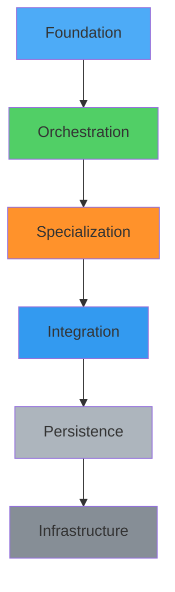
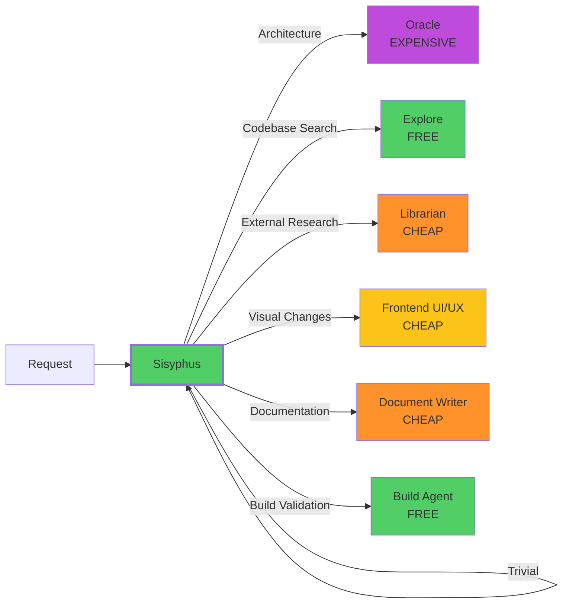
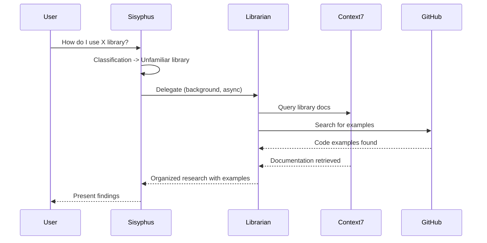
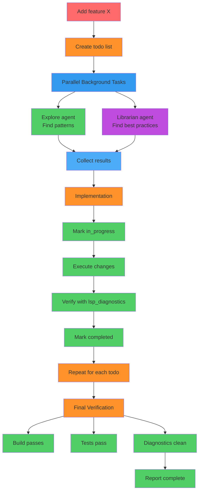

As developers, we've all experienced the frustration of fragmented tooling: separate systems for documentation, task management, code research, and AI assistance. The mental context switching costs add up, and the friction of learning dozens of different interfaces creates unnecessary overhead.

What if your entire development ecosystem could work together as one intelligent, specialized system?

That's exactly what OpenCode architecture achieves.

## The Foundation: A Tiered Approach

At its core, OpenCode is a **multi-tier orchestration platform**. Think of it as a nervous system with specialized cells that communicate and coordinate through intelligent protocols. The architecture consists of nine distinct layers, each with a clear responsibility.



This isn't accidental. Each layer has a specific purpose, and the boundaries between them are intentional. Clear separation enables extensibility—adding new capabilities doesn't require rethinking the entire system.

### Layer 1: Foundation (The Rules)

The foundation layer provides your core behavioral protocols:

- **Global Instructions**: A single source of truth for how all agents behave
- **Project Configuration**: Per-project AGENTS.md files that define context-specific rules
- **Trigger Words**: Natural language shortcuts that map to complex workflows

This is your system's DNA. When you say `todo`, the system knows exactly what to do. When you invoke `mem`, it retrieves semantic memory. The foundation layer ensures consistency across all interactions.

### Layer 2: Primary Orchestrator (Sisyphus)

At the center sits **Sisyphus**, the primary agent. Sisyphus isn't a generic chatbot—it's an orchestrator that:

- Parses implicit requirements from your explicit requests
- Adapts to codebase maturity (disciplined vs chaotic)
- Delegates specialized work to the right sub-agent
- Executes tasks in parallel for maximum throughput

Sisyphus follows a clear decision flow: classify request, check for skill matches, determine if ambiguity exists, then delegate or execute accordingly.

The key insight: **Sisyphus never works alone when a specialist is available**.

## Layer 3: Specialized Sub-Agents

The real power of the system emerges from its specialized sub-agents. Rather than one agent trying to be everything, OpenCode provides purpose-built specialists:

### Build Agent (FREE)
Type checking and build validation. When TypeScript compilation fails or tests break, this agent handles the diagnostics and fixes.

### Oracle Agent (EXPENSIVE)
Expert technical advisor with deep reasoning. Use for complex architecture decisions, multi-system tradeoffs, or after 2+ failed fix attempts. The cost is intentional—Oracle is for situations that warrant high-quality reasoning.

### Explore Agent (FREE)
Contextual grep for codebases. When you need to understand unfamiliar module structures or find cross-layer patterns, Explore uses grep tools intelligently to navigate your code.

### Librarian Agent (CHEAP)
External codebase research. When you're working with unfamiliar libraries, Librarian searches official documentation, GitHub repositories, and OSS implementations to find best practices and usage examples.

### Frontend UI/UX Engineer (CHEAP)
Visual design specialist. This agent handles visual changes—colors, spacing, layout, typography—not business logic. The separation is intentional.

### Document Writer (CHEAP)
Technical documentation specialist. README files, API documentation, architecture docs—this agent crafts clear, comprehensive documentation.



## The Cost-Optimized Delegation Model

Notice the cost tiers: FREE, CHEAP, EXPENSIVE. This isn't random—it's an optimization strategy.

```chart
{
  "type": "doughnut",
  "data": {
    "labels": ["FREE Agents", "CHEAP Agents", "EXPENSIVE Agents"],
    "datasets": [{
      "data": [40, 45, 15],
      "backgroundColor": ["#51CF66", "#FF922B", "#BE4BDB"]
    }]
  },
  "options": {
    "responsive": true,
    "plugins": {
      "title": {
        "display": true,
        "text": "Agent Cost Distribution Strategy"
      }
    }
  }
}
```

You get the right quality at the right cost. No one-size-fits-all, no unnecessary expense.

## Skills: Pre-Packaged Workflows

Beyond agents, the system includes **20+ skills**—pre-packaged workflows with complete procedural knowledge.

When you need to store a YouTube transcript, the `transcription` skill handles the entire workflow: extraction, validation, storage, and verification. You don't need to remember the process; the skill knows it.

When you need enterprise-grade research, the `research` skill provides multi-source validation and evidence-based synthesis.

The critical rule: **when invoking a skill, trust it to complete its entire workflow**. Manual intervention breaks the procedure and defeats the purpose.

## Fabric Patterns: AI Augmentation

The Fabric AI Framework provides **200+ AI augmentation patterns** accessible through multiple interfaces:

- CLI: `/root/.local/bin/fabric`
- API: `http://ubuntu58-1:8081` (pattern storage and retrieval)
- ZAI Proxy: Direct execution via port 8002

Pattern categories cover extraction, analysis, creation, transformation, and meta-tasks. Summarize a document with `summarize`, extract wisdom with `extract_wisdom`, write an essay with `write_essay`.

The innovation: You speak naturally, and the system routes and executes patterns via direct API calls for optimal performance.

## MCP Servers: Extended Capabilities

MCP (Model Context Protocol) servers extend agent capabilities with specialized tools:

- **brave-search**: Web search using Brave Search API
- **context7**: Search through documentation, libraries, SDKs (code patterns)
- **openmemory**: Semantic memory storage and retrieval
- **vercel-agent-browser**: Browser automation with 95% success rate
- **webfetch**: URL content fetching with markdown conversion
- **websearch**: Real-time web search using Exa AI
- **codesearch**: Code example search using Exa Code API

When Sisyphus needs code patterns, it queries Context7. When it needs external research, it invokes Librarian with Context7 and GitHub CLI. When it needs to test a web server, it uses Vercel Agent Browser.

The integration is seamless—agents don't need to know how these tools work. They just use them.

## OpenMemory: Persistent Context

The **storage and persistence layer** centers on OpenMemory, a semantic memory system with 433 memories stored across five sectors:

```chart
{
  "type": "pie",
  "data": {
    "labels": ["Episodic", "Semantic", "Procedural", "Emotional", "Reflective"],
    "datasets": [{
      "data": [20, 35, 25, 5, 15],
      "backgroundColor": ["#4DABF7", "#51CF66", "#FF922B", "#FF6B6B", "#ADB5BD"]
    }]
  },
  "options": {
    "responsive": true,
    "plugins": {
      "title": {
        "display": true,
        "text": "OpenMemory Sector Distribution"
      }
    }
  }
}
```

- **Episodic**: Events, sessions, experiences
- **Semantic**: Facts, decisions, preferences
- **Procedural**: Workflows, procedures
- **Emotional**: Feelings, reactions
- **Reflective**: Insights, learnings

This isn't just a log. OpenMemory provides semantic retrieval—when you ask "What did we decide about X?", the system finds the decision stored with `decision=true` metadata, not just keyword matches.

### Automatic Memory Storage

You don't need to manually store important information. The system automatically:

- Stores long user prompts (>20 words) with `user-prompts` tags
- Captures explicit "remember" commands
- Saves user preferences with `preferences` tags
- Reinforces successful procedures after task completion
- Stores important decisions with `semantic` tags and `decision=true` metadata

This means context persists across sessions. You never lose critical decisions or successful workflows.

## Infrastructure: 67 Docker Containers

The system runs on **67 Docker containers** with key services:

- Homepage: Dashboard for all self-hosted services
- Document Converter: PDF/DOCX/MD conversion (port 8001)
- OpenMemory: Semantic memory dashboard (port 8080)
- Portainer: Container management UI (port 9443)
- FileBrowser: Web-based file management (port 8070)

All services are accessible via the Tailscale network using the `ubuntu58-1` hostname. Web servers are tested with Vercel Agent Browser using `http://ubuntu58-1:port` format—ensuring real-world accessibility, not just localhost functionality.

## How It All Works Together: Real Workflows

### Example: External Library Research



### Example: Complex Multi-Step Task



## Key Design Principles

### 1. Specialization Over Generalization

The system never uses a generalist when a specialist is available. Visual changes delegate to the Frontend UI/UX Engineer. Architecture decisions consult Oracle. Codebase navigation uses Explore.

The result: Better outcomes, faster execution, fewer errors.

### 2. Evidence-Based Decision Making

Claims must be verified with evidence before presentation. Check database size and query performance before claiming "slow due to too many records." Review actual file contents before making architectural recommendations.

No assumptions. No jumping to conclusions.

### 3. Automatic Documentation

All generated documents automatically copy to `/media/docs/output` with timestamp naming. No exceptions, no questions asked.

This prevents loss, ensures discoverability, and enables traceability.

### 4. Persistent Configuration

All changes must survive system reboot. Reboot testing after fixes verifies permanence. Configuration lives in permanent files, not just runtime changes.

**Temporary fixes are not solutions.**

## System Metrics

```chart
{
  "type": "bar",
  "data": {
    "labels": ["Memories", "Containers", "Skills", "Patterns", "MCP Servers", "Sub-Agents"],
    "datasets": [{
      "label": "Count",
      "data": [433, 67, 20, 200, 10, 10],
      "backgroundColor": "rgba(51, 154, 240, 0.5)",
      "borderColor": "rgba(51, 154, 240, 1)",
      "borderWidth": 1
    }]
  },
  "options": {
    "indexAxis": "y",
    "responsive": true,
    "plugins": {
      "title": {
        "display": true,
        "text": "OpenCode System Component Counts (Jan 2026)"
      }
    }
  }
}
```

## The Bottom Line

This architecture provides a **highly specialized, efficient, and extensible system** for AI-assisted development. The key strengths are:

1. **Clear Separation of Concerns**: Foundation -> Orchestration -> Specialization -> Infrastructure
2. **Efficient Delegation**: Right agent/skill for every task
3. **Automatic Documentation**: No manual tracking required
4. **Persistent Memory**: Context preserved across sessions
5. **Extensible Design**: Easy to add new skills, patterns, MCP servers
6. **Evidence-Based**: All decisions backed by verification
7. **Cost-Optimized**: Use appropriate agent cost tier (FREE/CHEAP/EXPENSIVE)

The system is designed for maximum productivity with minimal friction, enabling seamless AI-human collaboration on complex development tasks.

You focus on building great software. The system handles the orchestration, delegation, and context management.

**That's how modern development should work.**