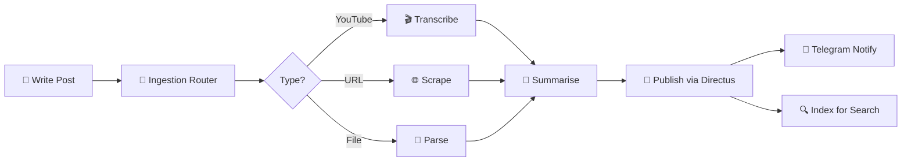
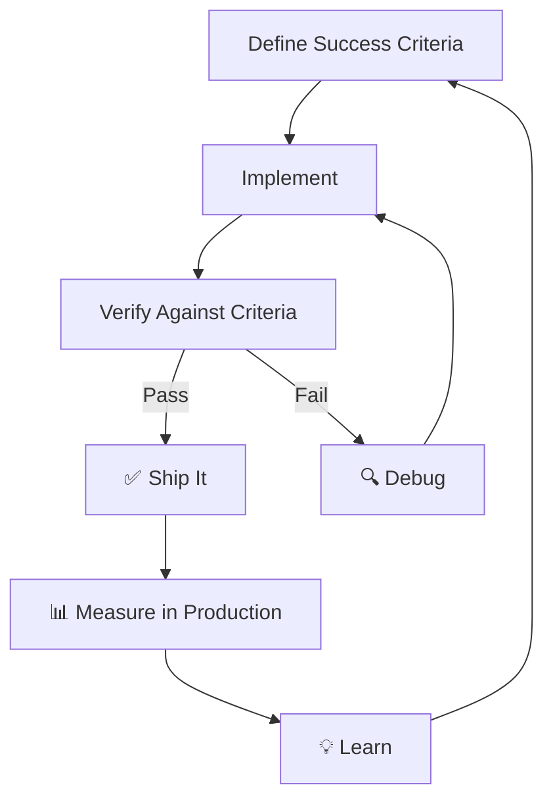
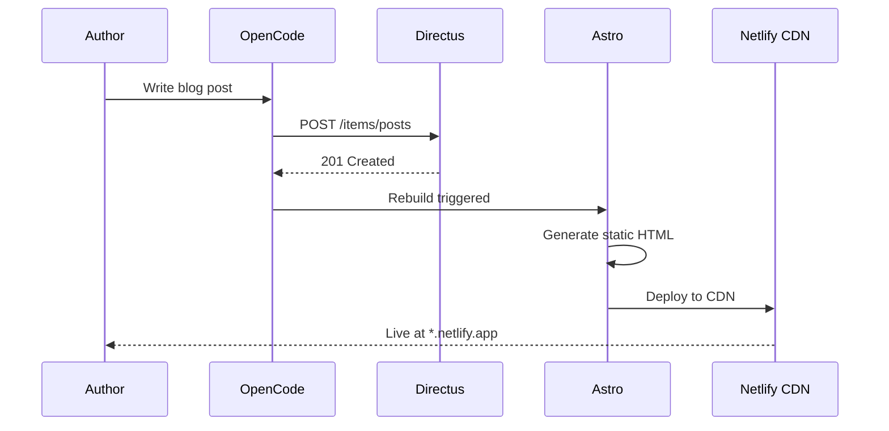
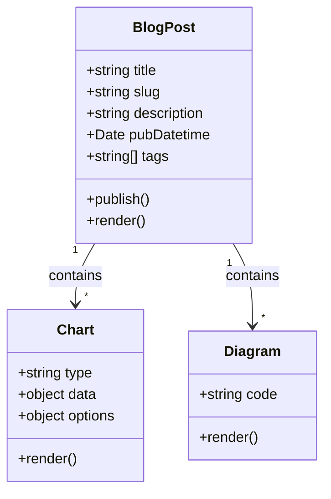
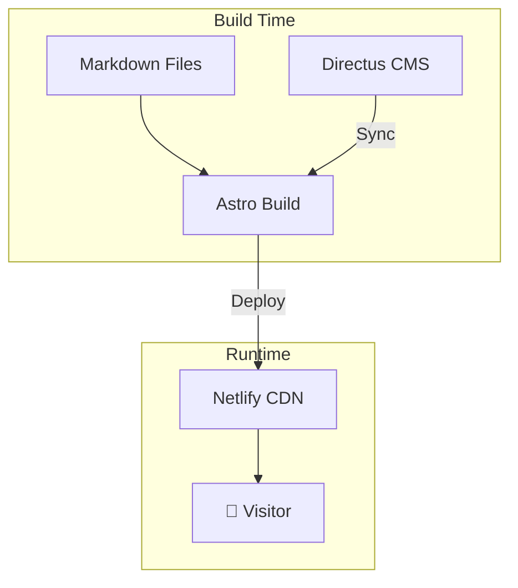
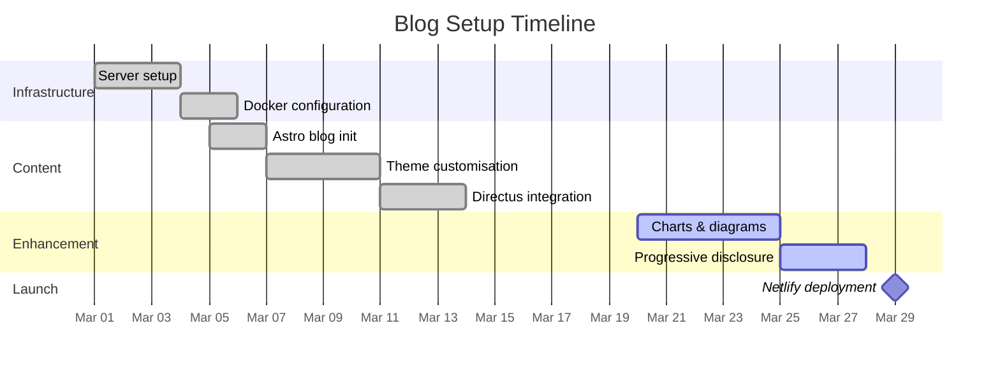
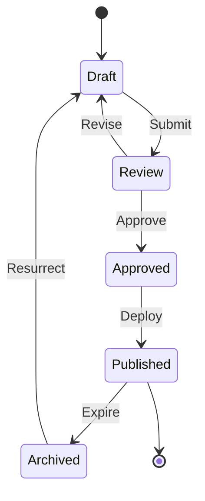
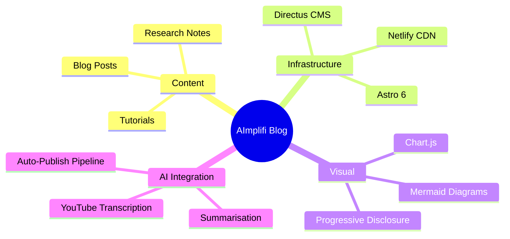

# Welcome to the Blog

This is a living showcase of everything this Astro blog can render — charts, diagrams, interactive menus, progressive disclosure, styled tables, and more.

Use this post as a reference for what's possible with Markdown + raw HTML + Mermaid + Chart.js.

---

## Flowcharts

### System Architecture

A typical AI-powered blog pipeline:



### The Karpathy Loop

The auto-improvement cycle that drives everything:



---

## Sequence Diagrams

How a blog post travels from idea to published:



---

## Class Diagrams



---

## Charts

### Bar Chart — Skill Usage by Domain

<div class="chart-container">
  <canvas id="skillChart" height="280"></canvas>
</div>

### Doughnut Chart — Content Distribution

<div style="max-width:360px;margin:2rem auto;">
  <canvas id="contentChart" height="280"></canvas>
</div>

### Line Chart — Posts Per Month

<div class="chart-container">
  <canvas id="postsChart" height="220"></canvas>
</div>

<script is:inline>
document.addEventListener('DOMContentLoaded', () => {
  const isDark = document.documentElement.getAttribute('data-theme') === 'dark';
  const gridColor = isDark ? 'rgba(148,163,184,0.15)' : 'rgba(100,116,139,0.12)';
  const textColor = isDark ? '#94a3b8' : '#475569';

  Chart.defaults.color = textColor;
  Chart.defaults.font.family = "'IBM Plex Mono', monospace";

  // Bar Chart — Skill Usage
  new Chart(document.getElementById('skillChart'), {
    type: 'bar',
    data: {
      labels: ['DevOps', 'Research', 'Writing', 'Monitoring', 'Scraping', 'Blog'],
      datasets: [{
        label: 'Invocations (30 days)',
        data: [142, 98, 87, 64, 53, 41],
        backgroundColor: [
          'rgba(99,102,241,0.75)',
          'rgba(16,185,129,0.75)',
          'rgba(245,158,11,0.75)',
          'rgba(239,68,68,0.75)',
          'rgba(168,85,247,0.75)',
          'rgba(14,165,233,0.75)'
        ],
        borderRadius: 6,
        borderSkipped: false,
      }]
    },
    options: {
      responsive: true,
      plugins: { legend: { display: false } },
      scales: {
        y: { beginAtZero: true, grid: { color: gridColor } },
        x: { grid: { display: false } }
      }
    }
  });

  // Doughnut — Content Distribution
  new Chart(document.getElementById('contentChart'), {
    type: 'doughnut',
    data: {
      labels: ['Blog Posts', 'Code', 'Diagrams', 'Research', 'Notes'],
      datasets: [{
        data: [35, 25, 15, 15, 10],
        backgroundColor: [
          'rgba(99,102,241,0.8)',
          'rgba(16,185,129,0.8)',
          'rgba(245,158,11,0.8)',
          'rgba(239,68,68,0.8)',
          'rgba(168,85,247,0.8)'
        ],
        borderWidth: 0,
        hoverOffset: 8,
      }]
    },
    options: {
      responsive: true,
      cutout: '60%',
      plugins: {
        legend: { position: 'bottom', labels: { padding: 16, usePointStyle: true, pointStyle: 'circle' } }
      }
    }
  });

  // Line — Posts Per Month
  new Chart(document.getElementById('postsChart'), {
    type: 'line',
    data: {
      labels: ['Jan', 'Feb', 'Mar', 'Apr', 'May', 'Jun'],
      datasets: [{
        label: 'Posts Published',
        data: [2, 4, 7, 12, 9, 15],
        borderColor: 'rgba(99,102,241,1)',
        backgroundColor: 'rgba(99,102,241,0.1)',
        fill: true,
        tension: 0.4,
        pointBackgroundColor: 'rgba(99,102,241,1)',
        pointRadius: 5,
        pointHoverRadius: 8,
      }]
    },
    options: {
      responsive: true,
      plugins: { legend: { display: false } },
      scales: {
        y: { beginAtZero: true, grid: { color: gridColor } },
        x: { grid: { display: false } }
      }
    }
  });
});
</script>

---

## Attractive Tables

### Tech Stack

| Layer | Technology | Purpose | Status |
|:------|:-----------|:--------|:------:|
| Framework | Astro 6.0 | Static site generation | 🟢 |
| Styling | Tailwind CSS | Utility-first CSS | 🟢 |
| Charts | Chart.js | Data visualisation | 🟢 |
| Diagrams | Mermaid.js | Flowcharts & more | 🟢 |
| Search | Fuse.js | Client-side fuzzy search | 🟢 |
| Hosting | Netlify | CDN + CI/CD | 🟢 |
| CMS | Directus | Content management | 🟡 |
| Fonts | IBM Plex Mono | Monospace typography | 🟢 |

### Service Inventory

<div style="overflow-x:auto;">

| Service | Port | Container | Category | Uptime |
|--------:|-----:|:----------|:---------|-------:|
| Directus | 8055 | directus | CMS | 99.9% |
| Astro Blog | 3002 | astro-blog | Website | 99.8% |
| Grafana | 3003 | grafana | Monitoring | 99.7% |
| Prometheus | 9090 | prometheus | Metrics | 99.9% |
| FreshRSS | 8088 | freshrss | RSS Reader | 99.5% |
| PostgreSQL | 5432 | postgres | Database | 99.99% |
| Redis | 6379 | redis | Cache | 99.99% |

</div>

### Comparison Matrix

<div style="overflow-x:auto;">

| Feature | Astro | Next.js | Hugo | Jekyll |
|:--------|:-----:|:-------:|:----:|:------:|
| Static output | ✅ | ✅ | ✅ | ✅ |
| SSR | ✅ | ✅ | ❌ | ❌ |
| React components | ✅ | ✅ | ❌ | ❌ |
| Zero JS by default | ✅ | ❌ | ✅ | ✅ |
| Content collections | ✅ | ❌ | ❌ | ❌ |
| Build speed | Fast | Medium | Blazing | Slow |
| Markdown support | ✅ | ✅ | ✅ | ✅ |

</div>

---

## Progressive Disclosure

Click each section to expand. This pattern keeps pages scannable while hiding depth.

<details>
<summary>🔧 Architecture Deep Dive</summary>

The blog uses a **static-first** architecture:

1. **Content** lives in Markdown files (or syncs from Directus CMS)
2. **Astro** builds everything at compile time — zero client JS by default
3. **Mermaid** and **Chart.js** are the only client-side scripts
4. **Netlify** serves the static output via global CDN



</details>

<details>
<summary>📊 Performance Metrics</summary>

<div style="overflow-x:auto;">

| Metric | Score | Target |
|:-------|------:|:------:|
| Lighthouse Performance | 98 | > 90 |
| First Contentful Paint | 0.4s | < 1.5s |
| Largest Contentful Paint | 0.8s | < 2.5s |
| Cumulative Layout Shift | 0.01 | < 0.1 |
| Total Blocking Time | 0ms | < 200ms |

</div>

> These numbers are achievable because Astro ships zero JavaScript to the client by default. Only Mermaid and Chart.js add client-side weight.

</details>

<details>
<summary>🎯 Trigger Words Reference</summary>

Trigger words are shortcuts recognised by the AI assistant:

| Trigger | Action |
|:--------|:-------|
| `?` | What next analysis |
| `bs` | Brainstorm session |
| `bp` | Blog post (Astro) |
| `sf` | Skill factory |
| `dt` | Discover tasks |
| `ri` | Repo intel |
| `cron` | Cron management |
| `perf` | Performance analysis |
| `news` | News aggregator |
| `i` | Idea capture |

Type any trigger in the chat to activate the corresponding workflow.

</details>

<details>
<summary>⚙️ Advanced Configuration</summary>

The blog is configured via three key files:

- **`astro.config.mjs`** — Site URL, integrations, Vite aliases
- **`tailwind.config.cjs`** — Theme colours, typography plugin
- **`src/styles/base.css`** — CSS custom properties for light/dark themes

Dark mode is toggled via a button in the header that sets `data-theme="dark"` on the `<html>` element. All colour tokens respond to this attribute.

```js
// Theme tokens (light)
--color-fill: 250, 250, 255;
--color-accent: 99, 102, 241;
--color-secondary: 16, 185, 129;
--color-highlight: 245, 158, 11;

// Theme tokens (dark)
--color-fill: 15, 23, 42;
--color-accent: 129, 140, 248;
--color-secondary: 52, 211, 153;
--color-highlight: 251, 191, 36;
```

</details>

---

## Buttons & Menu Examples

### Action Buttons

<div style="display:flex;flex-wrap:wrap;gap:0.75rem;margin:1.5rem 0;">

<button style="
  padding:0.6rem 1.4rem;
  border-radius:0.5rem;
  border:2px solid rgb(99,102,241);
  background:rgb(99,102,241);
  color:#fff;
  font-family:'IBM Plex Mono',monospace;
  font-weight:600;
  cursor:pointer;
  transition:all 0.2s;
" onmouseover="this.style.opacity='0.85'" onmouseout="this.style.opacity='1'">
  🚀 Deploy
</button>

<button style="
  padding:0.6rem 1.4rem;
  border-radius:0.5rem;
  border:2px solid rgb(16,185,129);
  background:transparent;
  color:rgb(16,185,129);
  font-family:'IBM Plex Mono',monospace;
  font-weight:600;
  cursor:pointer;
  transition:all 0.2s;
" onmouseover="this.style.background='rgb(16,185,129)';this.style.color='#fff'" onmouseout="this.style.background='transparent';this.style.color='rgb(16,185,129)'">
  ✅ Verify
</button>

<button style="
  padding:0.6rem 1.4rem;
  border-radius:0.5rem;
  border:2px solid rgb(245,158,11);
  background:transparent;
  color:rgb(245,158,11);
  font-family:'IBM Plex Mono',monospace;
  font-weight:600;
  cursor:pointer;
  transition:all 0.2s;
" onmouseover="this.style.background='rgb(245,158,11)';this.style.color='#fff'" onmouseout="this.style.background='transparent';this.style.color='rgb(245,158,11)'">
  ⚡ Optimise
</button>

<button style="
  padding:0.6rem 1.4rem;
  border-radius:0.5rem;
  border:2px solid rgb(239,68,68);
  background:transparent;
  color:rgb(239,68,68);
  font-family:'IBM Plex Mono',monospace;
  font-weight:600;
  cursor:pointer;
  transition:all 0.2s;
" onmouseover="this.style.background='rgb(239,68,68)';this.style.color='#fff'" onmouseout="this.style.background='transparent';this.style.color='rgb(239,68,68)'">
  🔥 Reset
</button>

</div>

### Badge Collection

<div style="display:flex;flex-wrap:wrap;gap:0.5rem;margin:1.5rem 0;">

<span style="
  display:inline-block;
  padding:0.3rem 0.8rem;
  border-radius:9999px;
  background:rgba(99,102,241,0.15);
  color:rgb(99,102,241);
  font-size:0.8rem;
  font-weight:600;
  font-family:'IBM Plex Mono',monospace;
">Astro 6.0</span>

<span style="
  display:inline-block;
  padding:0.3rem 0.8rem;
  border-radius:9999px;
  background:rgba(16,185,129,0.15);
  color:rgb(16,185,129);
  font-size:0.8rem;
  font-weight:600;
  font-family:'IBM Plex Mono',monospace;
">Tailwind CSS</span>

<span style="
  display:inline-block;
  padding:0.3rem 0.8rem;
  border-radius:9999px;
  background:rgba(245,158,11,0.15);
  color:rgb(245,158,11);
  font-size:0.8rem;
  font-weight:600;
  font-family:'IBM Plex Mono',monospace;
">Chart.js</span>

<span style="
  display:inline-block;
  padding:0.3rem 0.8rem;
  border-radius:9999px;
  background:rgba(168,85,247,0.15);
  color:rgb(168,85,247);
  font-size:0.8rem;
  font-weight:600;
  font-family:'IBM Plex Mono',monospace;
">Mermaid</span>

<span style="
  display:inline-block;
  padding:0.3rem 0.8rem;
  border-radius:9999px;
  background:rgba(14,165,233,0.15);
  color:rgb(14,165,233);
  font-size:0.8rem;
  font-weight:600;
  font-family:'IBM Plex Mono',monospace;
">Netlify</span>

<span style="
  display:inline-block;
  padding:0.3rem 0.8rem;
  border-radius:9999px;
  background:rgba(239,68,68,0.15);
  color:rgb(239,68,68);
  font-size:0.8rem;
  font-weight:600;
  font-family:'IBM Plex Mono',monospace;
">Directus</span>

</div>

### Status Indicators

| Indicator | Meaning | Example |
|:----------|:--------|:--------|
| 🟢 Green | Operational / Active | Service running |
| 🟡 Yellow | Degraded / Pending | Build in progress |
| 🔴 Red | Down / Error | Deployment failed |
| 🔵 Blue | Informational | New version available |
| ⚪ Grey | Disabled / Inactive | Feature flag off |

---

## Gantt Chart

Project timeline for the blog setup:



---

## Pie Chart — Time Allocation

<div style="max-width:380px;margin:2rem auto;">
  <canvas id="timeChart" height="280"></canvas>
</div>

<script is:inline>
document.addEventListener('DOMContentLoaded', () => {
  const isDark = document.documentElement.getAttribute('data-theme') === 'dark';
  const textColor = isDark ? '#94a3b8' : '#475569';

  new Chart(document.getElementById('timeChart'), {
    type: 'pie',
    data: {
      labels: ['Coding', 'Research', 'Writing', 'Debugging', 'Deploying', 'Coffee'],
      datasets: [{
        data: [30, 20, 15, 15, 10, 10],
        backgroundColor: [
          'rgba(99,102,241,0.85)',
          'rgba(16,185,129,0.85)',
          'rgba(245,158,11,0.85)',
          'rgba(239,68,68,0.85)',
          'rgba(168,85,247,0.85)',
          'rgba(180,120,60,0.85)'
        ],
        borderWidth: 2,
        borderColor: isDark ? '#1e293b' : '#f5f5ff',
      }]
    },
    options: {
      responsive: true,
      plugins: {
        legend: {
          position: 'bottom',
          labels: {
            color: textColor,
            padding: 14,
            usePointStyle: true,
            pointStyle: 'rectRounded',
            font: { family: "'IBM Plex Mono', monospace", size: 12 }
          }
        }
      }
    }
  });
});
</script>

---

## Nested Progressive Disclosure

<details>
<summary>📂 Level 1 — Frontend Stack</summary>

The frontend uses a minimal, fast stack:

- **Astro 6.0** for static generation
- **Tailwind CSS** for styling
- **IBM Plex Mono** as the typeface

<details>
<summary>🎨 Theme System</summary>

Colours are defined as CSS custom properties that respond to `data-theme`:

```css
:root { --color-accent: 99, 102, 241; }
html[data-theme="dark"] { --color-accent: 129, 140, 248; }
```

This means every colour in the UI updates with a single attribute change — no class swapping, no rebuilds.

<details>
<summary>🌑 Dark Mode Details</summary>

Dark mode colours are deliberately **muted** to reduce eye strain:

| Token | Light | Dark |
|:------|:------|:-----|
| Fill | `#f5f5ff` | `#0f172a` |
| Text | `#1e1e28` | `#e2e8f0` |
| Accent | `#6366f1` | `#818cf8` |
| Card | `#eef2ff` | `#1e293b` |

</details>
</details>
</details>

---

## State Diagram



---

## Feature Checklist

This is what the blog currently supports:

- [x] Static site generation with Astro
- [x] Tailwind CSS styling with dark mode
- [x] Full-text search with Fuse.js
- [x] RSS feed
- [x] SEO optimisation (Open Graph, Twitter cards)
- [x] Mermaid diagrams (flowcharts, sequence, class, state, gantt)
- [x] Chart.js charts (bar, doughnut, line, pie)
- [x] Progressive disclosure (`<details>` / `<summary>`)
- [x] Styled tables with responsive overflow
- [x] Interactive buttons and badges
- [x] Nested collapsible sections
- [ ] WebAssembly-powered image processing
- [ ] Web Audio API visualisations
- [ ] WebGL 3D embeds

---

## Mind Map



---

## SVG Diagrams

Inline SVG diagrams rendered as base64 images — bright, light-mode friendly, no external dependencies.

### Content Publishing Pipeline

A horizontal flow showing the blog publishing pipeline with quality gates:

<img src="data:image/svg+xml;base64,PHN2ZyB4bWxucz0iaHR0cDovL3d3dy53My5vcmcvMjAwMC9zdmciIHZpZXdCb3g9IjAgMCA3MDAgMjgwIiBzdHlsZT0iZm9udC1mYW1pbHk6J1NlZ29lIFVJJyxzeXN0ZW0tdWksc2Fucy1zZXJpZjsiPgogIDxkZWZzPgogICAgPGxpbmVhckdyYWRpZW50IGlkPSJiZzEiIHgxPSIwIiB5MT0iMCIgeDI9IjEiIHkyPSIxIj4KICAgICAgPHN0b3Agb2Zmc2V0PSIwJSIgc3RvcC1jb2xvcj0iI2YwZjlmZiIvPgogICAgICA8c3RvcCBvZmZzZXQ9IjEwMCUiIHN0b3AtY29sb3I9IiNlMGYyZmUiLz4KICAgIDwvbGluZWFyR3JhZGllbnQ+CiAgICA8bGluZWFyR3JhZGllbnQgaWQ9ImcxIiB4MT0iMCIgeTE9IjAiIHgyPSIwIiB5Mj0iMSI+CiAgICAgIDxzdG9wIG9mZnNldD0iMCUiIHN0b3AtY29sb3I9IiMzYjgyZjYiLz4KICAgICAgPHN0b3Agb2Zmc2V0PSIxMDAlIiBzdG9wLWNvbG9yPSIjMjU2M2ViIi8+CiAgICA8L2xpbmVhckdyYWRpZW50PgogICAgPGxpbmVhckdyYWRpZW50IGlkPSJnMiIgeDE9IjAiIHkxPSIwIiB4Mj0iMCIgeTI9IjEiPgogICAgICA8c3RvcCBvZmZzZXQ9IjAlIiBzdG9wLWNvbG9yPSIjMTBiOTgxIi8+CiAgICAgIDxzdG9wIG9mZnNldD0iMTAwJSIgc3RvcC1jb2xvcj0iIzA1OTY2OSIvPgogICAgPC9saW5lYXJHcmFkaWVudD4KICAgIDxsaW5lYXJHcmFkaWVudCBpZD0iZzMiIHgxPSIwIiB5MT0iMCIgeDI9IjAiIHkyPSIxIj4KICAgICAgPHN0b3Agb2Zmc2V0PSIwJSIgc3RvcC1jb2xvcj0iI2Y5NzMxNiIvPgogICAgICA8c3RvcCBvZmZzZXQ9IjEwMCUiIHN0b3AtY29sb3I9IiNlYTU4MGMiLz4KICAgIDwvbGluZWFyR3JhZGllbnQ+CiAgICA8bGluZWFyR3JhZGllbnQgaWQ9Ikc0IiB4MT0iMCIgeTE9IjAiIHgyPSIwIiB5Mj0iMSI+CiAgICAgIDxzdG9wIG9mZnNldD0iMCUiIHN0b3AtY29sb3I9IiM4YjVjZjYiLz4KICAgICAgPHN0b3Agb2Zmc2V0PSIxMDAlIiBzdG9wLWNvbG9yPSIjN2MzYWVkIi8+CiAgICA8L2xpbmVhckdyYWRpZW50PgogICAgPGZpbHRlciBpZD0iczEiIHg9Ii01JSIgeT0iLTUlIiB3aWR0aD0iMTEwJSIgaGVpZ2h0PSIxMjAlIj4KICAgICAgPGZlRHJvcFNoYWRvdyBkeD0iMCIgZHk9IjIiIHN0ZERldmlhdGlvbj0iNCIgZmxvb2Qtb3BhY2l0eT0iMC4xMiIvPgogICAgPC9maWx0ZXI+CiAgPC9kZWZzPgogIDxyZWN0IHdpZHRoPSI3MDAiIGhlaWdodD0iMjgwIiByeD0iMTYiIGZpbGw9InVybCgjYmcxKSIgc3Ryb2tlPSIjYmFlNmZkIiBzdHJva2Utd2lkdGg9IjEiLz4KICA8dGV4dCB4PSIzNTAiIHk9IjM2IiB0ZXh0LWFuY2hvcj0ibWlkZGxlIiBmb250LXNpemU9IjE2IiBmb250LXdlaWdodD0iNzAwIiBmaWxsPSIjMWUzYTVmIj5Db250ZW50IFB1Ymxpc2hpbmcgUGlwZWxpbmU8L3RleHQ+CiAgPHJlY3QgeD0iMjAiIHk9IjcwIiB3aWR0aD0iMTMwIiBoZWlnaHQ9IjU2IiByeD0iMTAiIGZpbGw9InVybCgjZzEpIiBmaWx0ZXI9InVybCgjczEpIi8+CiAgPHRleHQgeD0iODUiIHk9Ijk1IiB0ZXh0LWFuY2hvcj0ibWlkZGxlIiBmb250LXNpemU9IjEzIiBmb250LXdlaWdodD0iNjAwIiBmaWxsPSIjZmZmIj7wn5mPIFdyaXRlPC90ZXh0PgogIDx0ZXh0IHg9Ijg1IiB5PSIxMTMiIHRleHQtYW5jaG9yPSJtaWRkbGUiIGZvbnQtc2l6ZT0iMTAiIGZpbGw9IiNkYmViZmUiPk1hcmtkb3duICsgSFRNTDwvdGV4dD4KICA8ZGVmcz48bWFya2VyIGlkPSJhcnIiIHZpZXdCb3g9IjAgMCAxMCAxMCIgcmVmWD0iOSIgcmVmWT0iNSIgbWFya2VyV2lkdGg9IjciIG1hcmtlckhlaWdodD0iNyIgb3JpZW50PSJhdXRvIj48cGF0aCBkPSJNMCwwIEwxMCw1IEwwLDEwIFoiIGZpbGw9IiM2NDc0OGIiLz48L21hcmtlcj48L2RlZnM+CiAgPGxpbmUgeDE9IjE1MCIgeTE9Ijk4IiB4Mj0iMTg4IiB5Mj0iOTgiIHN0cm9rZT0iIzY0NzQ4YiIgc3Ryb2tlLXdpZHRoPSIyIiBtYXJrZXItZW5kPSJ1cmwoI2FycikiLz4KICA8cmVjdCB4PSIxOTIiIHk9IjcwIiB3aWR0aD0iMTMwIiBoZWlnaHQ9IjU2IiByeD0iMTAiIGZpbGw9InVybCgjZzIpIiBmaWx0ZXI9InVybCgjczEpIi8+CiAgPHRleHQgeD0iMjU3IiB5PSI5NSIgdGV4dC1hbmNob3I9Im1pZGRsZSIgZm9udC1zaXplPSIxMyIgZm9udC13ZWlnaHQ9IjYwMCIgZmlsbD0iI2ZmZiI+8J+TsiBJbmdlc3Q8L3RleHQ+CiAgPHRleHQgeD0iMjU3IiB5PSIxMTMiIHRleHQtYW5jaG9yPSJtaWRkbGUiIGZvbnQtc2l6ZT0iMTAiIGZpbGw9IiNkMWZhZTUiPkNsYXNzaWZ5ICsgUm91dGU8L3RleHQ+CiAgPGxpbmUgeDE9IjMyMiIgeTE9Ijk4IiB4Mj0iMzYwIiB5Mj0iOTgiIHN0cm9rZT0iIzY0NzQ4YiIgc3Ryb2tlLXdpZHRoPSIyIiBtYXJrZXItZW5kPSJ1cmwoI2FycikiLz4KICA8cmVjdCB4PSIzNjQiIHk9IjcwIiB3aWR0aD0iMTMwIiBoZWlnaHQ9IjU2IiByeD0iMTAiIGZpbGw9InVybCgjZzMpIiBmaWx0ZXI9InVybCgjczEpIi8+CiAgPHRleHQgeD0iNDI5IiB5PSI5NSIgdGV4dC1hbmNob3I9Im1pZGRsZSIgZm9udC1zaXplPSIxMyIgZm9udC13ZWlnaHQ9IjYwMCIgZmlsbD0iI2ZmZiI+8J+OiCBUcmFuc2Zvcm08L3RleHQ+CiAgPHRleHQgeD0iNDI5IiB5PSIxMTMiIHRleHQtYW5jaG9yPSJtaWRkbGUiIGZvbnQtc2l6ZT0iMTAiIGZpbGw9IiNmZmVkZDUiPlJlbmRlciArIE9wdGltaXNlPC90ZXh0PgogIDxsaW5lIHgxPSI0OTQiIHkxPSI5OCIgeDI9IjUzMiIgeTI9Ijk4IiBzdHJva2U9IiM2NDc0OGIiIHN0cm9rZS13aWR0aD0iMiIgbWFya2VyLWVuZD0idXJsKCNhcnIpIi8+CiAgPHJlY3QgeD0iNTM2IiB5PSI3MCIgd2lkdGg9IjE0MCIgaGVpZ2h0PSI1NiIgcng9IjEwIiBmaWxsPSJ1cmwoI0c0KSIgZmlsdGVyPSJ1cmwoI3MxKSIvPgogIDx0ZXh0IHg9IjYwNiIgeT0iOTUiIHRleHQtYW5jaG9yPSJtaWRkbGUiIGZvbnQtc2l6ZT0iMTMiIGZvbnQtd2VpZ2h0PSI2MDAiIGZpbGw9IiNmZmYiPvCfpbAgUHVibGlzaDwvdGV4dD4KICA8dGV4dCB4PSI2MDYiIHk9IjExMyIgdGV4dC1hbmNob3I9Im1pZGRsZSIgZm9udC1zaXplPSIxMCIgZmlsbD0iI2VkZTlmZSI+QXN0cm8gKyBOZXRsaWZ5IENETjwvdGV4dD4KICA8cmVjdCB4PSI0MCIgeT0iMTcwIiB3aWR0aD0iNjIwIiBoZWlnaHQ9IjgwIiByeD0iMTIiIGZpbGw9IiNmZmYiIHN0cm9rZT0iI2UyZThmMCIgc3Ryb2tlLXdpZHRoPSIxIiBmaWx0ZXI9InVybCgjczEpIi8+CiAgPHRleHQgeD0iMzUwIiB5PSIxOTIiIHRleHQtYW5jaG9yPSJtaWRkbGUiIGZvbnQtc2l6ZT0iMTIiIGZvbnQtd2VpZ2h0PSI2MDAiIGZpbGw9IiM0NzU1NjkiPlF1YWxpdHkgR2F0ZXM8L3RleHQ+CiAgPHJlY3QgeD0iNjAiIHk9IjIwNCIgd2lkdGg9IjExMCIgaGVpZ2h0PSIyOCIgcng9IjE0IiBmaWxsPSIjZGJlYWZlIi8+CiAgPHRleHQgeD0iMTE1IiB5PSIyMjIiIHRleHQtYW5jaG9yPSJtaWRkbGUiIGZvbnQtc2l6ZT0iMTEiIGZpbGw9IiMxZTQwYWYiIGZvbnQtd2VpZ2h0PSI1MDAiPlNwZWxsIENoZWNrPC90ZXh0PgogIDxyZWN0IHg9IjE4NSIgeT0iMjA0IiB3aWR0aD0iMTEwIiBoZWlnaHQ9IjI4IiByeD0iMTQiIGZpbGw9IiNkMWZhZTUiLz4KICA8dGV4dCB4PSIyNDAiIHk9IjIyMiIgdGV4dC1hbmNob3I9Im1pZGRsZSIgZm9udC1zaXplPSIxMSIgZmlsbD0iIzA2NWY0NiIgZm9udC13ZWlnaHQ9IjUwMCI+TGludCArIEZvcm1hdDwvdGV4dD4KICA8cmVjdCB4PSIzMTAiIHk9IjIwNCIgd2lkdGg9IjExMCIgaGVpZ2h0PSIyOCIgcng9IjE0IiBmaWxsPSIjZmVmM2M3Ii8+CiAgPHRleHQgeD0iMzY1IiB5PSIyMjIiIHRleHQtYW5jaG9yPSJtaWRkbGUiIGZvbnQtc2l6ZT0iMTEiIGZpbGw9IiM5MjQwMGUiIGZvbnQtd2VpZ2h0PSI1MDAiPkltYWdlIE9wdDwvdGV4dD4KICA8cmVjdCB4PSI0MzUiIHk9IjIwNCIgd2lkdGg9IjExMCIgaGVpZ2h0PSIyOCIgcng9IjE0IiBmaWxsPSIjZmNlN2YzIi8+CiAgPHRleHQgeD0iNDkwIiB5PSIyMjIiIHRleHQtYW5jaG9yPSJtaWRkbGUiIGZvbnQtc2l6ZT0iMTEiIGZpbGw9IiM5ZDE3NGQiIGZvbnQtd2VpZ2h0PSI1MDAiPlNFTyBWYWxpZGF0ZTwvdGV4dD4KICA8cmVjdCB4PSI1NjAiIHk9IjIwNCIgd2lkdGg9IjkwIiBoZWlnaHQ9IjI4IiByeD0iMTQiIGZpbGw9IiNlMGU3ZmYiLz4KICA8dGV4dCB4PSI2MDUiIHk9IjIyMiIgdGV4dC1hbmNob3I9Im1pZGRsZSIgZm9udC1zaXplPSIxMSIgZmlsbD0iIzM3MzBhMyIgZm9udC13ZWlnaHQ9IjUwMCI+RGVwbG95PC90ZXh0PgogIDxjaXJjbGUgY3g9IjE3NSIgY3k9IjIxOCIgcj0iMyIgZmlsbD0iIzk0YTNiOCIvPgogIDxjaXJjbGUgY3g9IjMwMCIgY3k9IjIxOCIgcj0iMyIgZmlsbD0iIzk0YTNiOCIvPgogIDxjaXJjbGUgY3g9IjQyNSIgY3k9IjIxOCIgcj0iMyIgZmlsbD0iIzk0YTNiOCIvPgogIDxjaXJjbGUgY3g9IjU1MCIgY3k9IjIxOCIgcj0iMyIgZmlsbD0iIzk0YTNiOCIvPgo8L3N2Zz4=" alt="Content Publishing Pipeline" style="width:100%;height:auto;display:block;margin:1.5rem auto;max-width:700px;" />

### Skill Maturity Dashboard

A card-grid layout showing auto-improvement metrics across five dimensions:

<img src="data:image/svg+xml;base64,PHN2ZyB4bWxucz0iaHR0cDovL3d3dy53My5vcmcvMjAwMC9zdmciIHZpZXdCb3g9IjAgMCA3MDAgMzAwIiBzdHlsZT0iZm9udC1mYW1pbHk6J1NlZ29lIFVJJyxzeXN0ZW0tdWksc2Fucy1zZXJpZjsiPgogIDxkZWZzPgogICAgPGxpbmVhckdyYWRpZW50IGlkPSJiZzIiIHgxPSIwIiB5MT0iMCIgeDI9IjEiIHkyPSIxIj4KICAgICAgPHN0b3Agb2Zmc2V0PSIwJSIgc3RvcC1jb2xvcj0iI2ZhZjVmZiIvPgogICAgICA8c3RvcCBvZmZzZXQ9IjEwMCUiIHN0b3AtY29sb3I9IiNmNWYzZmYiLz4KICAgIDwvbGluZWFyR3JhZGllbnQ+CiAgICA8ZmlsdGVyIGlkPSJzMiIgeD0iLTUlIiB5PSItNSUiIHdpZHRoPSIxMTAlIiBoZWlnaHQ9IjEyMCUiPgogICAgICA8ZmVEcm9wU2hhZG93IGR4PSIwIiBkeT0iMiIgc3RkRGV2aWF0aW9uPSI0IiBmbG9vZC1vcGFjaXR5PSIwLjEwIi8+CiAgICA8L2ZpbHRlcj4KICA8L2RlZnM+CiAgPHJlY3Qgd2lkdGg9IjcwMCIgaGVpZ2h0PSIzMDAiIHJ4PSIxNiIgZmlsbD0idXJsKCNiZzIpIiBzdHJva2U9IiNlOWQ1ZmYiIHN0cm9rZS13aWR0aD0iMSIvPgogIDx0ZXh0IHg9IjM1MCIgeT0iMzIiIHRleHQtYW5jaG9yPSJtaWRkbGUiIGZvbnQtc2l6ZT0iMTYiIGZvbnQtd2VpZ2h0PSI3MDAiIGZpbGw9IiMzYjFmNmUiPlNraWxsIE1hdHVyaXR5IERhc2hib2FyZDwvdGV4dD4KICA8dGV4dCB4PSIzNTAiIHk9IjUwIiB0ZXh0LWFuY2hvcj0ibWlkZGxlIiBmb250LXNpemU9IjExIiBmaWxsPSIjN2MzYWVkIj5BdXRvLWltcHJvdmVtZW50IGFjcm9zcyA1IGRpbWVuc2lvbnM8L3RleHQ+CiAgPHJlY3QgeD0iMjAiIHk9IjY4IiB3aWR0aD0iMjEwIiBoZWlnaHQ9IjkwIiByeD0iMTIiIGZpbGw9IiNmZmYiIHN0cm9rZT0iI2RkZDZmZSIgc3Ryb2tlLXdpZHRoPSIxIiBmaWx0ZXI9InVybCgjczIpIi8+CiAgPGNpcmNsZSBjeD0iNTAiIGN5PSI5OCIgcj0iMTQiIGZpbGw9IiNlZGU5ZmUiLz4KICA8dGV4dCB4PSI1MCIgeT0iMTAyIiB0ZXh0LWFuY2hvcj0ibWlkZGxlIiBmb250LXNpemU9IjE0Ij7wn5WPPC90ZXh0PgogIDx0ZXh0IHg9IjcyIiB5PSI5OCIgZm9udC1zaXplPSIxMyIgZm9udC13ZWlnaHQ9IjYwMCIgZmlsbD0iIzRjMWQ5NSI+U2NoZW1hIENvdmVyYWdlPC90ZXh0PgogIDx0ZXh0IHg9IjcyIiB5PSIxMTUiIGZvbnQtc2l6ZT0iMTEiIGZpbGw9IiM2ZDI4ZDkiPjQyIHNjaGVtYXMgdmFsaWRhdGVkPC90ZXh0PgogIDxyZWN0IHg9IjM1IiB5PSIxMjgiIHdpZHRoPSIxODAiIGhlaWdodD0iOCIgcng9IjQiIGZpbGw9IiNlOWQ1ZmYiLz4KICA8cmVjdCB4PSIzNSIgeT0iMTI4IiB3aWR0aD0iMTYyIiBoZWlnaHQ9IjgiIHJ4PSI0IiBmaWxsPSIjOGI1Y2Y2Ii8+CiAgPHRleHQgeD0iMjIwIiB5PSIxMzYiIGZvbnQtc2l6ZT0iOSIgZmlsbD0iIzdjM2FlZCIgZm9udC13ZWlnaHQ9IjYwMCI+OTAlPC90ZXh0PgogIDxyZWN0IHg9IjI0NSIgeT0iNjgiIHdpZHRoPSIyMTAiIGhlaWdodD0iOTAiIHJ4PSIxMiIgZmlsbD0iI2ZmZiIgc3Ryb2tlPSIjYmJmN2QwIiBzdHJva2Utd2lkdGg9IjEiIGZpbHRlcj0idXJsKCNzMikiLz4KICA8Y2lyY2xlIGN4PSIyNzUiIGN5PSI5OCIgcj0iMTQiIGZpbGw9IiNkY2ZjZTciLz4KICA8dGV4dCB4PSIyNzUiIHk9IjEwMiIgdGV4dC1hbmNob3I9Im1pZGRsZSIgZm9udC1zaXplPSIxNCI+8J+UjTwvdGV4dD4KICA8dGV4dCB4PSIyOTciIHk9Ijk4IiBmb250LXNpemU9IjEzIiBmb250LXdlaWdodD0iNjAwIiBmaWxsPSIjMTQ1MzJkIj5TaWduYWwgQ2FwdHVyZTwvdGV4dD4KICA8dGV4dCB4PSIyOTciIHk9IjExNSIgZm9udC1zaXplPSIxMSIgZmlsbD0iIzE2YTM0YSI+MSwyNDcgc2lnbmFscyB0aGlzIHdlZWs8L3RleHQ+CiAgPHJlY3QgeD0iMjYwIiB5PSIxMjgiIHdpZHRoPSIxODAiIGhlaWdodD0iOCIgcng9IjQiIGZpbGw9IiNiYmY3ZDAiLz4KICA8cmVjdCB4PSIyNjAiIHk9IjEyOCIgd2lkdGg9IjE0NCIgaGVpZ2h0PSI4IiByeD0iNCIgZmlsbD0iIzIyYzU1ZSIvPgogIDx0ZXh0IHg9IjQ0NSIgeT0iMTM2IiBmb250LXNpemU9IjkiIGZpbGw9IiMxNmEzNGEiIGZvbnQtd2VpZ2h0PSI2MDAiPjgwJTwvdGV4dD4KICA8cmVjdCB4PSI0NzAiIHk9IjY4IiB3aWR0aD0iMjEwIiBoZWlnaHQ9IjkwIiByeD0iMTIiIGZpbGw9IiNmZmYiIHN0cm9rZT0iI2ZlZDdhYSIgc3Ryb2tlLXdpZHRoPSIxIiBmaWx0ZXI9InVybCgjczIpIi8+CiAgPGNpcmNsZSBjeD0iNTAwIiBjeT0iOTgiIHI9IjE0IiBmaWxsPSIjZmZlZGQ1Ii8+CiAgPHRleHQgeD0iNTAwIiB5PSIxMDIiIHRleHQtYW5jaG9yPSJtaWRkbGUiIGZvbnQtc2l6ZT0iMTQiPvCfp6g8L3RleHQ+CiAgPHRleHQgeD0iNTIyIiB5PSI5OCIgZm9udC1zaXplPSIxMyIgZm9udC13ZWlnaHQ9IjYwMCIgZmlsbD0iIzdjMmQxMiI+QXV0by1GaXggUmF0ZTwvdGV4dD4KICA8dGV4dCB4PSI1MjIiIHk9IjExNSIgZm9udC1zaXplPSIxMSIgZmlsbD0iI2VhNTgwYyI+MzggaXNzdWVzIGF1dG8tcmVzb2x2ZWQ8L3RleHQ+CiAgPHJlY3QgeD0iNDg1IiB5PSIxMjgiIHdpZHRoPSIxODAiIGhlaWdodD0iOCIgcng9IjQiIGZpbGw9IiNmZWQ3YWEiLz4KICA8cmVjdCB4PSI0ODUiIHk9IjEyOCIgd2lkdGg9IjExNyIgaGVpZ2h0PSI4IiByeD0iNCIgZmlsbD0iI2Y5NzMxNiIvPgogIDx0ZXh0IHg9IjY3MCIgeT0iMTM2IiBmb250LXNpemU9IjkiIGZpbGw9IiNlYTU4MGMiIGZvbnQtd2VpZ2h0PSI2MDAiPjY1JTwvdGV4dD4KICA8cmVjdCB4PSIyMCIgeT0iMTc1IiB3aWR0aD0iMjEwIiBoZWlnaHQ9IjkwIiByeD0iMTIiIGZpbGw9IiNmZmYiIHN0cm9rZT0iI2JmZGJmZSIgc3Ryb2tlLXdpZHRoPSIxIiBmaWx0ZXI9InVybCgjczIpIi8+CiAgPGNpcmNsZSBjeD0iNTAiIGN5PSIyMDUiIHI9IjE0IiBmaWxsPSIjZGJlYWZlIi8+CiAgPHRleHQgeD0iNTAiIHk9IjIwOSIgdGV4dC1hbmNob3I9Im1pZGRsZSIgZm9udC1zaXplPSIxNCI+8J+bpjwvdGV4dD4KICA8dGV4dCB4PSI3MiIgeT0iMjA1IiBmb250LXNpemU9IjEzIiBmb250LXdlaWdodD0iNjAwIiBmaWxsPSIjMWUzYThhIj5NZW1vcnkgUmVjYWxsPC90ZXh0PgogIDx0ZXh0IHg9IjcyIiB5PSIyMjIiIGZvbnQtc2l6ZT0iMTEiIGZpbGw9IiMyNTYzZWIiPjIsODQ2IG1lbW9yaWVzIGluZGV4ZWQ8L3RleHQ+CiAgPHJlY3QgeD0iMzUiIHk9IjIzNSIgd2lkdGg9IjE4MCIgaGVpZ2h0PSI4IiByeD0iNCIgZmlsbD0iI2JmZGJmZSIvPgogIDxyZWN0IHg9IjM1IiB5PSIyMzUiIHdpZHRoPSIxNTMiIGhlaWdodD0iOCIgcng9IjQiIGZpbGw9IiMzYjgyZjYiLz4KICA8dGV4dCB4PSIyMjAiIHk9IjI0MyIgZm9udC1zaXplPSI5IiBmaWxsPSIjMjU2M2ViIiBmb250LXdlaWdodD0iNjAwIj44NSU8L3RleHQ+CiAgPHJlY3QgeD0iMjQ1IiB5PSIxNzUiIHdpZHRoPSIyMTAiIGhlaWdodD0iOTAiIHJ4PSIxMiIgZmlsbD0iI2ZmZiIgc3Ryb2tlPSIjZmVjZGQzIiBzdHJva2Utd2lkdGg9IjEiIGZpbHRlcj0idXJsKCNzMikiLz4KICA8Y2lyY2xlIGN4PSIyNzUiIGN5PSIyMDUiIHI9IjE0IiBmaWxsPSIjZmZlNGU2Ii8+CiAgPHRleHQgeD0iMjc1IiB5PSIyMDkiIHRleHQtYW5jaG9yPSJtaWRkbGUiIGZvbnQtc2l6ZT0iMTQiPvCfjY08L3RleHQ+CiAgPHRleHQgeD0iMjk3IiB5PSIyMDUiIGZvbnQtc2l6ZT0iMTMiIGZvbnQtd2VpZ2h0PSI2MDAiIGZpbGw9IiM4ODEzMzciPk1lbnUgT3B0aW1pc2F0aW9uPC90ZXh0PgogIDx0ZXh0IHg9IjI5NyIgeT0iMjIyIiBmb250LXNpemU9IjExIiBmaWxsPSIjZTExZDQ4Ij5BL0IgdGVzdGluZyAxNCBtZW51czwvdGV4dD4KICA8cmVjdCB4PSIyNjAiIHk9IjIzNSIgd2lkdGg9IjE4MCIgaGVpZ2h0PSI4IiByeD0iNCIgZmlsbD0iI2ZlY2RkMyIvPgogIDxyZWN0IHg9IjI2MCIgeT0iMjM1IiB3aWR0aD0iMTI2IiBoZWlnaHQ9IjgiIHJ4PSI0IiBmaWxsPSIjZjQzZjVlIi8+CiAgPHRleHQgeD0iNDQ1IiB5PSIyNDMiIGZvbnQtc2l6ZT0iOSIgZmlsbD0iI2UxMWQ0OCIgZm9udC13ZWlnaHQ9IjYwMCI+NzAlPC90ZXh0PgogIDxyZWN0IHg9IjQ3MCIgeT0iMTc1IiB3aWR0aD0iMjEwIiBoZWlnaHQ9IjkwIiByeD0iMTIiIGZpbGw9IiMxZTFiNGIiIGZpbHRlcj0idXJsKCNzMikiLz4KICA8dGV4dCB4PSI1NzUiIHk9IjIwNSIgdGV4dC1hbmNob3I9Im1pZGRsZSIgZm9udC1zaXplPSIxMSIgZmlsbD0iI2M0YjVmZCI+T3ZlcmFsbCBIZWFsdGg8L3RleHQ+CiAgPHRleHQgeD0iNTc1IiB5PSIyNDAiIHRleHQtYW5jaG9yPSJtaWRkbGUiIGZvbnQtc2l6ZT0iMzIiIGZvbnQtd2VpZ2h0PSI4MDAiIGZpbGw9IiNhNzhiZmEiPjc4JTwvdGV4dD4KICA8dGV4dCB4PSI1NzUiIHk9IjI1NiIgdGV4dC1hbmNob3I9Im1pZGRsZSIgZm9udC1zaXplPSIxMCIgZmlsbD0iIzhiNWNmNiI+4oaSIGxlYXJuIG1vcmUgaW4gdGhlIDxhIGhyZWY9Ii9wb3N0cy93aGF0LWlmLXlvdXItYWktaW5mcmFzdHJ1Y3R1cmUiPmF1dG8taW1wcm92ZW1lbnQgcG9zdDwvYT48L3RleHQ+Cjwvc3ZnPg==" alt="Skill Maturity Dashboard" style="width:100%;height:auto;display:block;margin:1.5rem auto;max-width:700px;" />

---

## Quick Reference Card

<div style="
  border:2px solid rgb(99,102,241);
  border-radius:0.75rem;
  padding:0;
  margin:2rem 0;
  background:rgba(99,102,241,0.03);
  overflow:hidden;
  box-shadow:0 4px 24px rgba(99,102,241,0.12);
">

<div style="
  background:rgba(99,102,241,0.1);
  padding:0.75rem 1.5rem;
  border-bottom:2px solid rgb(99,102,241);
  display:flex;
  align-items:center;
  gap:0.5rem;
">
<span style="font-size:1.1rem;">⌨️</span>
<span style="font-weight:700;color:rgb(99,102,241);font-family:'IBM Plex Mono',monospace;letter-spacing:0.02em;">Keyboard Shortcuts</span>
</div>

<div style="padding:0.75rem 1.5rem;">

| Shortcut | Action | Description |
|:---------|:-------|:------------|
| `Ctrl + K` | Open search | Full-text fuzzy search across all posts |
| `T` | Toggle theme | Switch between light and dark mode |
| `G then H` | Go home | Return to the homepage |
| `G then P` | Go to posts | Jump to the posts listing |
| `/` | Quick search | Alternative search trigger |

</div>
</div>

<div style="
  border-left:4px solid rgb(245,158,11);
  padding:1rem 1.5rem;
  margin:1.5rem 0;
  background:linear-gradient(135deg,rgba(245,158,11,0.08),rgba(245,158,11,0.02));
  border-radius:0 0.5rem 0.5rem 0;
  box-shadow:0 2px 12px rgba(245,158,11,0.08);
">

**💡 Pro Tip:** Use `details`/`summary` HTML elements in any Markdown post to create collapsible sections. They're automatically styled by the theme — no extra CSS needed.

</div>

<div style="
  border-left:4px solid rgb(16,185,129);
  padding:1rem 1.5rem;
  margin:1.5rem 0;
  background:linear-gradient(135deg,rgba(16,185,129,0.08),rgba(16,185,129,0.02));
  border-radius:0 0.5rem 0.5rem 0;
  box-shadow:0 2px 12px rgba(16,185,129,0.08);
">

**✅ Fun fact:** This entire post is a single Markdown file. No React components, no build tricks — just HTML + CSS + two `<script>` tags for Chart.js.

</div>

---

*This post is a living showcase. It will be updated as new visual capabilities are added to the blog.*
