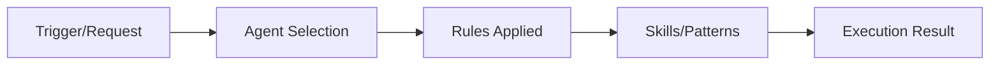

## The Question

After updating our blog post trigger (`bp.md`) to stop storing blog posts to OpenMemory, a natural question emerged: **What actually counts as a "flow"?**

Is `bp.md` itself a flow? Is the process of creating a blog post a flow? Where's the line between execution and documentation?

This article clarifies the distinction and provides a simple test.

---

## The Definition

A **flow** is an **execution** — a sequence of steps that actually happened in time, with a start, middle, and end.

It's not a description of what could happen. It's what **did happen**.

---

## Key Characteristics

| Characteristic | Flow ✅ | Not a Flow ❌ |
|---------------|---------|---------------|
| **Temporal** | Happens in time (has timestamps) | Static documentation |
| **Execution** | Actually performed | Just described/instructed |
| **Outcome** | Has a result (success/fail/partial) | No outcome — it's just text |
| **Steps** | Discrete stages with durations | Just sections in a document |
| **Agent(s)** | Involves agent(s) doing work | Just instructions for agents |

---

## The Test

**Ask: "Did something actually happen in time with steps and an outcome?"**

- ✅ **Yes** → It's a flow → Consider storing to OpenMemory
- ❌ **No** → It's documentation → Don't store

---

## Examples

### Flows (Store These)

| Event | Why It's a Flow |
|-------|-----------------|
| **"bp" trigger execution** | User said "bp" → agent detected context → wrote markdown → saved file → published. Has timestamps, outcome, steps. |
| **Delegation: sisyphus → explore** | Agent delegated task to subagent, which executed and returned results. |
| **Task: Fix YouTube flow** | Multiple steps: investigate → diagnose → fix → verify. Has files changed, errors, duration. |
| **Menu choice: Option A** | User selected from menu → decision recorded → action taken. |
| **Update bp.md** | Read file → edited content → verified change → stored decision. Has timestamps and outcome. |
| **This conversation** | User asked question → agent clarified → we're here now. |

### Not Flows (Don't Store)

| Item | Why Not a Flow |
|------|----------------|
| **`bp.md` file** | Static documentation describing how to create blog posts. No execution, no timestamps. |
| **`flows.md` documentation** | Describes the flow tracking system. Doesn't execute anything. |
| **Blog post markdown file** | Artifact — the *creation* was a flow, the file itself is not. |
| **Python script file** | Code artifact — the *creation* was a flow, the file is not. |
| **Configuration files** | Static settings. No execution. |

---

## The Artifact Distinction

This is the key insight:

```
FLOW (store this):              ARTIFACT (don't store):
────────────────────            ────────────────────────
"I created a script"      →    The script file itself
"I wrote a blog post"     →    The blog post file itself
"I made a decision"       →    The decision rationale (store this)
"I updated bp.md"         →    The bp.md file (already in filesystem)
```

The **act of creation** is a flow. The **created thing** is an artifact.

---

## Flow Notation: A>B>C>D>E

A flow is represented as a sequence:



**With timestamps:**
```
A[16:17:06] > B[16:17:06.1] > C[16:17:06.2] > D[16:17:06.3] > E[16:17:11]
Duration: 5 seconds
Outcome: ✅ Success
```

---

## Case Study: The bp.md Update

### What Happened

User asked: "update this flow (blog post as is) so you dont save blog posts to openmemory from now on"

### The Flow

| Step | Action | Timestamp | Duration |
|------|--------|-----------|----------|
| A | User requested update | 17:10:00 | 0ms |
| B | Agent read bp.md | 17:10:01 | 1s |
| C | Agent located storage section | 17:10:02 | 1s |
| D | Agent edited file | 17:10:05 | 3s |
| E | Agent verified change | 17:10:06 | 1s |

**Flow Notation**: `A > B > C > D > E`

**Outcome**: ✅ Success — bp.md no longer stores blog posts

**That's a flow.**

### What Was NOT a Flow

- The `bp.md` file itself (artifact)
- The blog posts it creates (artifacts)
- The documentation it contains (static text)

---

## What to Store to OpenMemory

### ✅ DO Store (Flows)

| Type | Example |
|------|---------|
| **Task completions** | "Fixed YouTube flow stalls (2 issues, 15 min)" |
| **Delegations** | "sisyphus → explore: Find auth patterns" |
| **Menu choices** | "Selected Option A (Recommended)" |
| **Skill invocations** | "Executed git-master skill (commit created)" |
| **Architecture decisions** | "Decided: Use OpenMemory instead of flows.json" |
| **Protocol updates** | "Updated bp.md to not store blog posts" |

### ❌ DO NOT Store (Artifacts/Documentation)

| Type | Example |
|------|---------|
| **Blog posts** | Already published to Hugo |
| **Documentation files** | Already in filesystem |
| **Configuration files** | Already in filesystem |
| **Code files** | Already in filesystem |
| **Static content** | No execution happened |

---

## Why This Matters

### Redundancy Problem

If we stored blog posts to OpenMemory:
1. Blog post exists in Hugo (`/media/docker/website/content/posts/`)
2. Blog post accessible via web (`http://ubuntu4:1313/posts/slug/`)
3. Blog post version controlled in filesystem
4. **Then we also store to OpenMemory?** → Redundant

### The Solution

Blog posts are **self-documenting artifacts**. They don't need to be in OpenMemory because:
- Hugo already serves as the persistent record
- Web server makes them accessible
- File system stores them
- Version control tracks changes

OpenMemory should store **agent memory** — things that aren't already persisted elsewhere.

---

## Real Session Example

### Flows That Happened This Session

| # | Event | Flow? | Outcome |
|---|-------|-------|---------|
| 1 | Investigate YouTube stalls | ✅ | Found 2 root causes |
| 2 | Create hourly monitor | ✅ | Script + cron job |
| 3 | Migrate to OpenMemory | ✅ | Python analyzer + docs |
| 4 | Create migration blog post | ✅ | Published |
| 5 | Update bp.md | ✅ | Removed storage |
| 6 | Discuss "what is a flow" | ✅ | Concept clarified |

### Artifacts Created This Session

| Artifact | Already Stored In |
|----------|-------------------|
| `/root/scripts/flow-analyzer-openmemory.py` | Filesystem |
| `/root/.config/opencode/docs/instructions/triggers/flows-v2.md` | Filesystem |
| Blog post markdown | Hugo + filesystem |
| `bp.md` (updated) | Filesystem |

**None of these artifacts need to be in OpenMemory** — they're already persisted.

---

## The Decision Framework

When deciding whether to store something to OpenMemory:

```
1. Is it an execution? (Did something happen?)
   └─ No → Don't store
   └─ Yes ↓

2. Does it have timestamps and outcome?
   └─ No → Don't store
   └─ Yes ↓

3. Is it already persisted elsewhere?
   └─ Yes (Hugo, filesystem, version control) → Don't store
   └─ No → Store to OpenMemory
```

---

## Summary

**A flow is:**
- An execution that happened in time
- A sequence of steps with timestamps
- Something with an outcome (success/fail)
- Agent(s) doing work

**A flow is NOT:**
- Documentation describing what could happen
- Static files (code, configs, markdown)
- Artifacts created by flows
- Instructions or protocols

**The test:** "Did something actually happen in time with steps and an outcome?"

**The rule:** Store flows (executions) to OpenMemory. Don't store artifacts (they're already persisted).

---

## Updated bp.md Behavior

As of this session, the `bp` trigger now:

1. ✅ Creates blog posts
2. ✅ Verifies they're published
3. ✅ Delivers links to user
4. ❌ **Does NOT store to OpenMemory**

Blog posts are artifacts. The act of creating them is a flow. The files themselves don't need memory storage — Hugo already handles that.

---

**Session Context**: This clarification emerged from updating `bp.md` to stop storing blog posts. The update itself was a flow (A>B>C>D>E). The updated file is an artifact.

**Related**: Flow Tracking Migration (earlier today) - moved from `flows.json` to OpenMemory-based system.

---

*Flows are verbs. Artifacts are nouns. Store the verbs, not the nouns.*