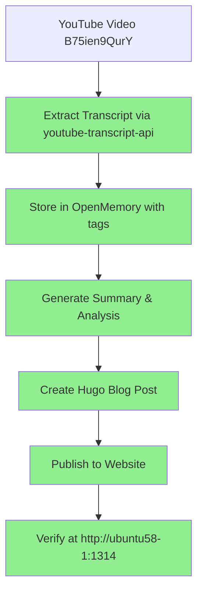

## Summary

This video analyzes Trump's appearance at the World Economic Forum in Davos, which the speaker describes as a "bombshell of epic proportions" that confirms the end of the unipolar, rules-based international order established after World War II.

## Key Points

- Trump's Davos appearance signals the definitive end of the post-WWII globalist consensus
- He directly confronted European elites instead of traditional adversaries like Putin or China
- European energy policies criticized as suicidal (electricity prices up 139%)
- NATO's reliability questioned - would European allies actually invoke Article 5 to help the US?
- The center of geopolitical gravity is shifting back to the Western Hemisphere
- Trump is drawing lines: countries must choose to be "with us or against us"

## Complete Transcript

[0.2s] What Trump did at Davos this week was a
[2.0s] bombshell of epic proportions. The
[4.0s] reverberations are still echoing around
[5.8s] the world. And I don't care if you voted
[7.4s] for Trump, you protested Trump, you
[9.2s] never want to hear his name again. It
[11.0s] really doesn't matter because what he
[12.6s] did was confirmation of what I've been
[14.5s] saying for the last year. The so-called
[16.6s] rules-based Bretonwoods era order is
[19.4s] finished. It's done. The unipolar order
[22.1s] is over. And the globalists are furious
[24.8s] about it. They're scratching back,
[26.6s] trying to cling to it. Howard Lutnik
[28.4s] nailed it. We are here to make a very
[31.1s] clear point. Globalization
[34.8s] has failed the West and United
[37.8s] States of America.
[39.3s] >> Lutnik is right. People are missing the
[41.1s] bigger story here. They're obsessing
[42.5s] over Greenland, which is a huge part of
[44.5s] the story. But Davos was the signal
[46.5s] flare, reshuffle of the story. Trump
[49.0s] walked into the World Economic Forum,
[50.7s] the globalist living room, the former
[53.2s] home of Klaus Schwab, and he framed it
[55.8s] as talking to friends and maybe a few
[58.2s] enemies in the room. Then he didn't go
[60.5s] after Putin or China. He went after the
[63.0s] people sitting right in front of him,
[64.5s] the European elites. He basically said,
[66.5s] "I don't trust you anymore, and I don't
[68.2s] trust you to do anything to help or
[69.8s] protect America." Like, if we had to
[72.3s] invoke Article 5 in NATO, would they
[74.6s] come to help us? Of course not. and he
[76.8s] told them their energy policies are
[78.7s] totally suicidal.
[80.3s] >> In fact, their electricity prices have
[83.2s] soared
[85.9s] 139%.
[88.7s] There are windmills all over Europe.
[91.6s] There are windmills all over the place
[94.8s] and they are losers.
[96.9s] >> He's like, you're putting wind turbines
[98.7s] up while you're sitting on the North Sea
[101.5s] loaded with oil and you refuse to drill.
[104.5s] United Kingdom produces just onethird of
[107.0s] the total energy from all sources that
[109.1s] it did in 1999. Think of that,
[111.2s] one-third.
[112.9s] And they're sitting on top of the North
[115.0s] Sea, one of the greatest reserves
[117.4s] anywhere in the world, but they don't
[120.1s] use it.
[120.9s] >> And then he tells them the other
[121.9s] forbidden truth. Europe's cities are
[124.0s] becoming unrecognizable because of mass
[126.5s] illegal immigration. from can do much
[129.2s] better by following what we're doing
[131.0s] because certain places in Europe are not
[133.8s] even recognizable frankly anymore.
[136.3s] They're not recognizable.
[137.8s] >> Now, right before Trump spoke, Canada's
[140.1s] Liberal Prime Minister Mark Carney gave
[141.8s] his Davos speech and you could not
[144.2s] script a better contrast to Trump.
[146.6s] Carney came out with this polite
[149.3s] globalist sermon basically rupture in
[152.9s] the rules-based order. He said it's a
[154.6s] rupture. Tariffs as weapons. Middle
[157.4s] powers need to band together. Not
[159.8s] superpowers like the little guys. The
[161.6s] middle powers need to come together.
[163.4s] Watch. Friends, it is time for companies
[167.8s] and countries to take their signs down.
[170.5s] For decades, countries like Canada
[172.4s] prospered under what we called
[174.0s] the rules-based international order. We
[176.3s] joined its institutions. We praised its
[178.4s] principles. We benefited from its
[180.6s] predictability.
[182.2s] And because of that, we could pursue
[184.0s] values-based foreign policies under its
[186.1s] protection.
[187.8s] Let me be direct. We are in the midst of
[190.7s] a rupture, not a transition. So the
[193.0s] translation here is, please everybody,
[195.2s] stop the superpowers from acting like
[197.3s] superpowers. Okay? And the hypocrisy is
[200.6s] wild because he's being hammered back at
[202.8s] home over Canada cozying up with China.
[206.5s] So, it's Wait a minute. We're going to
[208.7s] stand up to the superpowers while also
[211.0s] doing deals with Beijing. So, rules for
[213.8s] you, deals for Beijing for me. Okay.
[217.5s] Then Trump gets up and punches inward.
[219.9s] The Europeans, the NATO class, the
[222.0s] people who've been lecturing America
[223.7s] while cashing our checks. And then he
[225.4s] turns to Carney. Reports say Trump
[228.0s] actually told told him face to face that
[230.4s] Canada should be grateful
[232.7s] that Canada lives because of the United
[234.7s] States. Then he said that publicly.
[236.6s] >> Canada gets a lot of freebies from us,
[238.6s] by the way. They should be grateful
[240.0s] also. But they're not. I watched your
[242.4s] prime minister yesterday. He wasn't so
[244.3s] grateful. But they should be grateful to
[247.0s] us. Canada
[249.4s] lives because of the United States.
[251.4s] Remember that, Mark? The next time you
[253.5s] make your statements.
[254.8s] >> When Carney tries to posture like, "Oh,
[256.6s] we declined Trump's board of peace."
[259.3s] Trump basically laughs and then moves
[261.0s] on, withdraws the invitation. We don't
[263.3s] want you on our board of peace anyway.
[264.6s] And you can call it whatever you want.
[265.9s] Yeah, Netanyahu is on there. Come on.
[268.0s] That's like putting Thanos on your board
[269.8s] of peace, right? Anyway, it doesn't
[271.9s] really matter. But the point is, it's a
[273.4s] power move. Trump is building structures
[275.9s] outside the usual UN NATO machinery. And
[279.3s] he's basically saying, "Hey, we're done
[281.6s] with the United Nations. We're really
[283.3s] done with NATO, and I'm going to I'm
[286.2s] going to decide who's in and who's out.
[288.1s] Are you with us or are you against us?"
[290.3s] That's it. He just drew a line in the
[291.8s] sand.
[293.2s] Meanwhile, Carney's answer is peak
[295.1s] panic. He wants a coalition of middle
[297.6s] powers to stand up to superpowers.
[300.5s] That's like getting a group of
[301.8s] benchwarmers together to form a
[303.6s] committee to hold the starters
[304.9s] accountable. It's like a group of Karen
[307.6s] Hall monitors
[309.5s] telling others what to do. Okay, great.
[312.8s] Now, here's the point that everyone's
[314.5s] missing. This isn't just about
[316.1s] Greenland. Greenland is the exclamation
[318.2s] point here. This is the bigger story
[320.3s] though is that Trump is reentering US
[322.8s] strategy around the Western Hemisphere.
[325.8s] Again, love it or hate it, it doesn't
[328.0s] matter. But this is what is happening.
[330.6s] It's not a conspiracy. He actually wrote
[333.0s] it down. It's in his national security
[334.6s] strategy paper that was published before
[336.4s] Christmas. The Western Hemisphere was
[338.8s] the entire point. I think people just
[341.4s] maybe didn't take him at his word. The
[343.9s] whole point is to stabilize the
[345.7s] hemisphere, deter mass migration flows,
[348.8s] stop them from pouring into the United
[350.5s] States, crush all of these drug cartels
[353.2s] and these transnational criminal
[354.9s] networks that are trafficking children
[357.0s] and bringing all sorts of drugs into the
[358.9s] United States, and block hostile foreign
[361.5s] powers from owning key assets in our
[363.4s] backyard. Like, regardless of how you
[366.2s] feel about China, why does China own so
[368.6s] much land near our military bases?
[371.4s] Anyway, you can call it a modern-day
[372.9s] Monroe Doctrine energy, Donro
[375.3s] doctrine, as people are calling it.
[376.6s] Whatever. I know it's hokey. Who cares?
[379.8s] Only one hegemony in the Western
[382.0s] Hemisphere. And it's not Brussels. It's
[384.3s] in Washington DC. Again, it really
[386.9s] doesn't matter how you feel about it.
[389.3s] This is what's happening. It's not just
[390.8s] words. Now, look at the pattern here of
[393.0s] what Trump's doing. Argentina, open
[395.6s] support for Malay's government there.
[397.6s] Washington picking aside and saying this
[399.7s] matters in Argentina. Mexico cartels now
[402.6s] being designated as terrorist
[404.1s] organizations thanks to the bullying
[406.6s] from the Trump administration. That
[408.5s] changes the framework. This stops it
[410.2s] just being a crime and now it becomes a
[412.5s] national security issue and it expands
[414.2s] to what the US is willing to do. I don't
[416.4s] know. Bomb, by the way. And by the way,
[419.1s] the most immediate threat to Americans
[421.3s] isn't sitting in Tyrron. It's actually
[424.0s] sitting in cartel territory across the
[426.1s] border. As Colonel Douglas McGregor has
[428.4s] repeatedly said on our show, the biggest
[430.4s] threat to the United States of America
[432.4s] comes from Mexico.
[433.4s] >> And they're damn well interested in
[434.6s] what's happening in Mexico because they
[437.0s] know that that is a cesspool of
[439.5s] barbarism, savagery, criminality, and
[443.4s] that's our existential threat.
[445.8s] >> Yesterday, we learned that General Kaine
[447.4s] ordered the largest ever meeting of
[449.4s] Western Hemisphere militaries to come
[451.3s] together for a meeting. The point of
[452.9s] this meeting is to crush cartels,
[454.9s] terrorists, transnational criminal
[456.6s] networks. This is huge. 34 countries
[459.3s] meeting militarily to discuss what
[461.6s] they're going to do in the Western
[463.0s] Hemisphere.
[464.7s] And then there's Alberta, Canada. And
[467.0s] this is the part that's insane. This
[468.6s] week, Treasury Secretary Scott Benson on
[470.7s] camera talking about Alberta like it's a
[472.6s] free agent, praising Albertans as
[475.2s] fiercely independent, talking about how
[477.1s] fed up they are, basically saying an
[479.5s] independent Alberta would be a natural
[481.6s] partner for the United States. I mean,
[483.8s] let that sink in. The US Treasury
[485.5s] Secretary, not some random internet
[487.1s] account, openly waiting into Canadian
[489.2s] international politics during Davos
[491.5s] while Carney is literally in the
[493.3s] building. That's the contrast in one
[496.0s] sentence. Carney is begging for a
[497.9s] rules-based order while Trump's team is
[500.2s] saying, "Cool speech. Also, your richest
[502.6s] province might break up with you and
[504.9s] maybe want to join the United States."
[507.3s] And that's why the globalists are
[508.6s] furious here because the old model was,
[510.8s] "Hey, America's going to pay for
[512.2s] everything. America is going to protect
[513.7s] you. America follows rules while
[516.8s] Europe moralizes and cashes in." So
[519.4s] that's why you're seeing freakouts
[520.7s] right now. They're not mad because Trump
[522.4s] is out of control. That's how they label
[524.7s] him. is out of control. Maybe really is
[527.5s] he? They're mad because he's actually in
[530.1s] control and the control is shifting back
[532.6s] towards a national interest in the
[534.4s] United States. Border security,
[536.4s] hemispheric power. And Greenland is the
[539.6s] ultimate piece of that puzzle. Not
[540.9s] leasing, not sharing, you know, total
[542.9s] control there. Arctic access, minerals,
[545.1s] basing, northern approach. That's
[547.8s] why NATO and Europe are panicking. It
[549.6s] signals the United States is willing to
[551.4s] redraw priorities and Europe is not at
[554.5s] the top anymore. Sorry. So yes, laugh at
[557.4s] Davos, but don't miss what's happening
[559.2s] underneath. The postworld war II
[561.4s] globalist consensus is being replaced
[563.6s] with something harder and more
[565.0s] transactional. And the center of gravity
[567.1s] is shifting back to the Western
[568.6s] Hemisphere. Friend of the show, Anthony
[570.6s] Pompiano, just said it best last night.
[572.4s] He said, "Look, you know, you've got
[574.6s] this whole change that's happening,
[576.0s] geopolitics and money, and you better
[578.6s] keep your head on a swivel right now if
[580.5s] you want to if you want to survive
[582.2s] what's about to happen." So, that's the
[584.2s] news update part of today's video. Now,
[586.2s] brings me to the money portion that
[588.8s] I want to talk about and the sponsor for
[590.5s] today's video because when the world
[592.2s] when the world order shifts, money moves
[594.8s] fast. So, you need to pay attention to
[596.2s] the money piece of this and it is moving
[598.2s] big time right now. So, in the past two
[600.8s] months, my life has completely changed
[603.1s] because of the surge in both gold
[605.4s] and silver markets right now. I've said
[607.9s] it many times in the past few years. I'm
[610.0s] bullish on precious metals and I own
[612.1s] physical as well as a nice portfolio of
[615.0s] mining stocks. Been telling you this for
[617.4s] years. So, the dramatic sell-off in the
[620.2s] US dollar and the export controls on
[622.3s] silver from China are not new to me or
[624.6s] to you because on my channel I've been
[626.6s] discussing the end of globalization now
[628.6s] for the past 18 months at least.
[631.5s] Everything is tied to the big picture
[633.0s] that I keep covering and assessing for
[634.6s] you bringing independent research, world
[637.0s] recognized experts to your attention.
[639.1s] This week I had Peter Schiff, economist
[640.7s] Peter Schiff on the show. He said money
[643.0s] is going to start moving into mining
[644.8s] stocks because of what Trump is doing to
[646.9s] bring this infrastructure back home.
[649.2s] >> I think the real real opportunity for
[651.1s] people who, you know, have a little bit
[652.9s] more of a risk-taking mentality. I look
[655.2s] at gold and silver as conservative
[658.0s] stores of value. But gold mining stocks
[661.1s] and silver mining stocks, yeah, they've
[663.4s] tripled this year, but given how much
[666.6s] gold and silver have gone up, these
[668.7s] stocks are actually cheaper now than
[670.5s] before they triple. The thing is, Wall
[672.4s] Street hasn't woken up to that yet. So,
[674.7s] I think there's still an incredible
[676.2s] opportunity for people to buy these
[678.4s] mining companies that are literally, you
[680.6s] know, gold mines. They are now making a
[683.3s] fortune uh mining gold and silver
[686.7s] because their costs are about the same
[688.6s] if not a little lower than they were a
[690.2s] year ago. By the way, that was earlier
[691.8s] in the week. And then by the end of the
[693.4s] week, suddenly big money started moving
[696.2s] into a lot of junior mining stocks. Now,
[698.4s] look at the previous sponsors of my
[700.2s] channel. Now you can see for yourself
[701.6s] the companies that I'm bringing to your
[703.0s] attention. Now I told you about this
[704.6s] company. Then it went up 600% in the
[707.5s] last year after I told you about it.
[709.4s] Here's another one I told you about that
[710.8s] went up 420% in the past year. Trading
[714.0s] at all-time highs right now. Another
[717.0s] 128% in the past one year and near its
[720.5s] all-time high. Then I told you about
[723.5s] this one went up over a,000% in the past
[726.5s] years. Crushing markets trading at
[728.2s] another all-time high. These are just a
[730.5s] few of the mining companies that I've
[732.3s] been researching and bringing on as
[734.0s] sponsors of our channel that I feature
[736.3s] to you. Here's another one. Up 297%
[739.6s] this past year. Here's another one.
[741.7s] There's more. 492% in the past year,
[745.4s] 415% in the past 5 years, and 241%
[750.4s] in the past year. So, these are junior
[752.7s] mining companies and senior mining
[754.6s] companies in the natural resources
[756.4s] sector. gold, silver, copper, uranium,
[759.2s] lithium, and others. So, today I'm going
[761.2s] to feature a company that is considered
[762.8s] a junior explorer. It has exposure to
[765.4s] five metals simultaneously, including
[768.0s] gold and copper, both trading at
[769.9s] all-time highs. Uranium, which is
[772.2s] trading at multi-year highs, and lithium
[774.9s] that has nearly tripled in the past six
[776.8s] months, as well as a critical metal that
[778.9s] Chinese are already restricting
[780.6s] exports on. I'll tell you more about
[781.9s] that in a second. So after what we all
[784.7s] saw in the past few months with Putin,
[787.7s] Trump, Xihinping, and a trade war on key
[791.2s] components for new supply chains
[792.7s] that are forming right now, I'm going to
[794.1s] drop some bombshells on you in the next
[795.6s] few minutes, and you're going to be
[796.5s] amazed at how much work there's still
[798.0s] ahead of us to actually bring security
[800.4s] and minerals to the industrialized world
[803.4s] and into inside of America. So we know
[806.2s] that Trump enacted 50% tariffs related
[809.0s] to copper. The Chinese Communist Party
[811.2s] restricted exports on rare earth metals
[813.7s] in October and then just recently they
[815.9s] announced restrictions on silver. Russia
[819.4s] has seen Trump's administration taking
[821.4s] over Venezuela's oil industry. And I
[824.1s] want to show you that on the lithium
[825.9s] uranium uh side and in a strategic and
[829.1s] rarely talked about mineral that I'm
[831.0s] featuring for the first time in this
[832.3s] channel's history. China commands major
[834.2s] leverage over the West. Copper, gold,
[837.1s] lithium, uranium. And for the first time
[839.4s] ever, malibdinum. There are five key
[842.6s] minerals that our today's sponsor,
[844.7s] Vanguard Mining, has direct exposure to
[847.7s] in its diversified portfolio. So, I'm
[849.6s] going to put their ticker symbol up here
[851.2s] on your screen. It's UUFF
[854.6s] on the United States exchanges. Now,
[857.5s] they span a number of safe and
[859.8s] USfriendly jurisdictions does Vanguard
[862.4s] Mining. So, Vanguard Mining is the first
[864.2s] sponsor I've ever featured that is so
[866.1s> wisely diversified in multiple regions
[868.2s] and numerous metals. So, they are
[871.2s] available at Interactive Brokers,
[872.7s] Schwab, all of the big ones. E Trade,
[874.5s> Fidelity, if you want to look more
[876.3s] closely at them. Now, you have to see
[878.2s] what I saw when it comes to Chinese
[879.8s> dominance over these. Okay, lithium.
[882.8s] Lithium's price nose dived by 90%. It
[886.9s] bottomed in June of 2025 and it's
[889.6s] already doubled since then. So that
[892.2s] lithium winter is officially over.
[895.4s> China's strangle hold on lithium is most
[897.3s> evident in refining and processing where
[899.2s] it controls a commanding share of global
[901.2s> capacity. China pro get this China
[903.5s> processes 60 to 70% of world's
[906.6s> lithium chemicals including lithium
[908.8s> carbonate hydroxide and then taken
[911.1s> together China's lithium strangle hold
[913.7s> is a three layer system. It's kind of
[915.4s> crazy. They have processing dominance.
[917.6s> Then they have battery supply chain
[919.8s> scale and then they have the ability to
[921.9s> tighten the screws via export
[923.6s> restrictions which is what they did.
[926.6s> Copper China imports about 60% of global
[929.7s> copper ore and unrefined copper and then
[932.3s> it produces more than 45% of the world's
[935.7s> refined copper. But then on the
[937.8s> consumption side, China consumes about
[940.5s> 58% of the world's refined copper. So
[943.8s> much of it stays there.
[945.8s> China's copper strangle hold via
[948.2s> refining monopoly ore imports massive
[951.7s> consumption and then procurement
[953.6s> leverage positions it as a huge
[955.7s> gatekeeper for global electrification
[957.8s> right now and you know the demand for
[960.2s> electrification across the world and in
[962.5s> the United States
[964.4s> now malibdinum China holds a profound
[967.3s> strangle hold on malibdinum short hand
[970.2s> is called Mali it's easier to say than
[972.5s> malibdinum anyway they're dominating ing
[975.0s> primary production and
[976.5s> leveraging export restrictions to
[978.2s> control global availability of this
[980.0s> mineral while they're also consuming a
[981.9s> large share domestically for its steel
[983.8s> industry. China accounts for about 42 to
[986.9s> 45% of global Mali output. Now, the
[991.0s> most alarming development in China's recent
[993.1s> export crackdown in 2025. Chinese
[995.4s> authorities introduced strict strict
[997.4s> export controls on Mali powders and
[1000.3s> related alloys that were e being
[1002.2s> exported to the west with that has now
[1004.2s> collapsed by over 95% in a single year.
[1007.4s> It's crazy. So these are the main
[1010.1s> reasons why vanguard mining is huge on
[1012.5s> my list. These projects are gold in
[1015.3s> Brussels Creek project in British
[1016.9s> Columbia, gold copper palladium
[1019.4s> exploration project in the Cam Loops
[1021.4s> mining district. Gold just hit $5,000 an
[1024.7s> There's never been a better time in my
[1027.0s> opinion than on the uranium side. As the
[1029.5s> US looks to decouple from foreign supply
[1031.8s> chain vulnerabilities, the mandate is
[1033.5s> clear. Secure domestic and friendly
[1035.4s> jurisdiction uranium at any cost. We
[1037.9s> need it. The real X-actor isn't just
[1040.5s> policy. It's big tech right now.
[1041.8s> Companies like Amazon, Google, Microsoft
[1045.1s> are now bypassing traditional utilities
[1047.4s> to secure long-term power directly from
[1049.6s> their own nuclear reactors.
[1052.0s> You ever think like Amazon be building
[1053.6s> its own nuclear reactors? They are. This
[1056.0s> is why we've identified Vanguard Mining
[1058.5s> because they control 90,000 hectars in
[1061.3s> Paraguay's Parana Basin, strategically
[1063.9s> located right next door to a worldclass
[1066.2s> UT project. Lithium Argentine projects
[1069.8s> are key Westernfriendly alternatives to
[1071.9s> dominant suppliers. So, Vanguard Mining,
[1073.8s> which has brilliantly reclaimed 100%
[1076.2s> interest in the Pokeitos 1 lithium
[1078.5s> stellar project in Argentina. They have
[1081.1s> high potential brine asset enhances
[1083.1s> Vanguard Mining's corporate portfolio.
[1085.2s> So, the Pokeitos 1 project offers direct
[1088.0s> exposure to Argentina's worldclass
[1090.2s> solars. Lithium has nearly tripled since
[1093.4s> June 2025. There's never been a better
[1095.3s> time, I believe. Copper, Mali,
[1098.5s> indispensable. So, it strengthens steel.
[1101.1s> It's critical for pipelines, defense
[1103.2s> systems, aerospace, energy
[1104.8s> infrastructure. So, Vanguard Mining's
[1107.4s> inclusion of malibdinum alongside gold,
[1110.2s> uranium, lithium, and copper makes it
[1112.1s> uniquely positioned right now. So, guys,
[1114.5s> do your own research on this multiple
[1116.6s> minerals company. I'll have links in the
[1118.6s> description below so you can dive more
[1120.2s> deeply.

## Video Details

- **Video ID**: B75ien9QurY
- **Duration**: 37.39 minutes
- **Segments**: 501
- **Source**: https://youtu.be/B75ien9QurY

---

## Workflow Diagram

---

*This blog post was created using an automated workflow: YouTube video transcription → OpenMemory storage → Hugo blog post generation*