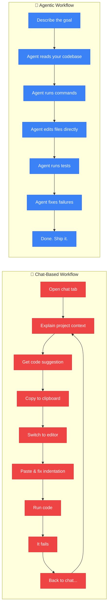
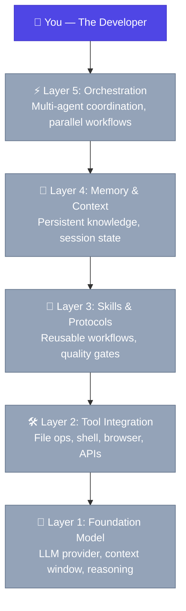

You're still copy-pasting from ChatGPT into your editor. There's a better way.

I know because I did it for months. You probably do it too — fire up a chat tab, describe your problem, get back a code block, highlight it, switch windows, paste it in, fix the indentation, realise it references a dependency you don't have, go back to the chat, ask for a fix, get another block, paste that in, run it, it fails, go back again. Sound familiar?

That loop — chat, copy, paste, debug, repeat — is the dominant way developers interact with AI in 2026. And it works, sort of. It's faster than Stack Overflow. But it's also fundamentally limited in ways that are about to feel very old-fashioned.

Let me show you why.

## The 3 Problems with Chat-Based AI

Chat-based AI tools — Copilot chat, ChatGPT, Gemini — are incredibly useful. I'm not here to bash them. But they share three structural limitations that cap how much they can actually help you.

### Problem 1: Context Loss

Every conversation starts from zero.

You open a new chat window and the AI knows nothing about your project. It doesn't know you're using Next.js 15 with the App Router, not Pages. It doesn't know your database schema, your naming conventions, or that you spent three hours yesterday refactoring the auth module. You have to re-explain all of it, every single time.

It's like hiring a junior developer who gets amnesia between every standup. "Oh hi, remind me again — what are we building? What language? What framework? Oh right, TypeScript. And we're using Prisma, not Drizzle? Okay, let me re-read the docs..."

This isn't a minor inconvenience. It's a fundamental architectural constraint. Chat interfaces are stateless by design. They were built for Q&A, not for sustained collaborative work on a codebase.

### Problem 2: No Tool Access

Your AI can't do anything. It can suggest, but it can't act.

When you ask ChatGPT to "fix the failing test in `auth.test.ts`," it gives you a code snippet. But it can't read the actual file. It can't run the test to see what's failing. It can't check which assertion is throwing. It can't look at the git history to see what changed. It's a brilliant developer locked in a room with no computer — all advice, no execution.

Think about what you do when you debug. You read the error message. You look at the file. You check the test output. You search for related code. You run the test again. Each step is a tool use — and chat-based AI has none of them.

### Problem 3: No Persistence

Learned behaviour resets each session.

After weeks of chatting, your AI has learned that you prefer `const` over `let`, that your API routes follow REST conventions, that you always add error boundaries. None of that survives to the next conversation. You're teaching the same lessons over and over.

It's Groundhog Day, but for code style preferences.



On the left: nine steps, and you're the glue between every single one. On the right: you describe what you want, and the agent does the rest. Same goal, fundamentally different experience.

## What "Agentic" Actually Means

The word "agentic" gets thrown around a lot in AI marketing right now, so let me be specific about what I mean.

An **agentic AI tool** has three properties that chat-based tools lack:

**1. Autonomous, goal-directed action.** You don't give it step-by-step instructions. You give it a goal — "fix the authentication bug" or "add a rate limiter to the API" — and it figures out the steps. It reads the relevant files, understands the architecture, makes changes, runs tests, and iterates until the goal is met. You're a manager, not a typist.

**2. Tool use and environment awareness.** The agent can read files, write files, run shell commands, search your codebase, query databases, browse documentation, and call APIs. It operates in your actual development environment, not in a vacuum. When it suggests a fix, it's already verified it against your real code.

**3. Persistent context and learned behaviour.** The agent remembers your project structure, your conventions, your preferences, and your past decisions. It builds up institutional knowledge over time, just like a real team member would. The longer you work with it, the better it gets — because it's learning *your* codebase, not just general programming patterns.

Think of the difference this way: a chat AI is a consultant you hire for an hour. An agentic AI is a pair programmer who sits next to you every day, reads every file in your project, and remembers every decision you've ever made together.

That's not an incremental improvement. That's a category shift.

## Quick Demo: OpenCode vs Claude Code

Right now, the two most powerful agentic coding tools are **OpenCode** and **Claude Code**. They take different approaches to the same problem.

**OpenCode** is an open-source CLI that sits in your terminal. You type `opencode` and get an interactive session where the AI can read your files, run commands, edit code, and execute tests — all with your approval at each step. It supports multiple LLM providers, has a skill system for extending its capabilities, and runs entirely on your machine. It's the hacker's agentic tool: extensible, transparent, and self-hosted.

**Claude Code** is Anthropic's agentic tool, deeply integrated with the Claude model. It excels at understanding large codebases, following complex instructions, and making multi-file changes that actually work together. It's polished, fast, and the Claude model's reasoning capabilities make it particularly good at architectural decisions.

Here's what using either one looks like in practice:

```bash
# You type:
> Add pagination to the /api/users endpoint. Use cursor-based pagination,
  20 items per page. Update the tests too.

# The agent does:
# 1. Reads src/routes/users.ts to understand the current endpoint
# 2. Reads src/db/schema.ts to check the database structure
# 3. Reads the existing tests in tests/users.test.ts
# 4. Edits src/routes/users.ts to add cursor-based pagination
# 5. Runs the test suite — 2 tests fail
# 6. Reads the failing test output
# 7. Fixes the test expectations to match the new response format
# 8. Runs the test suite again — all pass
# 9. Shows you the diff for review
```

Nine steps. Zero copy-pasting. Zero context re-explaining. Zero manual debugging loops.

You review the diff, approve it, and move on. The whole thing takes maybe 30 seconds. Doing it manually — even with chat AI assistance — would take 10-15 minutes of switching between files, writing the pagination logic, updating tests, running them, debugging failures, and iterating.

That's the agentic difference. Not better suggestions. *Autonomous execution.*

## The Agentic Stack: Series Roadmap

This post is the first in a six-part series called **The Agentic Stack**. We're going to build up from first principles to production-ready agent configurations, one layer at a time.

Here's the full picture — each layer builds on the one below it:



The greyed-out layers are what we'll unlock together across this series:

| Post | Title | Layer | What You'll Learn |
|------|-------|-------|-------------------|
| **Post 1** | Why Agentic Coding Changes Everything | Overview | The case for agents (you are here) |
| **Post 2** | Foundation Models — Choosing Your Engine | Layer 1 | How to pick the right LLM for coding tasks |
| **Post 3** | Tool Use — Giving Your Agent Hands | Layer 2 | File operations, shell access, browser control |
| **Post 4** | Skills — Teaching Your Agent Good Habits | Layer 3 | Reusable workflows, quality gates, protocols |
| **Post 5** | Memory — Building Institutional Knowledge | Layer 4 | Persistent context, session state, long-term learning |
| **Post 6** | Orchestration — Agents Working Together | Layer 5 | Multi-agent coordination, parallel workflows, production setup |

By the end of the series, you'll have a complete mental model for building a production-grade agentic coding setup — and the practical knowledge to actually do it.

## Start Today

You don't need to wait for the rest of the series to get started. If you're still copy-pasting from chat windows, try this right now:

1. **Install OpenCode**: `npm install -g opencode` — it's open source and runs locally
2. **Or try Claude Code**: `npm install -g @anthropic-ai/claude-code` — polished and powerful
3. **Open a real project** in your terminal, not a toy example
4. **Give it a real task** — something you'd normally spend 15 minutes on
5. **Watch what happens**

The first time an agent reads your codebase, understands the context, makes changes across multiple files, runs your tests, and fixes the failures — all without you touching the keyboard — that's when you'll feel it. The shift. The moment you realise you're not going back.

Welcome to agentic coding. It changes everything.

---

*Next in The Agentic Stack: [Foundation Models — Choosing Your Engine](/posts/foundation-models-choosing-your-engine/)*