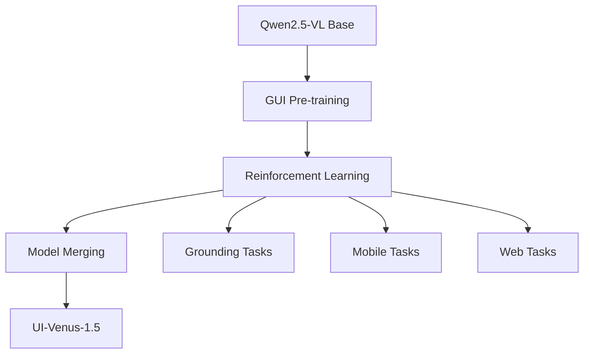

## Overview

UI-Venus-1.5 is a vision-language model from Inclusion AI that can analyze screenshots and determine appropriate GUI actions. In this video, Fahd Mirza demonstrates how to install and use this powerful local AI agent that can navigate websites and applications autonomously.

<!--more-->

## What is UI-Venus-1.5?

UI-Venus-1.5 is a GUI agent model that:
- Takes **screenshots** combined with **natural language instructions**
- Outputs actions: **click coordinates**, **typing**, or **scrolling** commands
- Built on **Qwen2.5-VL** (vision-language model foundation)
- Available in three sizes: **2B**, **8B**, and **Mixture of Experts** (flagship)

## Model Architecture & Training

The model was built using a 4-stage training pipeline:



1. **Base Model**: Qwen2.5-VL as foundation
2. **GUI Pre-training**: Massive GUI data to learn interface patterns
3. **Reinforcement Learning**: Separate training for grounding, mobile, and web tasks
4. **Model Merging**: Unified model combining all specializations

## Benchmark Performance

| Benchmark | Score |
|-----------|-------|
| AndroidWorld | **77.6%** |
| ScreenSpot Pro | **69.6%** (beats GPT-4) |

The model consistently dominates grounding ability across all model sizes compared to competitors like UIS and GUI-Owl.

## Technical Requirements

- **GPU**: NVIDIA RTX 6000 with 48GB VRAM (used in demo)
- **Model Size**: ~5GB download for 2B version
- **VRAM Usage**: Under 25GB when loaded
- **Dependencies**: vLLM and transformers library

## Installation

```bash
pip install vllm transformers
vllm serve inclusionai/UI-Venus-1.5-2B
```

## Practical Demonstrations

### Mobile App Test
The model successfully identified the heart icon for "liking" profiles in a dating app interface.

### Coordinate Output
When requested, the model provides **exact X/Y coordinates** for UI elements, making it suitable for building automation agents.

### YouTube Channel Test
The model correctly identified the "Videos" tab location between "Home" and "Shorts" on a YouTube channel page with accurate coordinates.

## Key Takeaways

- **Local AI Autonomy**: Runs entirely locally for privacy-preserving automation
- **Grounding Precision**: Accurately locates and identifies UI elements
- **Production Ready**: Use the Mixture of Experts model for customer-facing applications
- **Chinese App Focus**: Training data primarily from Chinese applications; Western apps may need additional fine-tuning

## Recommendation

> "If you're looking to implement it in production environment... go with the mixture of experts one." — Fahd Mirza

The 2B version is excellent for testing and development, while the MoE version is recommended for production deployments.

---

## Resources

- **Full Transcript**: Available in the processing output files
- **Short Summary**: Condensed version available for quick reference
- **Source Video**: [Watch on YouTube](https://www.youtube.com/watch?v=0-pijdJSyWc)