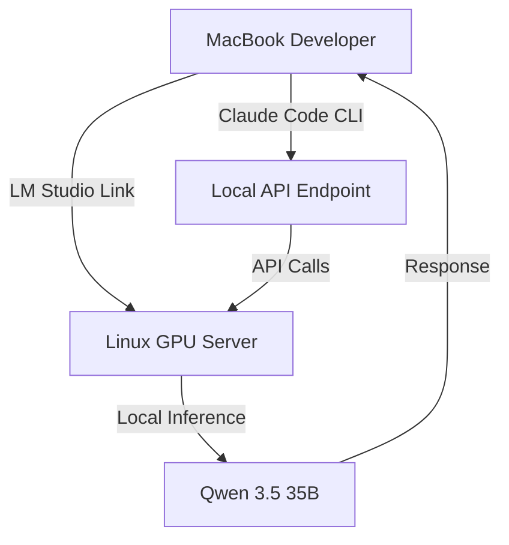

## Overview

Zen van Riel demonstrates a complete 2026 local AI coding workflow that combines Qwen 3.5 models, LM Studio's cross-device linking, and Claude Code CLI integration. This workflow enables privacy-preserving AI development without relying on cloud APIs.

<!--more-->

## Key Takeaways

### Hardware Requirements

The foundation of this workflow is a powerful GPU setup:

- **Primary GPU**: RTX 5090 with 32GB VRAM (Linux machine)
- **Development Environment**: MacBook (receives model remotely)
- **Model**: Qwen 3.5 with 35 billion parameters using Mixture of Experts (MoE) architecture
- **Performance**: 100-140 tokens per second when model fits entirely on GPU

> **Critical Warning**: Models partially loaded in system RAM perform poorly due to data transfer overhead. Always ensure your model fits entirely on GPU for usable performance.

### LM Studio Link: Cross-Device Model Sharing

One of the most powerful features demonstrated is LM Studio's linking functionality:

- Exposes encrypted connection between devices
- Allows MacBook to use Linux GPU remotely
- Appears as "linked model" in LM Studio interface
- No complex networking required

### Claude Code Integration

To connect Claude Code to local models:

```bash
export ANTHROPIC_BASE_URL=http://localhost:1234/v1
export ANTHROPIC_API_KEY=any-value
```

LM Studio exposes an Anthropic-compatible endpoint at `/v1/messages`, making integration seamless.

### Context Window Management

This is where many developers struggle:

| Setting | Default | Recommended |
|---------|---------|-------------|
| Context Window | 4,000 tokens | 80,000+ tokens |
| Overflow Behavior | Error | Truncate middle |

Claude Code's system prompt alone is 3,000+ tokens, so the default context window is insufficient.

## Architecture Overview



## Sub-Agent Strategy

A key optimization for local AI coding:

1. **Main Agent**: Orchestrates overall task
2. **Sub-Agents**: Each task gets fresh Claude Code instance
3. **Benefit**: Fresh context windows reduce token usage
4. **Result**: Much more efficient use of limited context capacity

> This approach is critical when working with local models that have limited context windows compared to cloud alternatives.

## Building Full-Stack Applications

The video demonstrates building a complete Next.js + TypeScript dashboard that:

- Proxies LM Studio API calls
- Displays real-time model status
- Shows loaded models and their configurations
- Integrates with local inference engine

The planning phase alone used 65,000 tokens, and implementation took approximately 30 minutes.

## Trade-offs: Local vs Cloud

| Local Models | Cloud Models |
|--------------|--------------|
| Complete privacy | Convenience |
| No per-token cost | Higher quality output |
| Hardware investment | No hardware needed |
| More bugs to fix | Better accuracy |
| Sometimes slower | Faster responses |

## Common Pitfalls & Solutions

| Issue | Solution |
|-------|----------|
| Model too slow | Ensure entire model fits on GPU |
| Context window errors | Increase from 4,000 to 80,000+ |
| Hard-coded/incorrect values | Provide API documentation to model |
| Bugs in generated code | Allow model to call APIs directly |

## Practical Workflow Summary

1. Set up powerful Linux machine with high-VRAM GPU
2. Install LM Studio and load Qwen 3.5 Coder
3. Enable LM Studio Link for cross-device access
4. Configure Claude Code environment variables
5. Increase context window to 80,000+ tokens
6. Use dev containers for safe autonomous coding
7. Plan with sub-agents to manage context
8. Iterate and debug (expect more bugs than cloud models)
9. Allow model to self-verify via API calls

## Bottom Line

Local AI coding in 2026 is **viable but requires significant hardware investment and careful configuration**. The combination of Qwen models, LM Studio Link, and Claude Code creates a powerful privacy-preserving workflow.

However, users should expect:
- More debugging than with cloud models
- Slower iteration cycles
- Need for hardware investment (RTX 5090 with 32GB VRAM recommended)

The gap with cloud models is narrowing rapidly, and privacy enthusiasts should definitely explore this workflow.

## Target Audience

- **Privacy enthusiasts** seeking complete data sovereignty
- **Developers with GPU hardware** (RTX 3090/4090/5090)
- **AI engineers** learning local model integration
- **Cost-conscious teams** wanting no per-token API costs
- **Offline environments** where internet is unavailable

---

## Related Resources

- **Video**: [The Unbeatable Local AI Coding Workflow](https://www.youtube.com/watch?v=3zSANOIBHYw)
- **Author**: Zen van Riel
- **Duration**: 16:34