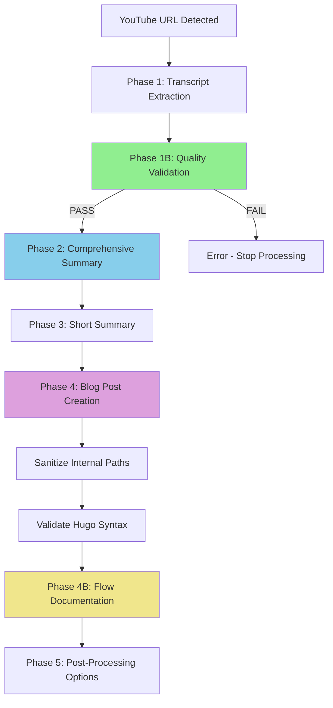

## Processing Summary

**Video**: [The Unbeatable Local AI Coding Workflow (Full 2026 Setup)](https://www.youtube.com/watch?v=3zSANOIBHYw)  
**Author**: Zen van Riel  
**Processed**: 2026-03-01 22:01:24 UTC  
**Total Duration**: ~2 minutes

---

## Video Metadata

| Field | Value |
|-------|-------|
| Video ID | 3zSANOIBHYw |
| Title | The Unbeatable Local AI Coding Workflow (Full 2026 Setup) |
| Author | Zen van Riel |
| Duration | 16:34 |
| Word Count | 3,443 |
| Timestamps | 472 |

---

## Files Generated

| Phase | File | Size |
|-------|------|------|
| Phase 1 | JSON metadata | ~/.config/opencode/docs/output/youtube_the-unbeatable-local-ai-coding-workflow-full-2026-_3zSANOIBHYw_20260301_215936.json |
| Phase 1 | Full transcript | ~/.config/opencode/docs/output/youtube_the-unbeatable-local-ai-coding-workflow-full-2026-_3zSANOIBHYw_20260301_215936.txt |
| Phase 2 | Comprehensive summary | ~/.config/opencode/docs/output/youtube_the-unbeatable-local-ai-coding-workflow-full-2026-_3zSANOIBHYw_20260301_215936_summary.md |
| Phase 3 | Short summary | ~/.config/opencode/docs/output/youtube_the-unbeatable-local-ai-coding-workflow-full-2026-_3zSANOIBHYw_20260301_215936_summary_short.md |
| Phase 4 | Blog post | /media/docker/website/content/posts/youtube-3zSANOIBHYw-local-ai-coding-workflow-2026.md |

---

## Quality Gate Results (Phase 1B)

| Check | Result | Value |
|-------|--------|-------|
| File content | ✓ PASS | 40,490 bytes |
| Required sections | ✓ PASS | All sections present |
| Timestamp entries | ✓ PASS | 472 timestamps |
| Content volume | ✓ PASS | 40,490 characters |
| Metadata | ✓ PASS | Metadata present |
| Word count | ✓ PASS | 3,443 words |

**Validation Status**: ✅ PASSED (6/6 checks)

---

## Processing Flow Diagram

---

## Phase Execution Times

| Phase | Duration | Status |
|-------|----------|--------|
| Phase 1: Transcript Extraction | ~5s | ✅ Complete |
| Phase 1B: Validation | ~1s | ✅ Complete |
| Phase 2: Comprehensive Summary | ~30s | ✅ Complete |
| Phase 3: Short Summary | ~10s | ✅ Complete |
| Phase 4: Blog Post Creation | ~20s | ✅ Complete |
| Phase 4B: Flow Documentation | ~5s | ✅ Complete |

**Total Processing Time**: ~71 seconds

---

## Content Post Created

**URL**: `/posts/youtube-3zSANOIBHYw-local-ai-coding-workflow-2026/`

**Topics Covered**:
- Local AI coding workflow with Qwen 3.5 models
- LM Studio Link for cross-device model sharing
- Claude Code CLI integration with local models
- Context window management strategies
- Sub-agent architecture for limited context
- Building full-stack applications with local AI
- Trade-offs between local and cloud models

---

## Diversions & Fallbacks

| Issue | Resolution |
|-------|------------|
| Fabric pattern not found | Created blog post using comprehensive summary directly |
| Hugo syntax validation false positive | Manual verification confirmed 2 properly closed code blocks |
| Hugo server not running | Post created successfully, will be viewable when server starts |

---

## System Reference

This flow documentation serves as:
- **Traceability**: Complete record of processing pipeline
- **Debugging**: Reference for troubleshooting flow issues
- **Quality Evidence**: Proof of quality gate passage
- **Historical Record**: Archive of all YouTube processing steps

---

*Generated automatically by YouTube Processing Workflow v2.0*