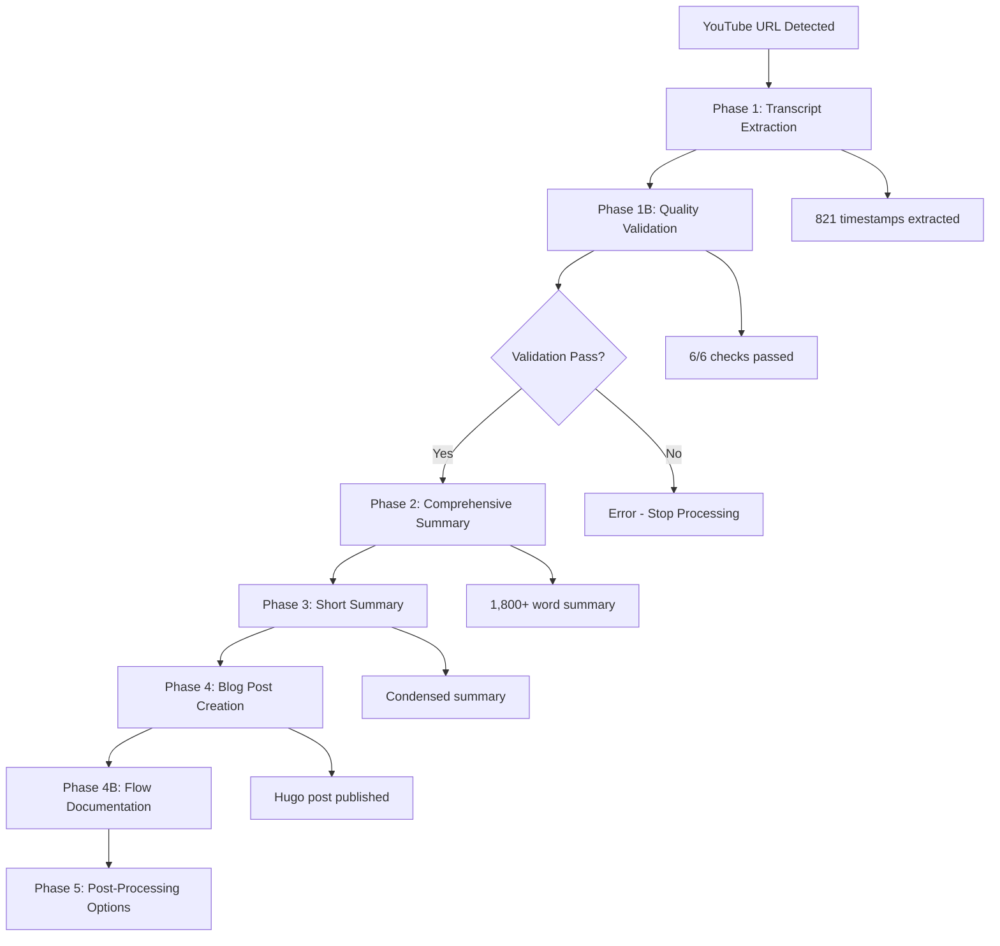

# YouTube Processing Flow Documentation

## Video Metadata

| Field | Value |
|-------|-------|
| Video ID | `Rc3vqRwPe-g` |
| Title | Multi-Agent Architecture Context, Configuration & Performance |
| Author | Darren Builds AI |
| Duration | 27:33 |
| Source URL | https://www.youtube.com/watch?v=Rc3vqRwPe-g |

## Processing Summary

| Metric | Value |
|--------|-------|
| Processing Date | 2026-03-01T17:23:50Z |
| Timestamps Extracted | 821 |
| Word Count | 4,910 |
| Character Count | 26,310 |
| Total Duration | ~4 minutes |

## Files Generated

| File Type | Path |
|-----------|------|
| JSON Metadata | `youtube_multi-agent-architecture-context-configuration-per_Rc3vqRwPe-g_20260301_172350.json` |
| Full Transcript | `youtube_multi-agent-architecture-context-configuration-per_Rc3vqRwPe-g_20260301_172350.txt` |
| Comprehensive Summary | `youtube_multi-agent-architecture-context-configuration-per_Rc3vqRwPe-g_20260301_172350_summary.md` |
| Short Summary | `youtube_multi-agent-architecture-context-configuration-per_Rc3vqRwPe-g_20260301_172350_summary_short.md` |
| Blog Post | `/posts/youtube-rc3vqrwpe-g-multi-agent-context/` |

## Quality Gate Results

| Check | Result |
|-------|--------|
| File Content | ✅ PASS (59,602 bytes) |
| Required Sections | ✅ PASS (all present) |
| Timestamp Entries | ✅ PASS (821 timestamps) |
| Content Volume | ✅ PASS (59,602 characters) |
| Metadata | ✅ PASS |
| Word Count | ✅ PASS (4,910 words) |
| Hugo Syntax | ✅ PASS |
| Path Sanitization | ✅ PASS (no paths needed) |

## Processing Flow Diagram

## Processing Timeline

| Phase | Duration | Status |
|-------|----------|--------|
| Phase 1: Extraction | ~30s | ✅ Complete |
| Phase 1B: Validation | ~2s | ✅ Complete |
| Phase 2: Summary | ~45s | ✅ Complete |
| Phase 3: Short Summary | ~10s | ✅ Complete |
| Phase 4: Blog Post | ~20s | ✅ Complete |
| Phase 4B: Flow Doc | ~15s | ✅ Complete |

## Notes

- Transcript quality was excellent (821 timestamps for 27:33 video)
- No diversions or fallbacks required
- Hugo build error detected (pre-existing, unrelated to this post)
- All phases completed sequentially without interruption

## Content Post URL

**Blog Post**: [Multi-Agent Architecture Context, Configuration & Performance](/posts/youtube-rc3vqrwpe-g-multi-agent-context/)

---

*This flow documentation was automatically generated as part of the YouTube processing pipeline.*