## The Mystery: Success Messages, No Results

YouTube URLs were being submitted to a homepage widget, the system reported "success," but blog posts never appeared. This is the story of tracking down two silent failures in an automated publishing pipeline.

## The Flow (What Should Happen)

```mermaid
flowchart LR
    A[Homepage Widget] --> B[Relay Service]
    B --> C[OliveTin]
    C --> D[OpenCode Agent]
    D --> E1[Transcript Extraction]
    E1 --> E1B[Validation]
    E1B --> E2[AI Summary]
    E2 --> E3[Short Summary]
    E3 --> E4[Blog Post]
    E4 --> SAN[Sanitize Paths]
    SAN --> VAL[Validate Hugo]
    VAL --> PUB[Publish]
    
    style A fill:#90EE90
    style B fill:#90EE90
    style C fill:#90EE90
    style D fill:#FF6B6B
    style E1 fill:#90EE90
    style E1B fill:#90EE90
    style E2 fill:#FFD93D
    style E3 fill:#FFD93D
    style E4 fill:#FFD93D
```



**Legend:**
- 🟢 Green = Working
- 🔴 Red = Failing
- 🟡 Yellow = Blocked by upstream failure

## Investigation Methodology

### Parallel Agent Deployment

Three background agents launched simultaneously:

1. **Explore Agent #1**: Find YouTube flow records in `flows.json`, `actions.json`
2. **Explore Agent #2**: Search logs for YouTube processing, API errors
3. **Explore Agent #3**: Check recent blog posts, verify what was actually published

### Key Data Sources

| Source | Purpose | Finding |
|--------|---------|---------|
| `/root/tmp/pending-summarization.txt` | Queue of pending videos | 14 entries stuck with `error:api_failed` |
| `/root/var/log/url-processor/*.log` | Processing logs | All 8 recent logs show `nsenter` failure |
| `/root/cron-logs/auto-summarize.log` | Summarization attempts | HTTP 401 Unauthorized from Zhipu API |
| `/media/docker/website/content/posts/` | Blog post directory | 2 YouTube posts published today despite failures |

## Finding #1: nsenter Permission Denied

### The Error

```bash
nsenter: reassociate to namespaces failed: Operation not permitted
[D] ❌ - Agent failed (exit: 1)
```

### Location

`/media/docker/olivetin/config/scripts/process-url-direct.sh` (line 132)

```bash
nsenter -t 1 -m -u -n -i sh -c "cd /root && opencode run '$PROMPT' --print-logs"
```

### Root Cause

The OliveTin container lacks the necessary Linux capabilities to use `nsenter` to escape its namespace and execute commands on the host system.

### The Fix

Add to `/media/docker/olivetin/docker-compose.yml`:

```yaml
services:
  olivetin:
    # ... existing configuration ...
    privileged: true  # Enables nsenter access
```

Alternative (more secure):
```yaml
services:
  olivetin:
    cap_add:
      - SYS_ADMIN  # Grants namespace manipulation capability
```

Then restart:
```bash
cd /media/docker/olivetin && docker compose up -d
```

## Finding #2: API Authentication Failure

### The Error

```python
API Error: HTTP Error 401: Unauthorized
ERROR: Failed to generate comprehensive summary
```

### Location

`/media/docker/commands/auto_summarize.py` (line 48)

```python
api_key = get_api_key()
if not api_key:
    print("ERROR: No Z_AI_API_KEY found")
    return None
```

### Root Cause

The Zhipu GLM API key (`Z_AI_API_KEY`) is missing. Investigation showed:

```bash
$ cat /root/.env
cat: /root/.env: No such file or directory
```

### The Fix

Create `/root/.env` with valid API credentials:

```bash
echo "Z_AI_API_KEY=your_valid_zhipu_api_key_here" > /root/.env
```

Test the API:
```bash
curl -X POST https://open.bigmodel.cn/api/paas/v4/chat/completions \
  -H "Authorization: Bearer $Z_AI_API_KEY" \
  -H "Content-Type: application/json" \
  -d '{"model":"glm-4-flash","messages":[{"role":"user","content":"test"}]}'
```

## The Confusing Part: Some Posts Worked

Despite the failures above, **2 YouTube posts were successfully published today**:

1. **"February's 33 Hottest GitHub Repos: Claw is EVERYWHERE"**
   - URL: http://ubuntu4:1313/posts/youtube-k4i5i-h859i/
   - Created: 13:29 UTC

2. **"Conservative Commentary: Candace Owens, Turning Point & Political Hypocrisy"**
   - URL: http://ubuntu4:1313/posts/candace-owens-turning-point-commentary/
   - Created: 08:39 UTC

**Possible Explanations:**
- Manual intervention bypassed the automated flow
- A different workflow path exists that doesn't use `nsenter`
- The failures are intermittent (permissions sometimes work)

## Flow Status Summary

| Phase | Component | Status | Evidence |
|-------|-----------|--------|----------|
| A | Homepage Widget | ✅ Working | Widget triggers relay |
| B | Relay Service | ✅ Working | Forwards to OliveTin |
| C | OliveTin | ✅ Working | Triggers script execution |
| E1 | Transcript Extraction | ✅ Working | 100% success rate in logs |
| E1B | Transcript Validation | ✅ Working | All logs show "Validation passed" |
| D | OpenCode Agent Trigger | ❌ Failed | `nsenter: Operation not permitted` |
| E2 | AI Summarization | ❌ Failed | HTTP 401 Unauthorized |
| E3-E4 | Blog Post Creation | ⏸️ Blocked | Waiting on upstream fixes |

## Immediate Action Plan

### Priority 1: Fix Container Privileges (5 minutes)

```bash
# Edit docker-compose.yml
vim /media/docker/olivetin/docker-compose.yml

# Add: privileged: true

# Restart container
cd /media/docker/olivetin && docker compose up -d
```

### Priority 2: Add Missing API Key (2 minutes)

```bash
# Create .env file
echo "Z_AI_API_KEY=your_valid_key" > /root/.env

# Verify
grep "Z_AI_API_KEY" /root/.env
```

### Priority 3: Clear Stuck Queue (1 minute)

```bash
# Backup current queue
cp /root/tmp/pending-summarization.txt /root/tmp/pending-summarization.txt.backup

# Clear queue
> /root/tmp/pending-summarization.txt
```

### Priority 4: Test End-to-End (2 minutes)

1. Submit a fresh YouTube URL via the homepage widget
2. Monitor logs: `tail -f /root/var/log/url-processor/*.log`
3. Verify blog post appears at http://ubuntu4:1313/

## Lessons Learned

### 1. Silent Failures Are Dangerous

The system reported "success" at multiple points:
- Homepage widget: ✅ Successfully triggered relay
- OliveTin: ✅ Successfully executed script
- Script: ✅ Successfully extracted transcript

But the **critical downstream steps failed silently** because:
- `nsenter` error was logged but not propagated
- API 401 error was logged but not flagged
- Queue entries marked `error:api_failed` but no alert triggered

### 2. Parallel Investigation Is Essential

Three simultaneous agent searches in different directions found:
- Flow records (what was tracked)
- Logs (what actually happened)
- Blog posts (what actually got published)

The discrepancy between logs (failures) and posts (successes) revealed the complexity.

### 3. Container Privileges Matter

Docker containers are isolated by design. Running commands on the host requires:
- `privileged: true` (full access), OR
- `cap_add: [SYS_ADMIN]` (specific capability), OR
- A different architecture (mount docker socket, use REST API)

### 4. API Keys Rot

Keys work until they don't. Common causes:
- Expiration (time-limited keys)
- Revocation (security incidents)
- Environment changes (new .env location, missing file)

## Monitoring Recommendations

### Add Health Checks

```bash
# Check for stuck queue entries
STUCK_COUNT=$(grep -c "error:api_failed" /root/tmp/pending-summarization.txt)
if [ "$STUCK_COUNT" -gt 5 ]; then
  echo "ALERT: $STUCK_COUNT videos stuck in queue"
fi

# Check for recent nsenter failures
RECENT_FAILURES=$(grep -c "Operation not permitted" /root/var/log/url-processor/*.log 2>/dev/null)
if [ "$RECENT_FAILURES" -gt 0 ]; then
  echo "ALERT: nsenter failures detected"
fi
```

### Add Alerting

- Queue depth > 10 entries → Send notification
- API 401 errors in last hour → Send notification
- No blog posts created in 24 hours → Send notification

## Files Referenced

| File | Purpose |
|------|---------|
| `/media/docker/olivetin/config/scripts/process-url-direct.sh` | URL processing script with nsenter call |
| `/media/docker/olivetin/docker-compose.yml` | Container configuration (needs privileged: true) |
| `/media/docker/commands/auto_summarize.py` | AI summarization script |
| `/root/tmp/pending-summarization.txt` | Queue of pending videos |
| `/root/var/log/url-processor/*.log` | Processing logs |
| `/root/cron-logs/auto-summarize.log` | Summarization cron logs |

## Summary

Two distinct failures created a confusing situation where some YouTube videos were published while others silently failed:

1. **Container isolation** prevented the OliveTin container from running OpenCode on the host
2. **Missing API credentials** prevented AI summarization from completing

The fixes are straightforward:
- Add `privileged: true` to OliveTin container
- Create `/root/.env` with valid `Z_AI_API_KEY`
- Clear the stuck queue and re-process

The investigation methodology—parallel agents searching different data sources—quickly identified the root causes despite the confusing "success" messages at multiple levels.

---

*Investigation conducted with 3 parallel background agents, 22 log files analyzed, 14 stuck queue entries identified, 2 root causes found.*