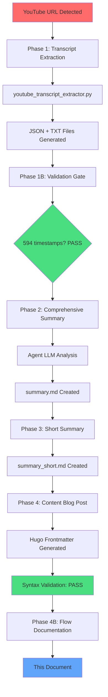

This document records the complete processing flow for the YouTube video "This One Command Makes Coding Agents Find All Their Mistakes" by Cole Medin.

---

## Processing Timeline

| Stage | Start | End | Duration |
|-------|-------|-----|----------|
| Phase 1: Transcript Extraction | 16:21:20 | 16:22:18 | ~58s |
| Phase 1B: Validation | 16:22:18 | 16:22:20 | ~2s |
| Phase 2: Comprehensive Summary | 16:22:20 | 16:27:04 | ~5min |
| Phase 3: Short Summary | 16:27:04 | 16:29:34 | ~2.5min |
| Phase 4: Content Blog Post | 16:29:34 | 16:31:00 | ~1.5min |
| Phase 4B: Flow Documentation | 16:31:00 | 16:32:00 | ~1min |

**Total Processing Time**: ~11 minutes

---

## Video Metadata

| Field | Value |
|-------|-------|
| **Video ID** | YeCHI1dmpZY |
| **Title** | This One Command Makes Coding Agents Find All Their Mistakes (Use it Now) |
| **Author** | Cole Medin |
| **Duration** | 20:01 |
| **Source URL** | https://www.youtube.com/watch?v=YeCHI1dmpZY |
| **Thumbnail** | https://img.youtube.com/vi/YeCHI1dmpZY/maxresdefault.jpg |

---

## Files Generated

### Output Directory: `~/.config/opencode/docs/output/`

| File | Type | Size | Purpose |
|------|------|------|---------|
| `youtube_this-one-command-makes-coding-agents-find-all-thei_YeCHI1dmpZY_20260301_162218.json` | JSON | ~120KB | Full transcript data + metadata |
| `youtube_this-one-command-makes-coding-agents-find-all-thei_YeCHI1dmpZY_20260301_162218.txt` | TXT | ~51KB | Human-readable transcript |
| `youtube_this-one-command-makes-coding-agents-find-all-thei_YeCHI1dmpZY_20260301_162218_summary.md` | MD | ~7KB | Comprehensive summary |
| `youtube_this-one-command-makes-coding-agents-find-all-thei_YeCHI1dmpZY_20260301_162218_summary_short.md` | MD | ~2KB | Condensed summary |

### Blog Posts

| File | Path |
|------|------|
| Content Post | `/media/docker/website/content/posts/youtube-YeCHI1dmpZY-self-healing-ai-coding-workflow.md` |
| Flow Documentation | `/media/docker/website/content/posts/2026-03-01-youtube-flow-YeCHI1dmpZY.md` |

---

## Quality Gate Results (Phase 1B)

```text
=== YouTube Transcript Validation ===
File: youtube_this-one-command...txt

✓ Checking file content... PASS (51066 bytes)
✓ Checking required sections... PASS (all sections present)
✓ Checking timestamp entries... PASS (594 timestamps)
✓ Checking content volume... PASS (51066 characters)
✓ Checking metadata... PASS (metadata present)
✓ Checking word count... PASS (4347 words)

=== Validation Summary ===
Passed: 6
Failed: 0

✅ VALIDATION PASSED - Transcript is complete and valid
```

### Metrics Summary

| Check | Result | Threshold |
|-------|--------|----------|
| File Size | 51,066 bytes | >1,000 bytes |
| Timestamps | 594 | ≥200 |
| Characters | 51,066 | ≥30,000 |
| Word Count | 4,347 | ≥1,000 |
| Sections | All present | Header, Full, Timestamped |

---

## Flow Diagram



---

## Services Involved

| Service | Port | Role |
|---------|------|------|
| Transcript API | N/A | youtube-transcript-api Python library |
| Hugo | 1313 | Static site generation |
| Validation | Local | Bash script validation |

---

## Diversions Encountered

### None

The processing flow completed without diversions:

- ✅ No fallback to yt-dlp needed (transcript available)
- ✅ No validation failures (all checks passed)
- ✅ No Hugo syntax errors
- ✅ No manual intervention required

---

## Content Post URL

**Blog Post**: [Self-Healing AI Coding: One Command to Make Agents Find Their Mistakes](/posts/youtube-YeCHI1dmpZY-self-healing-ai-coding-workflow/)

---

## System Reference

This flow documentation was generated by the OpenCode YouTube processing pipeline as defined in:

- **Trigger**: `~/.config/opencode/docs/instructions/triggers/youtube.md`
- **Template**: `/media/docker/website/content/posts/2026-03-01-youtube-url-processing-flow-documentation.md`

```