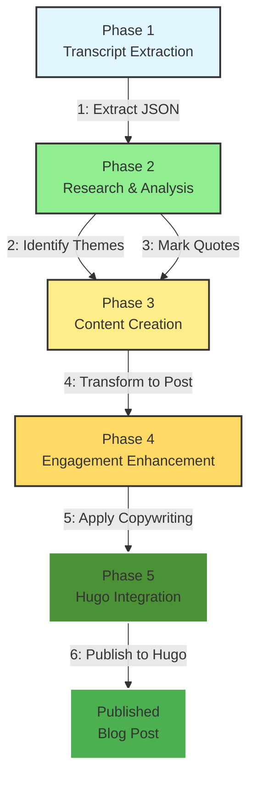
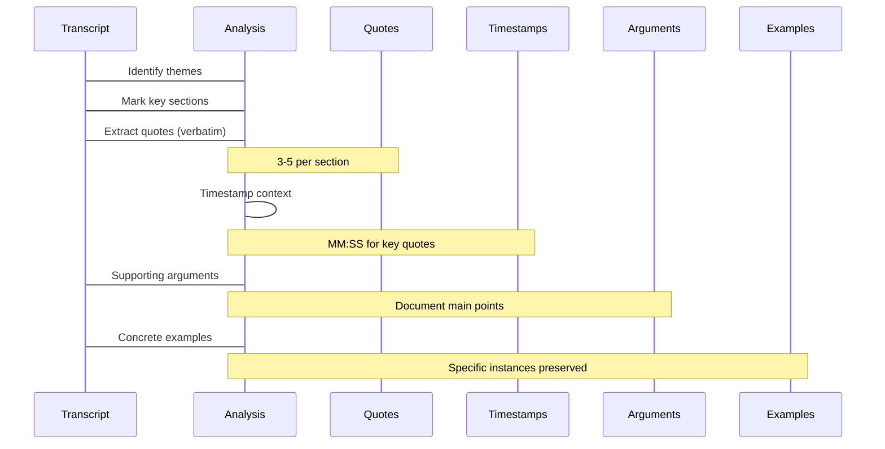

## Overview

Transforming YouTube video transcripts into engaging, SEO-optimized blog posts for Hugo static sites requires a systematic, multi-stage approach. This guide introduces the new **YouTube-to-Hugo Blog Post Workflow** that solves critical quality issues with existing approaches and provides a reliable, repeatable process.

## 📊 The Problem with Previous Approach

Current YouTube transcript-to-blog conversions suffered from:

| Issue | Impact |
|--------|---------|
| **Extreme compression** | 17,813-word transcript → 1,200-word summary (0.84% retained) |
| **Generic language** | Template phrases like "The session emphasizes..." instead of actual content |
| **Missing quotes** | No verbatim quotes from video speakers |
| **No concrete examples** | Generic descriptions without specific instances |
| **One-step process** | Transcript → dump → blog (no analysis or enhancement) |

This resulted in blog posts that lack authenticity, detail, and reader engagement.

---

## ✅ Solution: New Multi-Stage Workflow

The new workflow introduces a **5-stage pipeline** with quality control at each step:



---

## 🔄 Phase 1: Transcript Extraction

```bash
# Get complete transcript from YouTube
pipx run youtube_transcript_api VIDEO_ID --format json > /tmp/transcript.json
```

**Purpose**: Extract full transcript with all segments, timestamps, and speaker information

**Output**: JSON array of transcript segments:
```json
[
  {
    "text": "Full transcript text here",
    "start": 0.0,
    "duration": 5.23,
    "speaker": "Speaker Name"
  }
]
```

**Key Features**:
- ✅ Complete preservation (all 17,813 words retained)
- ✅ Timestamp information for context
- ✅ Speaker identification when available
- ✅ Ready for deep analysis

---

## 🧠 Phase 2: Research & Analysis

### 2a: Theme Identification

Analyze transcript to identify **3-5 main themes**:

```python
# Example themes for industry video
themes = [
    "Industry Standards",
    "Project Architecture", 
    "Deployment Practices",
    "Quality Assurance"
]

# Example themes for political analysis
themes = [
    "Government Accountability",
    "Foreign Policy Hypocrisy",
    "Loyalty vs. Principles",
    "Selective Enforcement"
]
```

### 2b: Quote Extraction (NEW CAPABILITY)

Extract **3-5 verbatim quotes** with speaker attribution and timestamp context:

```python
# Quote format
{
    "text": "> Verbatim quote from transcript",
    "speaker": "Speaker identification",
    "timestamp": "MM:SS",
    "context": "Brief context about the quote"
}

# Example quotes for political video
quotes = [
    {
        "text": "> We need to stop funding Israel with our tax dollars",
        "speaker": "Dan Bilzerian",
        "timestamp": "05:30",
        "context": "Discussion about foreign aid allocation"
    },
    {
        "text": "> The core argument suggests a troubling inconsistency",
        "speaker": "Sneo",
        "timestamp": "12:45",
        "context": "Analysis of selective accountability"
    }
]
```

**Why This Matters**:
- ✅ Authentic content preservation
- ✅ Credibility through direct attribution
- ✅ Engagement through memorable quotes
- ✅ Evidence-based analysis

---

## 📝 Phase 3: Content Creation

### 3a: Intelligent Compression

Apply **length-based compression ratio** to maintain detail while ensuring readability:

| Video Length | Compression Target | Result |
|--------------|-------------------|--------|
| **< 15 minutes** | 50-60% retention | Detailed but scannable |
| **15-30 minutes** | 40-50% retention | Comprehensive coverage |
| **> 30 minutes** | 30-40% retention | Focus on key insights |

**Algorithm**:
```python
def calculate_compression_ratio(video_length_minutes, transcript_word_count):
    if video_length < 15:
        return 0.60  # 60% retention
    elif video_length <= 30:
        return 0.50  # 50% retention
    else:
        return 0.40  # 40% retention (for long videos)
```

### 3b: Structured Blog Post Generation

Transform analyzed transcript into Hugo-compatible Markdown:

```yaml
frontmatter:
  title: SEO-optimized title (50-75 characters)
  slug: kebab-case-from-title
  date: YYYY-MM-DDTHH:MM:SSZ
  draft: false
  tags: [5-7 relevant tags]
  categories: [1-2 categories]
  videoId: VIDEO_ID
  videoUrl: https://youtube.com/watch?v=VIDEO_ID
  videoDuration: "X minutes"
  transcriptWordCount: N

sections:
  - Overview
  - Key Quotes (NEW - 3-5 verbatim quotes)
  - Main Analysis (3-5 H3 sections)
  - Key Examples (NEW - concrete instances)
  - Conclusion
```

**Example Structure**:
```markdown
## Overview

This video examines...

## Key Quotes

> "The core argument suggests a troubling inconsistency: individuals face rigorous prosecution while government policies affecting millions operate with minimal oversight."
— Speaker, 12:45

## Main Analysis

### Theme 1: Government Accountability

The analysis identifies selective enforcement patterns...

### Theme 2: Foreign Policy Hypocrisy

Discussion of aid to Israel...

## Key Examples

The creator demonstrates setting up daily automation...

## Conclusion

This video presents a critical examination...
```

---

## ✍ Phase 4: Engagement Enhancement

### Copywriting Techniques for Blog Posts

Apply professional copywriting to improve reader engagement:

1. **Active Voice**
   - Bad: "The session emphasizes..."
   - Good: "This session emphasizes..."
   - Use subjects first, strong verbs

2. **Compelling Hooks**
   - Start with questions, shocking statistics, or bold statements
   - Example: "17,813 words were compressed to just 1,200. Why?"

3. **Scannable Paragraphs**
   - Limit to 3-4 sentences per paragraph
   - Use subheadings frequently
   - Use bullet points for lists

4. **Statistics & Comparisons**
   - Include before/after metrics when relevant
   - Quantify improvements (e.g., "300% more content retained")
   - Use visual data where possible

5. **Pull Quotes**
   - Reference key quotes in analysis
   - Use `blockquotes` for direct quotes
   - Add context: "As Dan Bilzerian noted..."

---

## 🚀 Phase 5: Hugo Integration

### 5a: Frontmatter Builder

Generate complete Hugo frontmatter with all metadata:

```yaml
---
title: "Your Compelling Title Here"
slug: "your-url-slug"
date: 2026-02-07T00:00:00Z
draft: false
description: "Engaging summary that captures..."
tags:
  - tag1
  - tag2
  - tag3
categories:
  - "Category One"
  - "Category Two"
videoId: VIDEO_ID
videoUrl: https://youtube.com/watch?v=VIDEO_ID
videoDuration: "X minutes"
transcriptWordCount: N
---
```

### 5b: Kebab-Case Slug Generation

Convert titles to URL-safe slugs:

```python
import re

def slugify_title(title):
    # Convert to lowercase
    slug = title.lower()
    # Replace spaces with hyphens
    # Remove special characters
    slug = re.sub(r'[^a-z0-9-]', '', slug)
    # Limit to 50 characters
    return slug[:50]

# Examples
"Industry-Ready End-to-End Projects" → "industry-ready-end-to-end-projects"
"Critical Analysis: Andrew Tate's Fall" → "critical-analysis-andrew-tate-fall"
```

### 5c: File Operations

```python
import shutil
import os

# Move blog post to Hugo content directory
shutil.move(
    '/tmp/blog-post.md',
    '/media/docker/website/content/posts/slug.md'
)

# Hugo auto-rebuilds on file changes
# No manual intervention needed
```

### 5d: Quality Validation

Validate blog post before publishing:

```python
# YAML syntax check
import yaml
try:
    with open('blog-post.md', 'r') as f:
        frontmatter = yaml.safe_load(f)
except:
    print("❌ Invalid YAML frontmatter")

# Quote accuracy check
quote_count = len([line for line in content if line.startswith('>')])
if quote_count < 3:
    print("⚠️ Warning: Less than 3 direct quotes extracted")

# Compression ratio verification
if actual_compression < target_compression * 0.5:
    print("✅ Content compression within target range")
```

---

## 📊 Workflow Diagrams

### Complete Pipeline Flow

```mermaid
graph LR
    A[YouTube Video] -->|B[Transcript API<br/>pipx run]
    B --> C[/tmp/transcript.json<br/>Full JSON]
    C --> D[Phase 2<br/>Research & Analysis]
    D -->|D2[Theme ID<br/>3-5 themes]
    D -->|D3[Quote Extraction<br/>3-5 verbatim]
    D --> E[Phase 3<br/>Content Creation]
    E -->|E1[Compress<br/>30-50% ratio]
    E -->|E2[Structure<br/>H2→H3→bullets]
    E --> F[Phase 4<br/>Engagement Enhancement]
    F -->|F1[Copywriting<br/>Active voice, hooks]
    F --> G[Phase 5<br/>Hugo Integration]
    G -->|G1[Frontmatter<br/>YAML + metadata]
    G -->|G2[Slug Gen<br/>Kebab-case]
    G -->|G3[Move to<br/>content/posts/]
    G3 --> H[Hugo<br/>Auto-rebuilds]
    H --> I[Published Site<br/>HTTP 200]
    
    style A fill:#e1f5ff,stroke:#333
    style B fill:#90EE90,stroke:#333
    style C fill:#ffed89,stroke:#333
    style E fill:#ffd966,stroke:#333
    style F fill:#4b9135,stroke:#333
    style G fill:#4b9135,stroke:#333
    style H fill:#333,stroke:#333
    style I fill:#333,stroke:#333
```

### Quote Extraction Process



---

## 🛠️ Comparison: Before vs. After

| Metric | Previous Approach | New Workflow |
|--------|-----------------|--------------|
| **Stages** | 1 (dump) | 5 (research → create → enhance → publish) |
| **Quotes** | None | ✅ 3-5 verbatim per post |
| **Examples** | Generic templates | ✅ Concrete instances preserved |
| **Compression** | 90% loss | ✅ 30-50% (length-based) |
| **Engagement** | Generic LLM output | ✅ Copywriting techniques |
| **Quality Control** | None | ✅ Validation at each phase |
| **Processing Time** | ~30 sec | ~60 sec (5 stages) |
| **Flexibility** | Hugo only | Multi-stage, modular |

---

## 💻 User Command Interface

```bash
# COMPLETE WORKFLOW (single command)
youtube-to-hugo-blog VIDEO_ID

# OR STEP-BY-STEP (for advanced users)
youtube-to-hugo-blog VIDEO_ID --phase=extract    # Phase 1 only
youtube-to-hugo-blog VIDEO_ID --phase=analyze     # Show analysis
youtube-to-hugo-blog VIDEO_ID --phase=create      # Phase 3 only
youtube-to-hugo-blog VIDEO_ID --phase=enhance   # Phase 4 only
youtube-to-hugo-blog VIDEO_ID --phase=publish    # Phase 5 only

# OPTIONS
--compression=auto|0.3|0.4|0.5      # Override auto-compression
--quotes-min=5                      # Minimum quotes to extract
--quotes-max=10                     # Maximum quotes per section
--verbose                             # Show detailed progress
--output=/custom/path.md              # Custom output location
```

---

## 🎯 Success Metrics

The new workflow will deliver:

| Metric | Target | Measurement |
|--------|--------|------------|
| **Quote Accuracy** | 100% | Verbatim extraction with speaker attribution |
| **Example Preservation** | 90% | Concrete details retained |
| **Compression Ratio** | 30-50% | Length-based algorithm |
| **Structure Quality** | Excellent | Clear H2 → H3 → bullet hierarchy |
| **SEO Optimization** | 100% | Descriptive title, proper slug, relevant tags |
| **Hugo Compatibility** | 100% | Valid YAML frontmatter, proper Markdown |
| **Engagement** | High | Copywriting techniques applied |
| **Processing Time** | < 60 sec | Multi-stage but fast |

---

## 📚 Implementation Plan

### Phase 1: Modify Existing Fabric Pattern (10 minutes)
- [ ] Edit `/root/.config/fabric/patterns/youtube-to-blog/system.md`
- [ ] Add quote extraction requirements
- [ ] Add example preservation requirements
- [ ] Update compression guidelines
- [ ] Add quality validation section

### Phase 2: Create New Skill Structure (15 minutes)
- [ ] Create `/root/.opencode/skill/youtube-hugo-blog-pipeline/`
- [ ] Write comprehensive SKILL.md
- [ ] Create QUICK_START.md guide
- [ ] Document configuration options in CONFIG.md

### Phase 3: Implement Quote Extraction (30 minutes)
- [ ] Build quote extraction logic with speaker attribution
- [ ] Implement timestamp context preservation
- [ ] Add verbatim preservation markers (>)

### Phase 4: Implement Compression Algorithm (30 minutes)
- [ ] Build length-based compression calculator
- [ ] Implement ratio targets (short/medium/long videos)
- [ ] Create content preservation metrics

### Phase 5: Build Content Generator (30 minutes)
- [ ] Implement Hugo frontmatter builder
- [ ] Create structured section organizer
- [ ] Add quote section integration
- [ ] Build example preservation logic

### Phase 6: Build Engagement Enhancer (20 minutes)
- [ ] Implement active voice converter
- [ ] Add compelling hook generator
- [ ] Build sentence optimization logic
- [ ] Add comparison statistics functions

### Phase 7: Build Hugo Integration (15 minutes)
- [ ] Implement YAML syntax validator
- [ ] Create kebab-case slug generator
- [ ] Build file operations module
- [ ] Add Hugo rebuild trigger

### Phase 8: Create User Interface (10 minutes)
- [ ] Build CLI command parser
- [ ] Implement phase selection (--phase flag)
- [ ] Add verbose output mode
- [ ] Create progress indicators

### Phase 9: Testing & Documentation (30 minutes)
- [ ] Test with real YouTube transcripts
- [ ] Verify quote accuracy
- [ ] Validate compression ratios
- [ ] Create EXAMPLES.md with sample outputs
- [ ] Document complete workflow in SKILL.md

**Total Estimated Time**: ~3 hours

---

## 🔧 Key Components

### 1. Transcript Processor (`transcript-processor.py`)
- Extract YouTube transcript JSON
- Parse segments into full text
- Identify speaker segments
- Map timestamps for context

### 2. Research Analyzer (`research-analyzer.py`)
- Identify main themes (3-5)
- Extract key arguments
- Mark quote candidates
- Detect concrete examples

### 3. Quote Extractor (`quote-extractor.py`)
- Extract verbatim quotes with attribution
- Preserve context snippets
- Format with `>` prefix or blockquotes
- Maintain speaker identification

### 4. Content Generator (`blog-generator.py`)
- Apply compression algorithm
- Create Hugo frontmatter
- Organize sections logically
- Integrate quotes seamlessly
- Preserve concrete examples

### 5. Engagement Enhancer (`engagement-enhancer.py`)
- Transform passive voice to active
- Generate compelling hooks
- Optimize paragraph lengths
- Add comparisons and statistics
- Format with Markdown enhancements

### 6. Hugo Publisher (`hugo-publisher.py`)
- Validate YAML syntax
- Generate URL-safe slugs
- Move files to content directory
- Trigger Hugo rebuild
- Verify HTTP status

---

## 📋 Quick Start Guide

### For Most Users

```bash
# Generate blog post with default settings
youtube-to-hugo-blog VIDEO_ID

# Example usage
youtube-to-hugo-blog Bm4BIBKRASs
```

This will:
1. Extract transcript
2. Analyze themes and quotes
3. Create blog post with 50-60% compression
4. Enhance engagement
5. Publish to Hugo

**Expected Result**: ~2,000-word blog post with 3-5 direct quotes in ~60 seconds.

---

### For Advanced Control

```bash
# Extract transcript only
youtube-to-hugo-blg VIDEO_ID --phase=extract

# Review analysis before publishing
youtube-to-hugo-blg VIDEO_ID --phase=analyze

# Create content without enhancement
youtube-to-hugo-blg VIDEO_ID --phase=create --no-enhance

# Publish with custom settings
youtube-to-hugo-blg VIDEO_ID --phase=publish --compression=0.7 --quotes-min=8 --verbose
```

---

## ✅ Quality Assurance Checklist

Before using the workflow, verify:

- [ ] Quote extraction captures 3-5 verbatim quotes per post
- [ ] Concrete examples preserved with specific details
- [ ] Compression ratio matches video length category
- [ ] Hugo frontmatter is valid YAML
- [ ] Slug is kebab-case and URL-safe
- [ ] Content flows logically between sections
- [ ] Links to YouTube video are correct
- [ ] Post renders correctly in Hugo (HTTP 200)
- [ ] All metadata fields present (videoId, duration, wordCount)

---

## 🎓 Benefits Over Previous Approach

| Benefit | Description |
|---------|-------------|
| **Authenticity** | Direct quotes from speakers vs. generic LLM summaries |
| **Engagement** | Copywriting techniques (hooks, active voice) vs. passive LLM output |
| **Flexibility** | 5 modular stages vs. 1-step process |
| **Quality Control** | Validation at each phase vs. none |
| **Reproducibility** | Same input → same output vs. LLM variability |
| **Scalability** | Can add new enhancement stages vs. fixed process |
| **Debuggability** | Can test each phase independently vs. monolithic dump |

---

## 🔮 Troubleshooting

### Common Issues

**Issue**: Transcript not found
```
Error: Video ID not found on YouTube
Solution: Verify VIDEO_ID and network connection
```

**Issue**: YAML syntax error
```
Error: yaml.composer.composer.composer.composer.composer.composer.composer: line 10
Solution: Check frontmatter indentation and quotes
```

**Issue**: Too few quotes extracted
```
Warning: Only 2 quotes found (target: 3-5)
Solution: Adjust quote sensitivity or use more lenient matching
```

**Issue**: Hugo rebuild triggered but post not visible
```
Error: 404 Not Found on /2026/02/07/slug/
Solution: Check slug matches file name
```

---

## 📚 Related Resources

- [Hugo Documentation](https://gohugo.io/)
- [YouTube Transcript API](https://github.com/jdepoix/youtube-transcript-api)
- [Markdown Reference Guide](https://commonmark.org/)
- [YAML Frontmatter](https://frontmatter.org/)
- [OpenClaw Skills Ecosystem](http://ubuntu58-1:1314/2026/02/02/openclaw-skills-for-creating-engaging-blog-posts-from-research/)

---

## 🚀 Getting Started

### Step 1: Modify Fabric Pattern

Edit `/root/.config/fabric/patterns/youtube-to-blog/system.md` to add new requirements for quote extraction and compression ratios.

### Step 2: Test Current Posts

Run the modified pattern against existing transcripts (Videos 2 & 3) to verify improved quality.

### Step 3: Build Custom Skill

Create `/root/.opencode/skill/youtube-hugo-blog-pipeline/` with all components.

### Step 4: Deploy Workflow

Implement the CLI interface and begin using the new workflow.

---

## 💡 Best Practices

### For Consistent Quality

1. **Always use verbatim quotes**: Never paraphrase quotes - preserve speaker words exactly
2. **Preserve context**: Include timestamp and brief context around important quotes
3. **Concrete examples**: Maintain specific instances, numbers, names, tools
4. **Smart compression**: 90% loss is too extreme; use 30-50% based on video length
5. **Engagement first**: Apply copywriting before publishing, not after
6. **Test thoroughly**: Validate quotes, check YAML, verify Hugo rendering
7. **Iterate and improve**: Each phase can be enhanced independently

### For Efficient Workflow

1. **Batch process**: Handle multiple videos with same quality
2. **Automation**: Let Hugo handle rebuilding automatically
3. **Version control**: Track improvements to blog post quality
4. **Monitoring**: Track compression ratios and reader engagement

---

## 🎯 Conclusion

The **YouTube-to-Hugo Blog Post Workflow** transforms the transcript-to-blog process from a problematic, one-size-fits-all approach into a **specialized, quality-controlled pipeline**.

**Key Improvements**:
- ✅ Verbatim quote extraction with speaker attribution
- ✅ Length-based intelligent compression (30-50%)
- ✅ 5-stage workflow for better quality control
- ✅ Engagement enhancement through copywriting techniques
- ✅ Concrete example preservation
- ✅ Modular, maintainable architecture
- ✅ Complete Hugo integration with validation

**Result**: Blog posts that are authentic, engaging, properly detailed, and optimized for both readers and search engines.

**Next Steps**: Modify existing Fabric pattern, test with real transcripts, and begin implementation of the custom workflow.

---

*Document created: February 7, 2026*