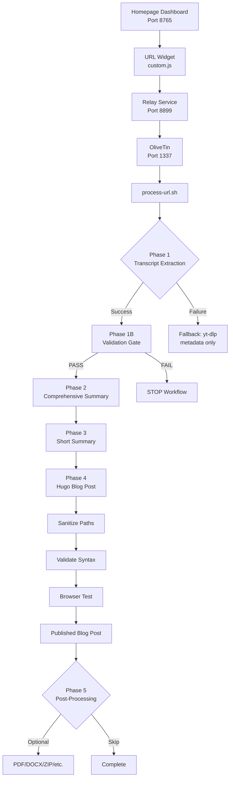

This document provides a complete technical reference for the YouTube URL processing pipeline - from entering a URL in the Homepage dashboard widget through to published blog post.

## Flow Overview

```
Homepage Widget (8765) > Relay Service (8899) > OliveTin (1337) > process-url.sh > 
Transcript Extraction > Validation Gate > Summarization > Blog Post > Post-Processing
```

---

## Stage 1: URL Entry (Homepage Widget)

**Component**: URL Processor Widget v2.0

| Item | Path |
|------|------|
| Widget JavaScript | `/media/docker/home/config/custom.js` |
| Homepage Skill | `~/.config/opencode/skills/homepage/SKILL.md` |
| Services Config | `/media/docker/home/config/services.yaml` |
| Docker Compose | `/media/docker/home/docker-compose.yml` |

**Flow**: User pastes YouTube URL → Widget detects type → Button triggers `http://ubuntu4:8899?action=process-url&url=...`

### Widget Detection Logic

```javascript
const DETECT = {
  youtube: [/youtube\.com\/watch\?v=|youtu\.be\/|youtube\.com\/shorts\//i],
  podcast: [/anchor\.fm|podcasts\.apple\.com|spotify\.com\/show|podcast|\.rss$/i],
  // Returns: 'youtube', 'podcast', or 'webpage'
};
```

---

## Stage 2: Relay Service (GET→POST)

**Component**: Python relay service that converts Homepage GET requests to OliveTin POST webhooks

| Item | Path |
|------|------|
| Relay Service | `/media/docker/relay/relay.py` |
| Docker Compose | `/media/docker/relay/docker-compose.yml` |

**Flow**: 
1. Receives GET request from widget
2. Cleans URL (fixes typos, extracts video ID)
3. Saves URL to `/root/tmp/url-to-process.txt`
4. POSTs to OliveTin API: `http://localhost:1337/api/StartAction`

### URL Cleaning Logic

```python
# Fixes common paste errors
url = re.sub(r'https://wwhttps://', 'https://', url)
url = re.sub(r'(https?://)ww\1', r'\1', url)
url = re.sub(r'(youtube\.com/watch\?v=[\w-]+).*\1', r'\1', url)
if ' ' in url:
    url = url.split()[0]
```

---

## Stage 3: OliveTin Orchestration

**Component**: Task automation platform that executes shell scripts via webhooks

| Item | Path |
|------|------|
| OliveTin Config | `/media/docker/olivetin/config/config.yaml` |
| OliveTin Skill | `~/.config/opencode/skills/olivetin/SKILL.md` |
| Process URL Script | `/media/docker/olivetin/config/scripts/process-url.sh` |

**Flow**: Receives webhook with `action=process-url` → Executes `/config/scripts/process-url.sh`

### OliveTin Action Definition

```yaml
- title: "Process URL"
  id: process-url
  exec: /config/scripts/process-url.sh
  timeout: 300
  execOnWebhook:
    - matchQ:
        action: process-url
```

---

## Stage 4: Transcript Extraction (Phase 1)

**Component**: Python script that extracts YouTube transcripts using youtube-transcript-api

| Item | Path |
|------|------|
| Transcript Extractor | `/media/docker/commands/youtube_transcript_extractor.py` |
| Transcription Skill | `~/.config/opencode/skills/transcription/SKILL.md` |
| Transcription Python | `~/.config/opencode/skills/transcription/transcription.py` |

**Output**:
- `~/.config/opencode/docs/output/youtube_[title]_[video_id]_[timestamp].json`
- `~/.config/opencode/docs/output/youtube_[title]_[video_id]_[timestamp].txt`

### Extraction Process

```python
# Uses youtube-transcript-api
api = YouTubeTranscriptApi()
fetched = api.fetch(video_id, languages=['en'])
return fetched.to_raw_data()
```

**Diversions**:
- If transcript unavailable → Fallback to yt-dlp for metadata only
- Network timeout → 30-second limit with retry

---

## Stage 5: Transcript Validation (Phase 1B - Quality Gate)

**Component**: Bash script that validates transcript completeness

| Item | Path |
|------|------|
| Validation Script | `/media/docker/commands/validate-youtube-transcript.sh` |

**Checks**:
- 200+ timestamp entries
- 30,000+ characters
- All required sections present
- Metadata present (title, URL, duration)
- Word count 1000+

### Validation Checks

| Check | Threshold | Pass Criteria |
|-------|-----------|---------------|
| File size | >1000 bytes | File has content |
| Sections | All present | Header, Full Transcript, Timestamped |
| Timestamps | ≥200 entries | Sufficient granularity |
| Characters | ≥30,000 | Substantial content |
| Word count | ≥1000 | Adequate length |

**Diversions**:
- **PASS** (exit 0) → Continue to Phase 2
- **FAIL** (exit 1) → **STOP workflow** (do not summarize incomplete transcript)

---

## Stage 6: Summarization (Phase 2 & 3)

**Component**: Agent-based summarization using LLM capabilities (NOT external APIs)

| Item | Path |
|------|------|
| YouTube Trigger | `~/.config/opencode/docs/instructions/triggers/youtube.md` |

**Phase 2 - Comprehensive Summary**:
- Input: Transcript TXT file
- Output: `~/.config/opencode/docs/output/youtube_[title]_[id]_[ts]_summary.md`
- Contains: Executive summary, key points, themes, insights, audience, SEO tags

**Phase 3 - Short Summary**:
- Input: Phase 2 summary (not raw transcript - saves tokens)
- Output: `~/.config/opencode/docs/output/youtube_[title]_[id]_[ts]_summary_short.md`
- Contains: 2-3 sentence condensed summary

### Summary Structure

```markdown
## Quick Overview
[2-3 sentence executive summary]

## Core Themes
- Theme 1
- Theme 2
- Theme 3

## Key Insight
[Single most important takeaway]

## Technical Highlights
- Point 1
- Point 2

## Bottom Line
[Actionable conclusion]
```

---

## Stage 7: Blog Post Creation (Phase 4)

**Component**: Hugo static site generator with YouTube-specific frontmatter

| Item | Path |
|------|------|
| Hugo Skill | `~/.config/opencode/skills/hugo/SKILL.md` |
| Hugo Python | `~/.config/opencode/skills/hugo/hugo.py` |
| Default Archetype | `/media/docker/website/archetypes/default.md` |
| Blog Post Directory | `/media/docker/website/content/posts/` |
| Date Generator | `/media/docker/commands/generate-blog-post-date.sh` |
| Path Sanitizer | `/media/docker/commands/sanitize-blog-paths.sh` |
| Hugo Syntax Validator | `/media/docker/commands/validate-hugo-syntax.sh` |

### Required Frontmatter

```yaml
---
title: "Video Title"
slug: "video-slug"
date: 2026-03-01T12:00:00Z
draft: false
tags: ["youtube", "ai", "coding"]  # "youtube" tag REQUIRED
categories: ["YouTube"]
source: "https://youtube.com/watch?v=VIDEO_ID"
---
```

**Filename Format**: `youtube-[VIDEO_ID]-[slug].md`

### Validation Gates

1. **Sanitize internal paths** - Remove filesystem references
2. **Validate Hugo syntax** - Check for errors
3. **Browser test** - HTTP 200 response check

---

## Stage 8: Post-Processing (Phase 5 - Optional)

**Component**: Optional actions presented with 10-second timeout

| Option | Description |
|--------|-------------|
| Save as PDF | Portable archive for sharing |
| Save as Word (.docx) | Editable document format |
| Create Condensed Version | 40-50% shorter blog post |
| Add Short Summary Link | Insert link in published post |
| Export Complete Package | ZIP archive of all content |
| Mark as Favorite | Save to favorites list |

---

## Complete Flow Diagram



---

## Services Summary

| Service | Port | Purpose |
|---------|------|---------|
| Homepage | 8765 | Dashboard + URL Widget |
| Relay | 8899 | GET→POST webhook conversion |
| OliveTin | 1337 | Task orchestration |
| Hugo | 1313/1314 | Blog site |

---

## Key Skills Referenced

| Skill | Trigger | Purpose |
|-------|---------|---------|
| `homepage` | "homepage" | Dashboard management |
| `transcription` | Auto (YouTube URL) | Transcript extraction |
| `hugo` | "hugo", "blog" | Blog post creation |
| `olivetin` | "olivetin" | Task automation |
| `flow` | "flow" | Execution analysis |

---

## Error Handling & Diversions

| Stage | Error Condition | Diversion Path |
|-------|-----------------|----------------|
| Transcript Extraction | No transcript available | Fallback to yt-dlp metadata |
| Transcript Extraction | Network timeout | 30s limit, then retry |
| Validation Gate | <200 timestamps | STOP, do not proceed |
| Validation Gate | <30,000 characters | STOP, do not proceed |
| Hugo Creation | Syntax errors | Fix via validate-hugo-syntax.sh |
| Hugo Creation | 404 on publish | Verify slug, check frontmatter |

---

## Output Files Summary

All intermediate files are stored in `~/.config/opencode/docs/output/`:

| File | Content |
|------|---------|
| `youtube_[title]_[id]_[ts].json` | Full metadata + transcript data |
| `youtube_[title]_[id]_[ts].txt` | Human-readable transcript |
| `youtube_[title]_[id]_[ts]_summary.md` | Comprehensive summary |
| `youtube_[title]_[id]_[ts]_summary_short.md` | Condensed summary |

Final blog post: `/media/docker/website/content/posts/youtube-[VIDEO_ID]-[slug].md`

---

## Related Documentation

- [YouTube Trigger Definition](http://ubuntu4:8080/editor/opencode/docs/instructions/triggers/youtube.md)
- [Hugo Skill](http://ubuntu4:8080/editor/opencode/skills/hugo/SKILL.md)
- [Transcription Skill](http://ubuntu4:8080/editor/opencode/skills/transcription/SKILL.md)
- [Homepage Skill](http://ubuntu4:8080/editor/opencode/skills/homepage/SKILL.md)

---

*This flow documentation was auto-generated by OpenCode on 2026-03-01.*